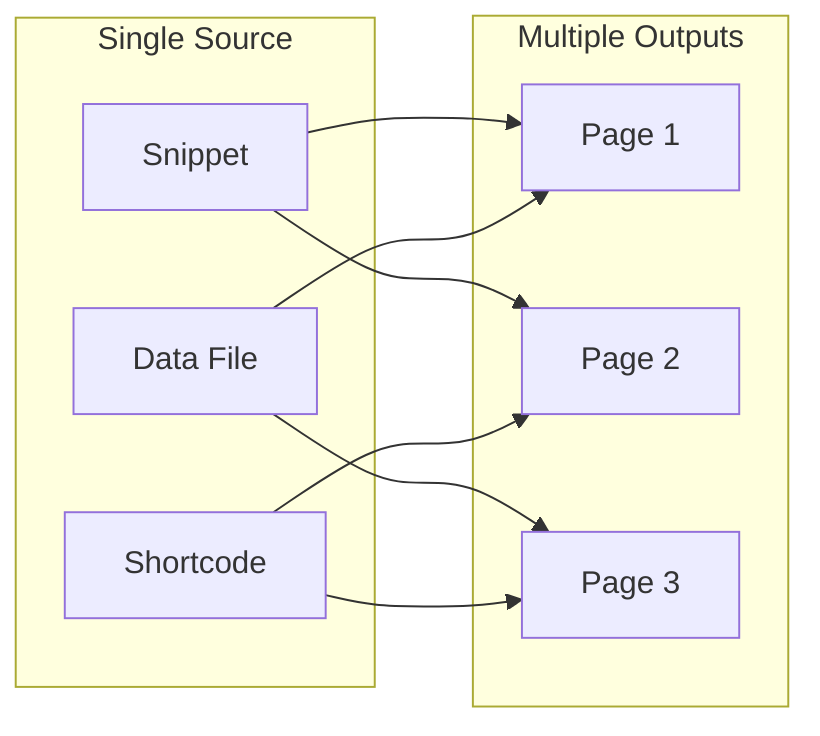

# Reusing Content

Write once, publish everywhere. Bengal provides multiple ways to avoid repeating yourself.

## Reuse Strategies



## Quick Reference

:::{tab-set}
:::{tab-item} Snippets
Reusable Markdown fragments stored in `_snippets/`:

```
_snippets/
├── install/
│   ├── pip.md
│   └── uv.md
└── warnings/
    └── experimental.md
```

Include in any page:
````markdown
```{include} _snippets/install/pip.md
```
````
:::

:::{tab-item} Data Files
Structured YAML/JSON in `data/`:

```yaml
# data/team.yaml
- name: Jane Doe
  role: Lead Developer
  github: janedoe
```

Access in templates:
```kida

  {{ member.name }} - {{ member.role }}

```
:::

:::{tab-item} Filtering
Query content dynamically:

```kida
{# All tutorials #}


{# Recent posts #}

```
:::
:::{/tab-set}

## When to Use What

| Method | Best For | Example |
|--------|----------|---------|
| **Snippets** | Repeated prose blocks | Installation instructions, warnings |
| **Data Files** | Structured data | Team members, product features |
| **Filtering** | Dynamic lists | Recent posts, related pages |
| **Shortcodes** | Parameterized components | Video embeds, API badges |

:::{tip}
**Start with snippets** for common content blocks. Graduate to data files when you need structured data, and filtering when you need dynamic queries.
:::
