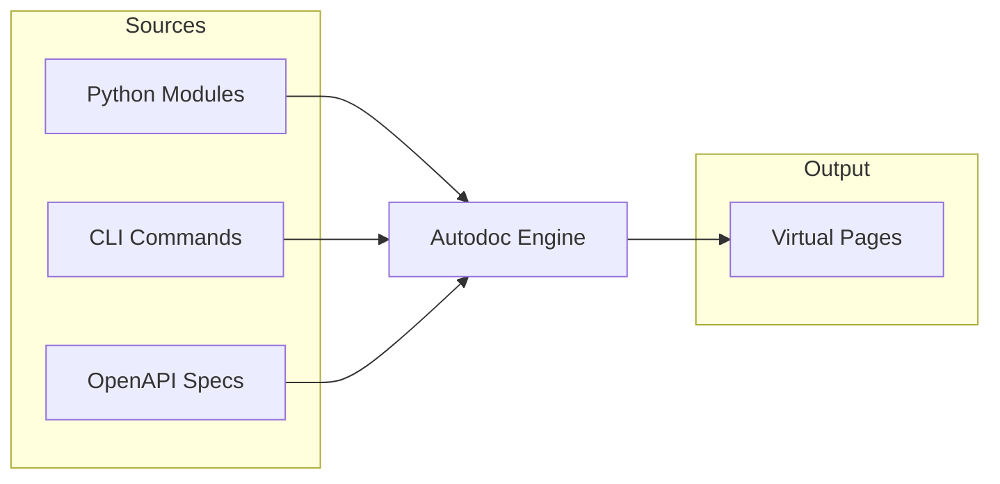

# Autodoc

Generate API documentation automatically from source code during site builds.

## Do I Need This?

:::{note}
**Skip this if**: You write all documentation manually.  
**Read this if**: You want API docs from Python docstrings, CLI help from Click/Typer commands, or API specs from OpenAPI.
:::

## How It Works

Autodoc generates **virtual pages** during your site build. No intermediate markdown files are created. Configure sources in your `bengal.toml` and documentation appears in your built site.



## Configuration

Configure autodoc in your `bengal.toml`:

:::{tab-set}
:::{tab-item} Python
```toml
# bengal.toml
[autodoc.python]
enabled = true
source_dirs = ["mypackage"]
include_private = false
include_special = false
docstring_style = "auto"  # auto, google, numpy, sphinx
```

Extracts:
- Module and class docstrings
- Function signatures and type hints
- Examples from docstrings
:::{/tab-item}

:::{tab-item} CLI
```toml
# bengal.toml
[autodoc.cli]
enabled = true
app_module = "mypackage.cli:main"  # Click/Typer app entry point
framework = "click"  # click, argparse, or typer
include_hidden = false
```

Extracts:
- Command descriptions
- Argument documentation
- Option flags and defaults
:::{/tab-item}

:::{tab-item} OpenAPI
```toml
# bengal.toml
[autodoc.openapi]
enabled = true
spec_file = "api/openapi.yaml"
```

Extracts:
- Endpoint documentation
- Request/response schemas
- Authentication requirements
:::{/tab-item}
:::{/tab-set}

## Python Configuration Options

```toml
[autodoc.python]
enabled = true

# Source directories to scan
source_dirs = ["mypackage"]

# Patterns to exclude
exclude = [
    "*/tests/*",
    "*/__pycache__/*",
    "*/.venv/*",
]

# Docstring parsing style: auto, google, numpy, sphinx
docstring_style = "auto"

# Include private members (_prefixed)
include_private = false

# Include dunder methods (__init__, etc.)
include_special = false

# Include inherited members
include_inherited = false

# Prefix to strip from module paths
strip_prefix = "mypackage"
```

## Building with Autodoc

Once configured, autodoc runs automatically during builds:

```bash
bengal build
```

The generated API documentation appears in your output directory alongside your regular content.

## Navigation (topbar)

If you do not define `menu.main`, Bengal generates a topbar menu automatically.

- **Manual menu overrides auto menu**: If `menu.main` is present and non-empty, Bengal uses it and does not auto-discover topbar items. (`bengal/orchestration/menu.py:401-406`, `bengal/rendering/template_functions/navigation.py:904-915`)
- **Dev dropdown**: In auto mode, Bengal may bundle autodoc outputs under a **Dev** dropdown when multiple “dev” links exist. If there is only one dev link (for example, API-only or CLI-only), it appears as a normal top-level menu entry.

If you want full control of where autodoc appears in the topbar, define `menu.main`.

## Strict Mode

Enable strict mode to fail builds on extraction or rendering errors:

```toml
[autodoc]
strict = true
```

:::{tip}
**Best practice**: Enable strict mode in CI pipelines to catch documentation issues early.
:::

:::{seealso}
- [Architecture Reference](/docs/reference/architecture/subsystems/autodoc/) — Technical details and API usage
:::
