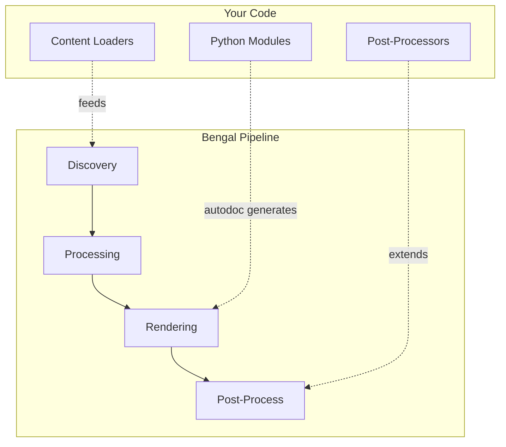

# Extend Bengal

Power features for documentation teams: auto-generate API docs and understand Bengal's architecture to contribute or customize.

## What Do You Need?

:::{child-cards}
:columns: 2
:include: sections
:fields: title, description, icon
:::

## Extension Points

:::{note}
**Most users don't need this section.** These are power features for documentation teams with specific automation needs. Start with [Content](../content/) and [Theming](../theming/) for standard documentation.
:::
