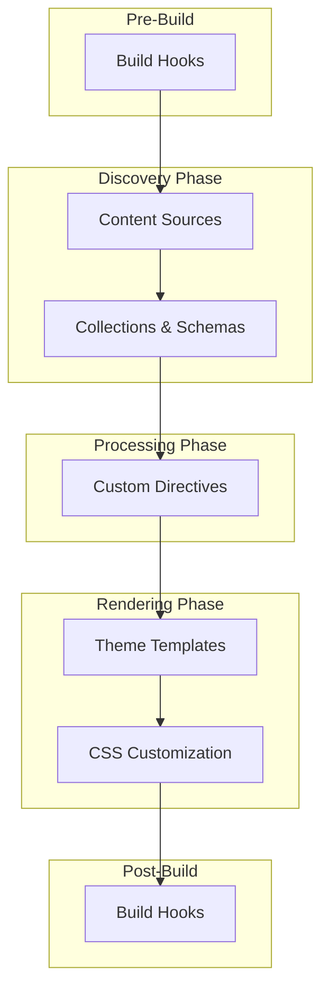

Bengal provides extension points for customizing content processing, adding new content sources, defining typed content schemas, and integrating external build tools.

## Extension Points

Bengal supports several extension mechanisms:

| Extension Type | Use Case | Difficulty |
|----------------|----------|------------|
| [Build Hooks](build-hooks/) | Run external tools (Tailwind, esbuild) before/after builds | Easy |
| [Theme Customization](theme-customization/) | Override templates and CSS | Easy |
| [Content Collections](collections/) | Type-safe frontmatter with schema validation | Moderate |
| [Custom Directives](custom-directives/) | Create new MyST directive blocks | Advanced |
| [Custom Content Sources](custom-sources/) | Fetch content from APIs, databases, or remote services | Advanced |

## Architecture Overview

Extensions integrate at different stages of the build pipeline:



## Quick Start Examples

### Build Hooks

Integrate external tools by adding hooks to your `bengal.toml`:

```toml
[dev_server]
pre_build_hooks = [
    "npx tailwindcss -i src/input.css -o assets/style.css"
]
post_build_hooks = [
    "echo 'Build complete!'"
]
```

### Theme Customization

Override any theme template by placing a file with the same name in your project's `templates/` directory:

```tree
your-project/
├── templates/
│   └── page.html      # Overrides theme's page.html
└── bengal.toml
```

### Content Collections

Define typed schemas for your content:

```python
# collections.py
from dataclasses import dataclass
from datetime import datetime
from bengal.collections import define_collection

@dataclass
class BlogPost:
    title: str
    date: datetime
    author: str = "Anonymous"

collections = {
    "blog": define_collection(schema=BlogPost, directory="content/blog"),
}
```

### Custom Directives

Create new directive blocks by subclassing `BengalDirective`:

```python
from bengal.directives import BengalDirective, DirectiveToken

class AlertDirective(BengalDirective):
    NAMES = ["alert"]
    TOKEN_TYPE = "alert"

    def parse_directive(self, title, options, content, children, state):
        return DirectiveToken(
            type=self.TOKEN_TYPE,
            attrs={"level": title or "info"},
            children=children,
        )

    def render(self, renderer, text, **attrs):
        level = attrs.get("level", "info")
        return f'<div class="alert alert-{level}">{text}</div>'
```

## When to Extend

Choose the right extension mechanism for your needs:

- **Build hooks**: Integrate CSS preprocessors, JavaScript bundlers, or custom scripts
- **Theme customization**: Modify page layouts, add partials, or change styling
- **Collections**: Enforce frontmatter requirements and get IDE autocompletion
- **Custom directives**: Add domain-specific content blocks (alerts, embeds, widgets)
- **Content sources**: Pull content from GitHub, Notion, REST APIs, or databases

## Related Resources

- [Architecture Reference](/docs/reference/architecture/) for understanding Bengal internals
- [Build Pipeline](/docs/reference/architecture/core/pipeline/) for pipeline phase details
- [Configuration](/docs/building/configuration/) for `bengal.toml` options
