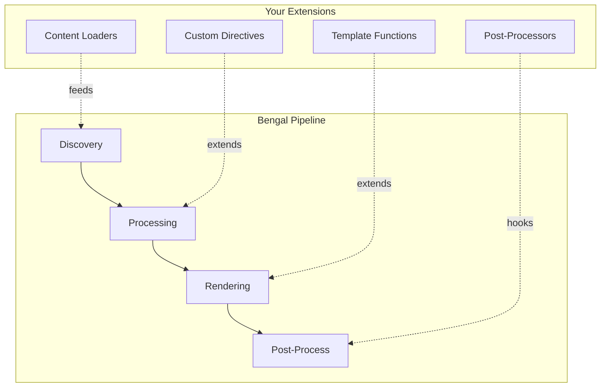

# Extend Bengal

Build plugins, custom parsers, and hook into Bengal's extension points.

:::{note}
**Coming soon.** Plugin architecture and extension point documentation is under development.

For now, see [Architecture Reference](/docs/reference/architecture/) to understand Bengal's internals.
:::

## Planned Topics

- **Custom Directives** — Create your own MyST directives
- **Content Loaders** — Build loaders for new content sources
- **Post-Processors** — Hook into the build pipeline
- **Custom Parsers** — Support new content formats
- **Template Functions** — Add custom Jinja filters and functions

## Extension Points

