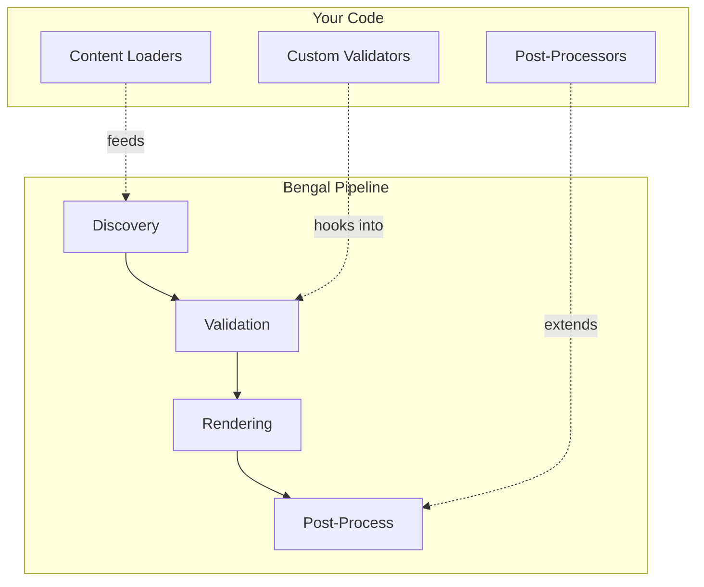

# Extend Bengal

Power features for documentation teams: auto-generate API docs, analyze site structure, validate content, and contribute to Bengal itself.

## What Do You Need?

::::{cards}
:columns: 2
:gap: medium

:::{card} 📚 Autodoc
:link: ./autodoc/
:color: blue

Generate documentation from Python docstrings, CLI commands, and OpenAPI specs.
:::

:::{card} 🔬 Analysis
:link: ./analysis/
:color: green

Graph analysis, PageRank, link suggestions, and navigation optimization.
:::

:::{card} ✅ Validation
:link: ./validation/
:color: purple

Health checks, broken link detection, auto-fix, and custom validators.
:::

:::{card} 🏗️ Architecture
:link: ./architecture/
:color: orange

For contributors: Bengal's internals, object model, and extension points.
:::
::::

## Extension Points

:::{note}
**Most users don't need this section.** These are power features for documentation teams with specific automation needs. Start with [Content](../content/) and [Theming](../theming/) for standard documentation.
:::
