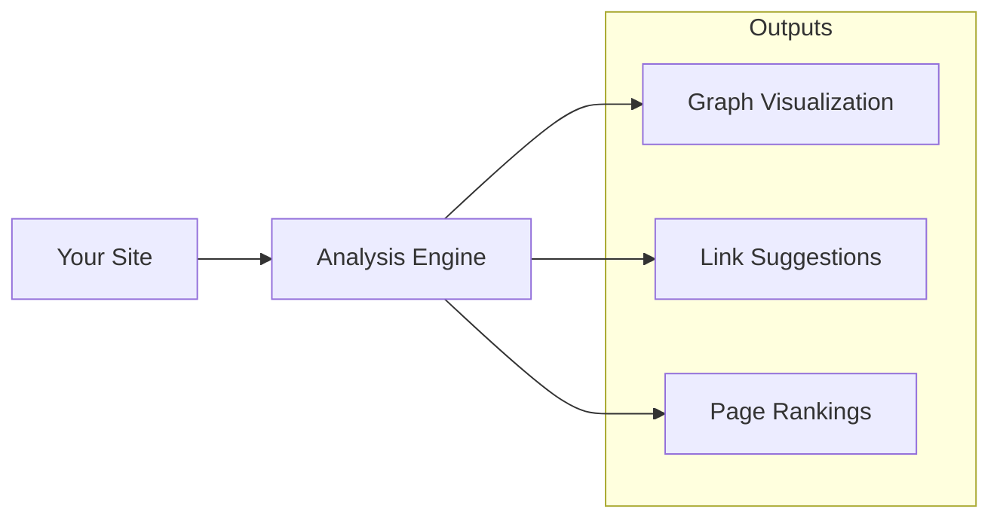

# Site Analysis

Analyze your site's structure to improve navigation and discoverability.

## Do I Need This?

:::{note}
**Skip this if**: Your site has under 50 pages.  
**Read this if**: You have a large site and want to optimize internal linking and find orphan pages.
:::

## Analysis Tools



## Quick Start

::::{tab-set}
:::{tab-item} Graph
```bash
bengal analyze graph --output graph.html
```

Visualizes:
- Page connections
- Orphan pages (no incoming links)
- Hub pages (many connections)
- Content clusters
:::

:::{tab-item} Links
```bash
bengal analyze links --suggestions --min-score 0.7
```

Suggests links based on:
- Content similarity
- Taxonomy overlap
- Structural proximity
:::

:::{tab-item} PageRank
```bash
bengal analyze pagerank
```

Identifies:
- Most important pages
- Underlinked valuable content
- Navigation priorities
:::
::::

## Use Cases

| Goal | Command | Output |
|------|---------|--------|
| Find orphan pages | `bengal analyze graph` | Pages with no incoming links |
| Improve internal linking | `bengal analyze links` | Suggested link additions |
| Identify key content | `bengal analyze pagerank` | Pages ranked by importance |

:::{tip}
**Start with graph analysis** to visualize your site structure. The visual output often reveals issues that metrics alone miss.
:::
