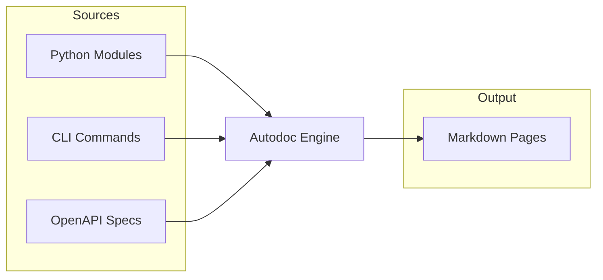

# Autodoc

Generate documentation automatically from source code.

## Do I Need This?

:::{note}
**Skip this if**: You write all documentation manually.  
**Read this if**: You want API docs from Python docstrings, CLI help from commands, or API specs from OpenAPI.
:::

## Supported Sources



## Quick Start

::::{tab-set}
:::{tab-item} Python
```bash
bengal autodoc python --source ./mypackage --output content/api/
```

Extracts:
- Module and class docstrings
- Function signatures and type hints
- Examples from docstrings
:::

:::{tab-item} CLI
```bash
bengal autodoc cli --source ./mypackage --output content/cli/
```

Extracts:
- Command descriptions
- Argument documentation
- Option flags and defaults
:::

:::{tab-item} OpenAPI
```bash
bengal autodoc openapi --source ./openapi.yaml --output content/api/
```

Extracts:
- Endpoint documentation
- Request/response schemas
- Authentication requirements
:::
::::

## Configuration

```toml
# bengal.toml
[autodoc.python]
source = "mypackage"
output = "content/api"
include_private = false
include_dunder = false
```

:::{tip}
**Best practice**: Run autodoc in your CI pipeline to keep generated docs in sync with code changes.
:::
