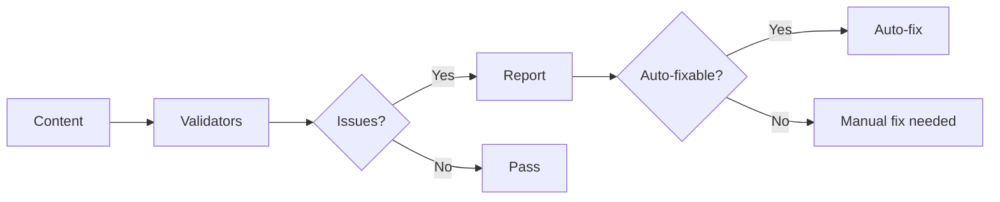

# Content Validation

Ensure content quality with health checks and automatic fixes.

## Do I Need This?

:::{note}
**Skip this if**: You manually check all links and content.  
**Read this if**: You want automated quality assurance and CI/CD integration.
:::

## Validation Flow



## Quick Start

::::{tab-set}
:::{tab-item} Validate
```bash
# Run all checks
bengal validate

# Specific checks
bengal validate --links
bengal validate --frontmatter
bengal validate --images
```
:::

:::{tab-item} Auto-fix
```bash
# Preview fixes
bengal fix --dry-run

# Apply fixes
bengal fix
```

Fixes:
- Missing frontmatter fields
- Broken relative links
- Incorrect slugs
:::

:::{tab-item} CI/CD
```bash
# Fail build on issues
bengal build --strict
```

The `--strict` flag makes warnings into errors.
:::
::::

## Built-in Checks

| Check | What it validates |
|-------|-------------------|
| `links` | Internal and external links work |
| `images` | Image references exist |
| `frontmatter` | Required fields present |
| `structure` | Content organization correct |
| `spelling` | Basic spell checking |

## Custom Validators

Create project-specific rules:

```python
# validators/custom.py
from bengal.health import Validator

class RequireAuthor(Validator):
    def validate(self, page):
        if not page.frontmatter.get("author"):
            return self.error("Missing author field")
```

:::{tip}
**CI integration**: Add `bengal validate` to your CI pipeline with `--strict` to catch issues before deployment.
:::
