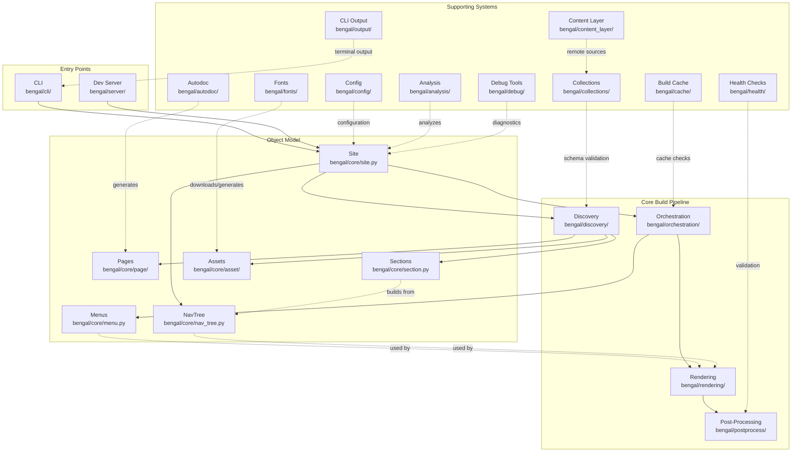

# Architecture Overview

Bengal SSG follows a modular architecture with clear separation of concerns to avoid "God objects" and maintain high performance even with large sites.

:::{child-cards}
:columns: 2
:include: sections
:fields: title, description, icon
:::

## High-Level Architecture

**Key Flows:**
1. **Build**: CLI → Site → Discovery → Orchestration → [Menus + Rendering] → Post-Process
2. **Menu Building**: Orchestration builds menus → Rendering uses menus in templates
3. **Navigation Tree**: Site builds NavTree from sections → Cached per version → Rendering uses for O(1) template access
4. **Cache**: Build Cache checks file changes and dependencies before rebuilding
5. **Autodoc**: Generate Python/CLI docs → treated as regular content pages
6. **Dev Server**: Watch files → trigger incremental rebuilds → serve output
7. **Collections**: Type-safe content schemas → validate frontmatter during discovery
8. **Content Layer**: Unified API for local/remote content → integrates with Collections
9. **CLI Output**: Centralized terminal output → profile-aware formatting for all commands
10. **Debug Tools**: Diagnostic utilities → explain builds, analyze dependencies, debug incremental issues

## Module Overview

### Core Modules

- **`core/`**: Passive data models (Site, Page, Section, Asset, Menu, NavTree)
- **`orchestration/`**: Build coordination via specialized orchestrators
- **`rendering/`**: Template engine, Markdown parsing, directive system
- **`discovery/`**: Content and asset discovery from filesystem or remote sources

### Supporting Modules

- **`cache/`**: Build cache, dependency tracking, query indexes
- **`collections/`**: Type-safe content schemas with validation
- **`content_layer/`**: Unified API for local/remote content sources
- **`content_types/`**: Content strategies (Blog, Docs, Portfolio)
- **`directives/`**: MyST-style directives for markdown (cards, tabs, navigation, etc.)
- **`postprocess/`**: Sitemap, RSS, link validation
- **`health/`**: Content validation and health checks
- **`config/`**: Configuration loading and validation
- **`cli/`**: Command-line interface
- **`output/`**: Centralized CLI output system
- **`server/`**: Development server with live reload
- **`utils/`**: Shared utilities

### Feature Subsystems

- **`autodoc/`**: Generate docs from Python, CLI, OpenAPI
- **`analysis/`**: Graph analysis, PageRank, link suggestions
- **`fonts/`**: Google Fonts download and self-hosting
- **`debug/`**: Diagnostic tools for understanding builds
- **`services/`**: Service interfaces and implementations
- **`assets/`**: Asset processing pipeline and manifest generation

## Object Model Relationships

### NavTree ↔ Section Relationship

`NavTree` is built from the site's `Section` hierarchy:

- **NavTree.build()** traverses `site.sections` and creates `NavNode` structures
- Each `NavNode` can reference a `Section` (via `node.section`) or a `Page` (via `node.page`)
- Version filtering uses `Section.pages_for_version()` and `Section.subsections_for_version()`
- The tree is cached per version for O(1) template access

**Benefits:**
- Pre-computed structure eliminates template-side version filtering overhead
- Immutable cached trees preserve thread safety
- Active trail computation happens once per page render (via `NavTreeContext`)
