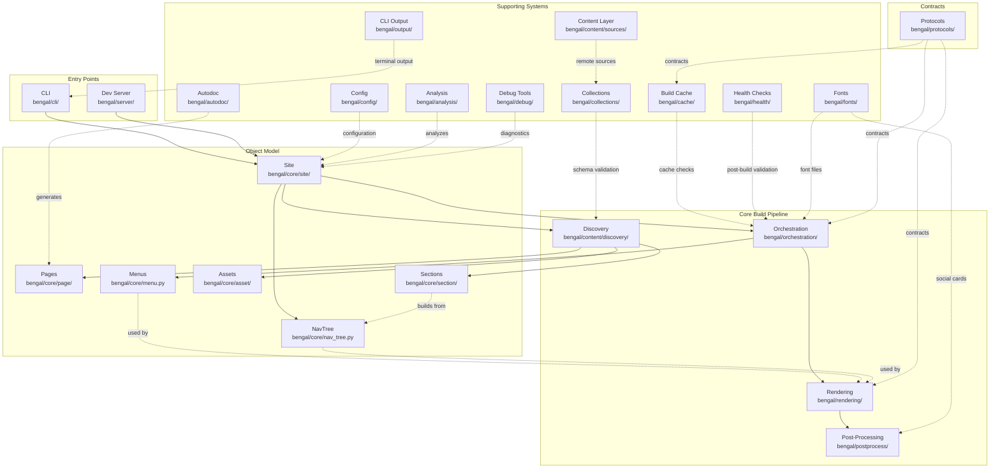

# Architecture Overview

Bengal is organized as a set of small subsystems with clear boundaries. Use this section to orient yourself and then jump to the specific subsystem you are changing.

## How to use this section

- Start with the overview diagram on this page.
- Use the cards to jump to a subsystem.
- Prefer subsystem pages over repeating context here.

:::{child-cards}
:columns: 2
:include: sections
:fields: title, description, icon
:::

## High-Level Architecture

## Key Flows

| Flow | Path |
|------|------|
| **Build** | CLI → Site → Discovery → Orchestration → Rendering → Post-process |
| **Dev server** | Watch → Incremental rebuild → Serve output |
| **Template context** | Site + Page + NavTree → Rendering |

## Quick Links

| Topic | Page |
|-------|------|
| Data models (Site, Page, Section) | [Object Model](core/object-model/) |
| Build coordination | [Orchestration](core/orchestration/) |
| Markdown → HTML | [Rendering Pipeline](rendering/rendering/) |
| Interface contracts | [Protocol Layer](meta/protocols/) |
| Design guidelines | [Design Principles](design-principles/) |
