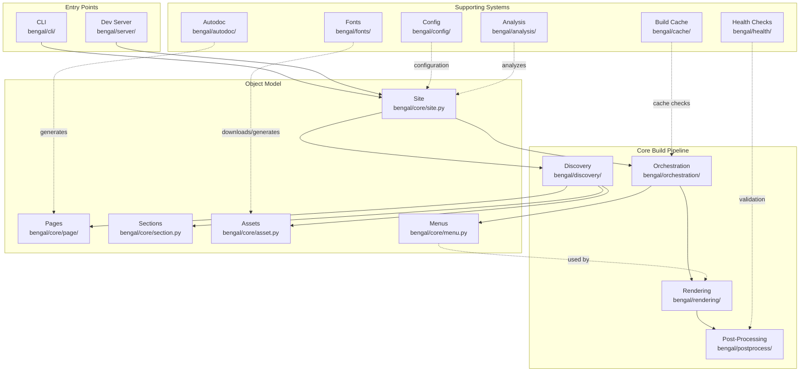

# Architecture Overview

Bengal SSG follows a modular architecture with clear separation of concerns to avoid "God objects" and maintain high performance even with large sites.

:::{child-cards}
:columns: 2
:include: sections
:fields: title, description, icon
:::

## High-Level Architecture

**Key Flows:**
1. **Build**: CLI → Site → Discovery → Orchestration → [Menus + Rendering] → Post-Process
2. **Menu Building**: Orchestration builds menus → Rendering uses menus in templates
3. **Cache**: Build Cache checks file changes and dependencies before rebuilding
4. **Autodoc**: Generate Python/CLI docs → treated as regular content pages
5. **Dev Server**: Watch files → trigger incremental rebuilds → serve output
