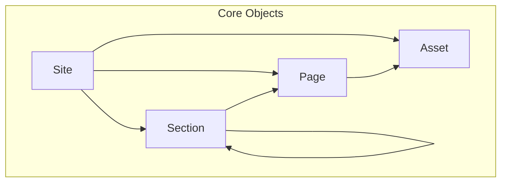

# Core Architecture

The brain of Bengal — foundational data models and build coordination.

## Data Model Overview

## Key Components

| Component | Responsibility | Module |
|-----------|----------------|--------|
| **Site** | Central container, holds all content | `bengal/core/site.py` |
| **Page** | Single content page with metadata | `bengal/core/page/` |
| **Section** | Directory container, holds children | `bengal/core/section.py` |
| **Asset** | Static file with processing metadata | `bengal/core/asset/` |

## Design Principles

- **No God Objects**: Each class has single responsibility
- **Passive Core**: Data models don't perform I/O
- **Composition over Inheritance**: BuildContext passes services
- **Immutable Where Possible**: Minimize side effects

:::{seealso}
- [Design Principles](../design-principles/) — Full architectural guidelines
- [Orchestration](orchestration/) — How builds are coordinated
:::
