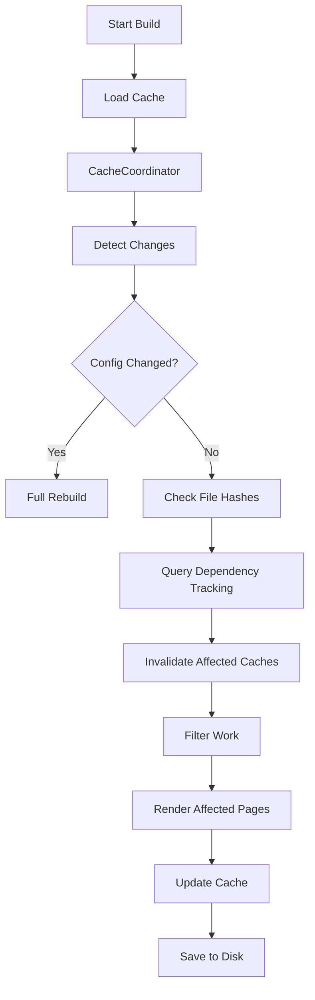
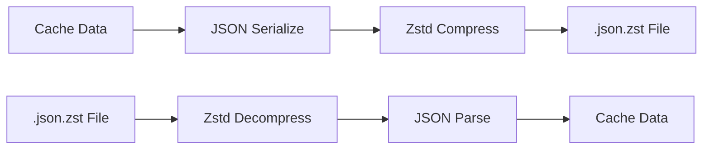

# Cache System

Bengal implements an intelligent caching system that enables sub-second incremental rebuilds.

## How It Works

The build cache (`.bengal/cache.json.zst`) tracks the state of your project to determine exactly what needs to be rebuilt. Cache files are compressed with **Zstandard** for 92-93% size reduction.



## Caching Strategies

:::{tab-set}
:::{tab-item} File Hashing
**Change Detection**

We use **SHA256** hashing to detect file changes.
- Content files (`.md`)
- Templates (`.html`, `.jinja2`)
- Config files (`.toml`)
- Assets (`.css`, `.js`)
:::

:::{tab-item} Dependency Tracking
**Impact Analysis**

We track relationships to know what to rebuild.
- **Page → Template**: If `post.html` changes, rebuild all blog posts.
- **Tag → Pages**: If `python` tag changes, rebuild `tags/python/` page.
- **Page → Partial**: If `header.html` changes, rebuild everything.
:::

:::{tab-item} Inverted Index
**Taxonomy Lookup**

We store an inverted index of tags to avoid parsing all pages.
- **Stored**: `tag_to_pages['python'] = ['post1.md', 'post2.md']`
- **Benefit**: O(1) lookup for taxonomy page generation.
:::
:::

## Cache Invalidation Architecture

Bengal uses a unified **CacheCoordinator** to manage page-level cache invalidation across all cache layers. This ensures consistent invalidation cascades and provides observability into why pages are rebuilt.

### Components

| Component | Module | Purpose |
|-----------|--------|---------|
| **CacheCoordinator** | `bengal/orchestration/build/coordinator.py` | Central service for coordinated cache invalidation |
| **PathRegistry** | `bengal/cache/path_registry.py` | Canonical path representation for consistent cache keys |
| **RebuildManifest** | `bengal/cache/manifest.py` | Tracks rebuilds with reasons and timing |

### Page Invalidation Reasons

When a page's caches are invalidated, the coordinator records **why**:

```python
class PageInvalidationReason(Enum):
    CONTENT_CHANGED = auto()      # Page content modified
    DATA_FILE_CHANGED = auto()    # Data file dependency changed
    TEMPLATE_CHANGED = auto()     # Template dependency changed
    TAXONOMY_CASCADE = auto()     # Tag/category member changed
    ASSET_CHANGED = auto()        # Asset dependency changed
    CONFIG_CHANGED = auto()       # Site config changed
    MANUAL = auto()               # Explicit invalidation
    FULL_BUILD = auto()           # Full rebuild requested
    OUTPUT_MISSING = auto()       # Output file doesn't exist
```

### Cache Layers

The coordinator invalidates multiple cache layers per page:

1. **Fingerprint** (`file_fingerprints`) — File hash for change detection
2. **Parsed Content** (`parsed_content`) — Markdown parsing results
3. **Rendered Output** (`rendered_output`) — Final HTML output

```python
# Example: Data file change triggers cascade
events = coordinator.invalidate_for_data_file(Path("data/team.yaml"))
# Returns list of InvalidationEvent for each affected page
```

### Invalidation Events

Each invalidation is recorded as an `InvalidationEvent`:

```python
@dataclass
class InvalidationEvent:
    page_path: Path              # Which page was invalidated
    reason: PageInvalidationReason  # Why it was invalidated
    trigger: str                 # What triggered it (e.g., "data/team.yaml")
    caches_cleared: list[str]   # Which cache layers were cleared
```

### Integration Points

The coordinator integrates with existing change detectors:

| Detector | Uses |
|----------|------|
| `DataChangeDetector` | `coordinator.invalidate_for_data_file()` |
| `TaxonomyCascadeDetector` | `coordinator.invalidate_taxonomy_cascade()` |
| `phase_update_pages_list` | `coordinator.invalidate_page()` |

### PathRegistry

The `PathRegistry` ensures consistent path representation across cache layers:

```python
registry = PathRegistry(site)

# Get canonical source path (relative to content dir)
canonical = registry.canonical_source(page)  # e.g., "blog/post.md"

# Get cache key for consistent lookups
key = registry.cache_key(page)  # Used as dict key in all caches

# Check if a path is for generated content
is_gen = registry.is_generated(path)  # True for taxonomy pages, autodoc, etc.
```

This prevents cache key mismatches between different parts of the build (e.g., absolute vs relative paths, content vs generated pages).

## Provenance-Based Builds

Incremental decisions are backed by **provenance tracking** in `bengal/build/provenance/`.
Instead of relying on ad-hoc flags, the provenance store tracks content-addressed
inputs and outputs so the detection pipeline can quickly prove what is fresh and
what must be rebuilt.

## Zstandard Compression

Bengal uses **Zstandard (zstd)** compression for all cache files, leveraging Python 3.14's new `compression.zstd` module (PEP 784).

### Performance Benefits

| Metric | Before | After | Improvement |
|--------|--------|-------|-------------|
| Cache size (773 pages) | 1.64 MB | 99 KB | **94% smaller** |
| Compression ratio | 1x | 12-14x | **12-14x** |
| Cache load time | ~5ms | ~0.5ms | **10x faster** |
| Cache save time | ~3ms | ~1ms | **3x faster** |

### How It Works



### File Format

Cache files are stored as JSON and transparently compressed/decompressed:

```tree
.bengal/
├── cache.json.zst           # Main build cache (compressed)
├── page_metadata.json.zst   # Page discovery cache (compressed)
├── asset_deps.json.zst     # Asset dependency map (compressed)
├── taxonomy_index.json.zst  # Tag/category index (compressed)
├── build_history.json       # Build history for delta analysis
├── server.pid               # Dev server PID
├── asset-manifest.json      # Asset manifest
├── indexes/                 # Query indexes (section, author, etc.)
├── templates/               # Jinja bytecode cache
├── content_cache/           # Remote content cache
├── logs/                    # Build/serve logs
├── metrics/                 # Performance metrics
├── profiles/                # Profiling output
├── themes/                  # Theme state (swizzle registry)
│   └── sources.json
├── js_bundle/               # JS bundle temporary files
├── pipeline_out/            # Asset pipeline temporary output
└── generated/               # Generated content (auto-pages, etc.)
```

All cache files (`cache.json.zst`, `page_metadata.json.zst`, `asset_deps.json.zst`, `taxonomy_index.json.zst`) are compressed with Zstandard for optimal performance. This provides 92-93% size reduction and 10x faster I/O compared to uncompressed JSON.

### Backward Compatibility

Bengal automatically handles migration:

1. **Read**: Tries `.json.zst` first, falls back to `.json`
2. **Write**: Always writes compressed `.json.zst`
3. **Migration**: Old uncompressed caches are read and re-saved as compressed

This means existing projects upgrade seamlessly—no manual migration needed.

### CI/CD Benefits

Compressed caches significantly improve CI/CD workflows:

```yaml
# GitHub Actions - cache is 16x smaller to transfer
- uses: actions/cache@v4
  with:
    path: .bengal/
    key: bengal-${{ hashFiles('content/**') }}
```

- **Faster cache upload/download** (100KB vs 1.6MB)
- **Lower storage costs**
- **Faster build times** in CI pipelines

## The "No Object References" Rule

:::{card} Architecture Principle
**Never persist object references across builds.**
:::

The cache **only** stores:
1.  File paths (strings)
2.  Hashes (strings)
3.  Simple metadata (dicts/lists)

This ensures cache stability. When a build starts, we load the cache and **reconstruct** the relationships with fresh live objects.

## Cacheable Protocol

Bengal uses a `Cacheable` protocol to enforce type-safe cache contracts across all cacheable types. This ensures consistent serialization, prevents cache bugs, and enables compile-time validation.

### Protocol Definition

```python
@runtime_checkable
class Cacheable(Protocol):
    """Protocol for types that can be cached to disk."""

    def to_cache_dict(self) -> dict[str, Any]:
        """Return JSON-serializable data only."""
        ...

    @classmethod
    def from_cache_dict(cls, data: dict[str, Any]) -> Cacheable:
        """Reconstruct object from data."""
        ...
```

### Contract Requirements

1. **JSON Primitives Only**: `to_cache_dict()` must return only JSON-serializable types (str, int, float, bool, None, list, dict)
2. **Type Conversion**: Complex types must be converted:
   - `datetime` → ISO-8601 string (via `datetime.isoformat()`)
   - `Path` → str (via `str(path)`)
   - `set` → sorted list (for stability)
3. **No Object References**: Never serialize live objects (Page, Section, Asset). Use stable identifiers (usually string paths) instead.
4. **Round-trip Invariant**: `T.from_cache_dict(obj.to_cache_dict())` must reconstruct an equivalent object (== by fields)
5. **Stable Keys**: Field names in `to_cache_dict()` are the contract. Adding/removing fields requires version bump in cache file.

### Types Implementing Cacheable

| Type | Location | Purpose |
|------|----------|---------|
| `PageCore` | `bengal/core/page/page_core.py` | Cacheable page metadata (title, date, tags, etc.) |
| `TagEntry` | `bengal/cache/taxonomy_index.py` | Taxonomy index entries |
| `IndexEntry` | `bengal/cache/query_index.py` | Query index entries |
| `AssetDependencyEntry` | `bengal/cache/asset_dependency_map.py` | Asset dependency tracking |

### Example Implementation

The following shows a simplified `PageCore` (the actual implementation has 14+ fields):

```python
@dataclass
class PageCore(Cacheable):
    source_path: str
    title: str
    date: datetime | None = None
    tags: list[str] = field(default_factory=list)

    def to_cache_dict(self) -> dict[str, Any]:
        """Serialize PageCore to cache-friendly dictionary."""
        return {
            "source_path": self.source_path,
            "title": self.title,
            "date": self.date.isoformat() if self.date else None,
            "tags": self.tags,
        }

    @classmethod
    def from_cache_dict(cls, data: dict[str, Any]) -> PageCore:
        """Deserialize PageCore from cache dictionary."""
        return cls(
            source_path=data["source_path"],
            title=data["title"],
            date=datetime.fromisoformat(data["date"]) if data.get("date") else None,
            tags=data.get("tags", []),
        )
```

See `bengal/core/page/page_core.py` for the full implementation.

### Generic CacheStore Helper

Bengal provides a generic `CacheStore` helper for type-safe cache operations:

```python
from bengal.cache.cache_store import CacheStore

# Type-safe cache operations
store = CacheStore[PageCore](cache_path)
store.save([page1.core, page2.core])  # List of Cacheable objects
entries = store.load()  # Returns list[PageCore]
```

### Benefits

- **Type Safety**: Static type checkers (mypy) validate cache contracts at compile time
- **Consistency**: All cache entries follow the same serialization pattern
- **Versioning**: Built-in version checking for cache invalidation
- **Safety**: Prevents accidental pickling of complex objects that might break across versions
- **Performance**: Protocol has zero runtime overhead (structural typing)

### PageCore Serialization

With PageCore, cache serialization is type-safe via the Cacheable protocol:

```python
# Before: Manual field mapping (error-prone)
cache_data = {
    "source_path": str(page.source_path),
    "title": page.title,
    "date": page.date.isoformat() if page.date else None,
    # ... 10+ more fields
}

# After: Use to_cache_dict() for correct serialization
cache_data = page.core.to_cache_dict()  # datetime → ISO-8601, all types handled

# Round-trip example
loaded = PageCore.from_cache_dict(cache_data)
assert loaded.title == page.core.title
```

:::{note}
Don't use `asdict(page.core)` directly—it won't convert `datetime` to ISO-8601 strings. Always use `to_cache_dict()` for correct serialization.
:::

### Runtime Validation

The `@runtime_checkable` decorator allows `isinstance()` checks:

```python
from bengal.protocols import Cacheable

if isinstance(obj, Cacheable):
    data = obj.to_cache_dict()
    # Safe to serialize
```

However, static type checking via mypy is the primary validation method.
