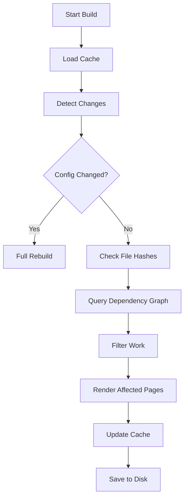

# Cache System

Bengal implements an intelligent caching system that enables sub-second incremental rebuilds.

## How It Works

The build cache (`.bengal/cache.json.zst`) tracks the state of your project to determine exactly what needs to be rebuilt. Cache files are compressed with **Zstandard** for 92-93% size reduction.



## Caching Strategies

:::{tab-set}
:::{tab-item} File Hashing
**Change Detection**

We use **SHA256** hashing to detect file changes.
- Content files (`.md`)
- Templates (`.html`, `.jinja2`)
- Config files (`.toml`)
- Assets (`.css`, `.js`)
:::

:::{tab-item} Dependency Graph
**Impact Analysis**

We track relationships to know what to rebuild.
- **Page → Template**: If `post.html` changes, rebuild all blog posts.
- **Tag → Pages**: If `python` tag changes, rebuild `tags/python/` page.
- **Page → Partial**: If `header.html` changes, rebuild everything.
:::

:::{tab-item} Inverted Index
**Taxonomy Lookup**

We store an inverted index of tags to avoid parsing all pages.
- **Stored**: `tag_to_pages['python'] = ['post1.md', 'post2.md']`
- **Benefit**: O(1) lookup for taxonomy page generation.
:::
:::{/tab-set}

## Zstandard Compression

Bengal uses **Zstandard (zstd)** compression for all cache files, leveraging Python 3.14's new `compression.zstd` module (PEP 784).

### Performance Benefits

| Metric | Before | After | Improvement |
|--------|--------|-------|-------------|
| Cache size (773 pages) | 1.64 MB | 99 KB | **94% smaller** |
| Compression ratio | 1x | 12-14x | **12-14x** |
| Cache load time | ~5ms | ~0.5ms | **10x faster** |
| Cache save time | ~3ms | ~1ms | **3x faster** |

### How It Works


### File Format

Cache files are stored as JSON and transparently compressed/decompressed:

```
.bengal/
├── cache.json.zst           # Main build cache (compressed)
├── page_metadata.json       # Page discovery cache
├── asset_deps.json          # Asset dependency map
├── taxonomy_index.json      # Tag/category index
├── build_history.json       # Build history for delta analysis
├── server.pid               # Dev server PID
├── asset-manifest.json      # Asset manifest
├── indexes/                 # Query indexes (section, author, etc.)
├── templates/               # Jinja bytecode cache
├── content_cache/           # Remote content cache
├── logs/                    # Build/serve logs
├── metrics/                 # Performance metrics
├── profiles/                # Profiling output
├── themes/                  # Theme state (swizzle registry)
│   └── sources.json
├── js_bundle/               # JS bundle temporary files
├── pipeline_out/            # Asset pipeline temporary output
└── generated/               # Generated content (auto-pages, etc.)
```

The main build cache (`cache.json.zst`) is always compressed with Zstandard for optimal performance. Other cache files remain uncompressed JSON for easier debugging and external tool integration.

### Backward Compatibility

Bengal automatically handles migration:

1. **Read**: Tries `.json.zst` first, falls back to `.json`
2. **Write**: Always writes compressed `.json.zst`
3. **Migration**: Old uncompressed caches are read and re-saved as compressed

This means existing projects upgrade seamlessly—no manual migration needed.

### CI/CD Benefits

Compressed caches significantly improve CI/CD workflows:

```yaml
# GitHub Actions - cache is 16x smaller to transfer
- uses: actions/cache@v4
  with:
    path: .bengal/
    key: bengal-${{ hashFiles('content/**') }}
```

- **Faster cache upload/download** (100KB vs 1.6MB)
- **Lower storage costs**
- **Faster build times** in CI pipelines

## The "No Object References" Rule

:::{card} Architecture Principle
**Never persist object references across builds.**
:::

The cache **only** stores:
1.  File paths (strings)
2.  Hashes (strings)
3.  Simple metadata (dicts/lists)

This ensures cache stability. When a build starts, we load the cache and **reconstruct** the relationships with fresh live objects.

## Cacheable Protocol

Bengal uses a `Cacheable` protocol to enforce type-safe cache contracts across all cacheable types. This ensures consistent serialization, prevents cache bugs, and enables compile-time validation.

### Protocol Definition

```python
@runtime_checkable
class Cacheable(Protocol):
    """Protocol for types that can be cached to disk."""

    def to_cache_dict(self) -> dict[str, Any]:
        """Return JSON-serializable data only."""
        ...

    @classmethod
    def from_cache_dict(cls, data: dict[str, Any]) -> Cacheable:
        """Reconstruct object from data."""
        ...
```

### Contract Requirements

1. **JSON Primitives Only**: `to_cache_dict()` must return only JSON-serializable types (str, int, float, bool, None, list, dict)
2. **Type Conversion**: Complex types must be converted:
   - `datetime` → ISO-8601 string (via `datetime.isoformat()`)
   - `Path` → str (via `str(path)`)
   - `set` → sorted list (for stability)
3. **No Object References**: Never serialize live objects (Page, Section, Asset). Use stable identifiers (usually string paths) instead.
4. **Round-trip Invariant**: `T.from_cache_dict(obj.to_cache_dict())` must reconstruct an equivalent object (== by fields)
5. **Stable Keys**: Field names in `to_cache_dict()` are the contract. Adding/removing fields requires version bump in cache file.

### Types Implementing Cacheable

| Type | Location | Purpose |
|------|----------|---------|
| `PageCore` | `bengal/core/page/page_core.py` | Cacheable page metadata (title, date, tags, etc.) |
| `TagEntry` | `bengal/cache/taxonomy_index.py` | Taxonomy index entries |
| `IndexEntry` | `bengal/cache/query_index.py` | Query index entries |
| `AssetDependencyEntry` | `bengal/cache/asset_dependency_map.py` | Asset dependency tracking |

### Example Implementation

```python
@dataclass
class PageCore(Cacheable):
    source_path: str
    title: str
    date: datetime | None = None
    tags: list[str] = field(default_factory=list)

    def to_cache_dict(self) -> dict[str, Any]:
        """Serialize PageCore to cache-friendly dictionary."""
        return {
            "source_path": self.source_path,
            "title": self.title,
            "date": self.date.isoformat() if self.date else None,
            "tags": self.tags,
        }

    @classmethod
    def from_cache_dict(cls, data: dict[str, Any]) -> PageCore:
        """Deserialize PageCore from cache dictionary."""
        return cls(
            source_path=data["source_path"],
            title=data["title"],
            date=datetime.fromisoformat(data["date"]) if data.get("date") else None,
            tags=data.get("tags", []),
        )
```

### Generic CacheStore Helper

Bengal provides a generic `CacheStore` helper for type-safe cache operations:

```python
from bengal.cache.cache_store import CacheStore

# Type-safe cache operations
store = CacheStore[PageCore](cache_path)
store.save([page1.core, page2.core])  # List of Cacheable objects
entries = store.load()  # Returns list[PageCore]
```

### Benefits

- **Type Safety**: Static type checkers (mypy) validate cache contracts at compile time
- **Consistency**: All cache entries follow the same serialization pattern
- **Versioning**: Built-in version checking for cache invalidation
- **Safety**: Prevents accidental pickling of complex objects that might break across versions
- **Performance**: Protocol has zero runtime overhead (structural typing)

### PageCore Serialization

With PageCore, cache serialization is simplified:

```python
# Before: Manual field mapping (error-prone)
cache_data = {
    "source_path": str(page.source_path),
    "title": page.title,
    "date": page.date.isoformat() if page.date else None,
    # ... 10+ more fields
}

# After: Single line using PageCore
from dataclasses import asdict
cache_data = asdict(page.core)  # All cacheable fields serialized
```

### Runtime Validation

The `@runtime_checkable` decorator allows `isinstance()` checks:

```python
from bengal.cache.cacheable import Cacheable

if isinstance(obj, Cacheable):
    data = obj.to_cache_dict()
    # Safe to serialize
```

However, static type checking via mypy is the primary validation method.

Refer to `bengal/cache/cacheable.py` for the protocol definition and examples.
