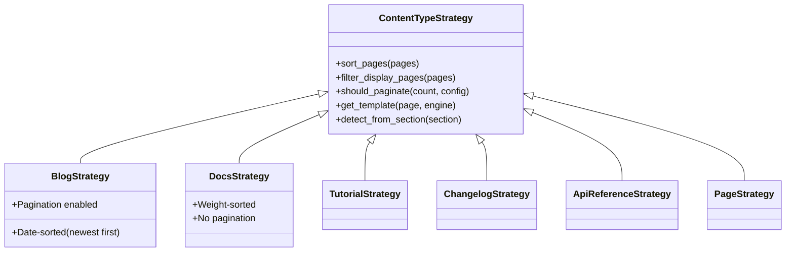

# Content Type Strategies

Bengal uses a **Strategy Pattern** to handle different content types (blog, docs, tutorials, etc.) with type-specific behavior for sorting, templates, and pagination.

## Architecture



## Built-in Strategies

::::{cards}
:columns: 2
:gap: medium
:variant: info

:::{card} Blog
:icon: book-open
**For chronological content.**
- Sort: Newest first (by date)
- Pagination: Enabled
- Detection: Section named `blog`, `posts`, `news`
- Templates: `blog/list.html`, `blog/single.html`
:::

:::{card} Documentation
:icon: file-text
**For structured knowledge bases.**
- Sort: By `weight`, then title
- Pagination: Disabled
- Detection: Section named `docs`, `documentation`, `guides`
- Templates: `doc/list.html`, `doc/single.html`
:::

:::{card} Tutorial
:icon: graduation-cap
**For step-by-step guides.**
- Sort: By `weight` (sequential order)
- Pagination: Disabled
- Detection: Section named `tutorials`, `guides`, `how-to`
- Templates: `tutorial/list.html`
:::

:::{card} Changelog
:icon: clock
**For release notes.**
- Sort: Newest first (by date)
- Pagination: Disabled
- Detection: Section named `changelog`, `releases`
- Templates: `changelog/list.html`
:::

:::{card} API Reference
:icon: code
**For autodoc content.**
- Sort: Alphabetical (discovery order)
- Pagination: Disabled
- Detection: Section named `api`, `reference`
- Templates: `autodoc/python/list.html`
:::

:::{card} Page (Default)
:icon: file
**Generic fallback strategy.**
- Sort: By `weight`, then title
- Pagination: Disabled
- Templates: `index.html`
:::
::::

## Setting Content Types

Content types are set in section `_index.md` frontmatter:

```yaml
---
title: Blog
content_type: blog
---
```

Available types: `blog`, `doc`, `tutorial`, `changelog`, `api-reference`, `cli-reference`, `track`, `page`

## Auto-Detection

If no `content_type` is specified, Bengal auto-detects based on:

1. **Section name patterns** (e.g., `blog/` → BlogStrategy)
2. **Page metadata** (e.g., >60% pages with dates → BlogStrategy)

## Custom Strategies

Create custom strategies by subclassing `ContentTypeStrategy`:

```python
from bengal.content_types.base import ContentTypeStrategy

class NewsStrategy(ContentTypeStrategy):
    """Custom strategy for news articles."""

    default_template = "news/list.html"
    allows_pagination = True

    def sort_pages(self, pages):
        """Sort by date, newest first."""
        from datetime import datetime
        return sorted(
            pages,
            key=lambda p: p.date or datetime.min,
            reverse=True
        )

    def detect_from_section(self, section):
        """Auto-detect news sections."""
        return section.name.lower() in ("news", "announcements")
```

Register in your site's Python configuration:

```python
from bengal.content_types.registry import ContentTypeRegistry

ContentTypeRegistry.register("news", NewsStrategy)
```

## Strategy Methods

| Method | Purpose | Default Behavior |
|--------|---------|------------------|
| `sort_pages(pages)` | Order pages in list views | Weight → title |
| `filter_display_pages(pages, index)` | Filter pages for display | Exclude `_index.md` |
| `should_paginate(count, config)` | Enable pagination | Check `allows_pagination` + threshold |
| `get_template(page, engine)` | Resolve template | Type-prefixed cascade |
| `detect_from_section(section)` | Auto-detect content type | Returns `False` |

:::{seealso}
- [ContentTypeStrategy source](https://github.com/bengal-ssg/bengal/blob/main/bengal/content_types/base.py)
- [Built-in strategies](https://github.com/bengal-ssg/bengal/blob/main/bengal/content_types/strategies.py)
:::
