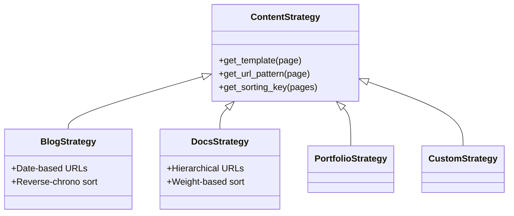

# Content Types System

Bengal uses a **Strategy Pattern** to handle different types of content (Blog, Docs, Portfolio) without hardcoding logic.

## Architecture



## Built-in Strategies

::::{cards}
:columns: 2
:gap: medium
:variant: info

:::{card} Blog
:icon: book-open
**For chronological content.**
- URLs: `/2025/10/slug/`
- Sort: Newest first
- Archives: Date-based
- RSS: Full feed
:::

:::{card} Documentation
:icon: file-text
**For knowledge bases.**
- URLs: `/section/page/`
- Sort: Manual (`weight`)
- Features: Breadcrumbs, TOC
- Sidebar: Tree navigation
:::

:::{card} Portfolio
:icon: grid
**For visual showcases.**
- URLs: `/projects/slug/`
- Sort: Featured first
- Layout: Grid/Masonry
:::

:::{card} Landing
:icon: layout
**For marketing pages.**
- URLs: `/` (Single page)
- Layout: Section-based
:::
::::

## Custom Strategies

You can define your own strategy by subclassing `ContentStrategy`.

```python
class MyStrategy(ContentStrategy):
    def get_template(self, page):
        return "custom.html"

    def get_url_pattern(self, page):
        return "custom/{slug}/"
```

Register it in `bengal.toml`:

```toml
[content_type]
strategy = "custom"
```

## Configuration

Strategies are configured globally but can be overridden per-section.

```toml
[content_type]
default_strategy = "blog"

[content_type.overrides]
"/docs/" = "docs"
"/projects/" = "portfolio"
```
