## Complete Build Pipeline (from build.py)

```mermaid
flowchart TD
    Start([BUILD START]) --> P0_5

    subgraph P0_5 [Phase 0.5: FONT PROCESSING]
        direction TB
        P0_5_Proc["Download Google Fonts<br/>Generate CSS (if configured)"]
    end

    P0_5 --> P1

    subgraph P1 [Phase 1: CONTENT DISCOVERY]
        direction TB
        P1_In["content/ (Markdown files)"] --> P1_Disc[ContentDiscovery.discover]
        P1_Disc --> P1_Out["Page Objects (frontmatter + raw)<br/>Section Objects (structure)"]
    end

    P1 --> P1_25

    subgraph P1_25 [Phase 1.25: CACHE DISCOVERY METADATA]
        direction TB
        P1_25_Proc["Save page metadata to cache<br/>Enable lazy loading"]
    end

    P1_25 --> P1_5

    subgraph P1_5 [Phase 1.5: CLEANUP DELETED FILES]
        direction TB
        P1_5_Proc["Remove output files<br/>for deleted sources"]
    end

    P1_5 --> P2

    subgraph P2 [Phase 2: INCREMENTAL FILTERING]
        direction TB
        P2_Proc["Detect changed files (SHA256)<br/>Filter pages/assets to rebuild<br/>Early optimization"]
    end

    P2 --> P3

    subgraph P3 [Phase 3: SECTION FINALIZATION]
        direction TB
        P3_Proc["Ensure sections have index pages<br/>Validate section structure"]
    end

    P3 --> P4

    subgraph P4 [Phase 4: TAXONOMIES]
        direction TB
        P4_Proc["Collect tags/categories<br/>Generate taxonomy pages<br/>Incremental-aware"]
    end

    P4 --> P4_5

    subgraph P4_5 [Phase 4.5: SAVE TAXONOMY INDEX]
        direction TB
        P4_5_Proc["Persist tag-to-pages mapping<br/>to cache"]
    end

    P4_5 --> P5

    subgraph P5 [Phase 5: MENUS]
        direction TB
        P5_Proc["Build navigation structure<br/>From config + frontmatter<br/>Incremental-aware"]
    end

    P5 --> P5_5

    subgraph P5_5 [Phase 5.5: RELATED POSTS & QUERY INDEXES]
        direction TB
        P5_5_Proc["Pre-compute related posts<br/>Build query indexes<br/>O(1) template access"]
    end

    P5_5 --> P6

    subgraph P6 [Phase 6: UPDATE FILTERED PAGES]
        direction TB
        P6_Proc["Add generated taxonomy pages<br/>to rebuild set"]
    end

    P6 --> P7

    subgraph P7 [Phase 7: PROCESS ASSETS]
        direction TB
        P7_In["assets/ (CSS, JS, images)"] --> P7_Disc[AssetDiscovery.discover]
        P7_Disc --> P7_Objs[Asset Objects]
        P7_Objs --> P7_Proc["Minify (CSS/JS)<br/>Optimize (images)<br/>Hash fingerprint<br/>Copy to output/"]
    end

    P7 --> P8

    subgraph P8 [Phase 8: RENDERING]
        direction TB
        P8_In[Page Object] --> P8_Pipe[RenderingPipeline.process_page]

        subgraph P8_S1 [1. Markdown Parsing]
            P8_S1_Proc["parse_with_toc_and_context<br/>Variable substitution<br/>Output: HTML + TOC"]
        end

        subgraph P8_S2 [2. Post-processing]
            P8_S2_Proc["API doc enhancement<br/>Link extraction"]
        end

        subgraph P8_S3 [3. Template Application]
            P8_S3_Proc["Jinja2 TemplateEngine<br/>Inject content into layout<br/>Output: Complete HTML"]
        end

        P8_Pipe --> P8_S1
        P8_S1 --> P8_S2
        P8_S2 --> P8_S3
        P8_S3 --> P8_Out[Write to output/]
    end

    P8 --> P8_4

    subgraph P8_4 [Phase 8.4: UPDATE SITE PAGES]
        direction TB
        P8_4_Proc["Replace PageProxy with Page<br/>Fresh content for post-processing"]
    end

    P8_4 --> P8_5

    subgraph P8_5 [Phase 8.5: TRACK ASSET DEPENDENCIES]
        direction TB
        P8_5_Proc["Extract asset references<br/>Cache page-to-assets mapping"]
    end

    P8_5 --> P9

    subgraph P9 [Phase 9: POST-PROCESSING]
        direction TB
        P9_Proc["Generate sitemap.xml<br/>Generate RSS feed<br/>Validate links"]
    end

    P9 --> P9_Cache

    subgraph P9_Cache [Phase 9: UPDATE CACHE]
        direction TB
        P9_Cache_Proc["Save build cache<br/>Update dependency graph<br/>Persist for next build"]
    end

    P9_Cache --> P10

    subgraph P10 [Phase 10: HEALTH CHECK]
        direction TB
        P10_Proc["Run validators<br/>Generate health report<br/>Profile-filtered"]
    end

    P10 --> End([BUILD COMPLETE])
```

### Phase Notes

**Sub-Phases**: Some phases have decimal numbering (0.5, 1.25, 1.5, 4.5, 5.5, 8.4, 8.5) to indicate they are sub-steps or optimizations within the main phase flow.

**Incremental Optimization**: Phase 2 (Incremental Filtering) runs **early** (before taxonomies/menus) to minimize work. This is a key optimization that filters the build set before expensive operations.

**Asset-Rendering Order**: Assets are processed **before** rendering (Phase 7 → Phase 8) so that `asset_url()` template functions can resolve fingerprinted asset paths during rendering.

**Cache Phases**: Multiple cache-related sub-phases (1.25, 4.5, 8.5, 9) persist metadata throughout the build for efficient incremental rebuilds.
