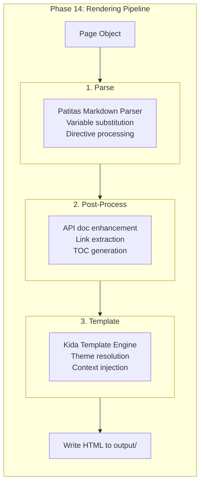

## Complete Build Pipeline

The build executes **21 phases** in sequence, organized into four modules: `initialization.py`, `content.py`, `rendering.py`, and `finalization.py`.

```mermaid
flowchart TD
    Start([BUILD START]) --> Init

    subgraph Init [INITIALIZATION - Phases 1-5]
        direction TB
        P1["Phase 1: Font Processing<br/>Download Google Fonts, generate CSS"]
        P1 --> P1_5["Phase 1.5: Template Validation<br/>Optional strict mode check"]
        P1_5 --> P2["Phase 2: Content Discovery<br/>Scan content/, create Page/Section objects"]
        P2 --> P3["Phase 3: Cache Discovery Metadata<br/>Save page metadata for lazy loading"]
        P3 --> P4["Phase 4: Config Check<br/>Detect config changes, cleanup deleted files"]
        P4 --> P5["Phase 5: Incremental Filtering<br/>SHA256 change detection, filter rebuild set"]
    end

    Init --> Content

    subgraph Content [CONTENT PROCESSING - Phases 6-12]
        direction TB
        P6["Phase 6: Section Finalization<br/>Ensure index pages, validate hierarchy"]
        P6 --> P7["Phase 7: Taxonomies<br/>Collect tags/categories, generate pages"]
        P7 --> P8["Phase 8: Taxonomy Index<br/>Persist tag-to-pages mapping"]
        P8 --> P9["Phase 9: Menus<br/>Build navigation from config + frontmatter"]
        P9 --> P10["Phase 10: Related Posts<br/>Pre-compute for O(1) template access"]
        P10 --> P11["Phase 11: Query Indexes<br/>Build section, author, date indexes"]
        P11 --> P12["Phase 12: Update Pages List<br/>Add generated taxonomy pages"]
        P12 --> P12_5["Phase 12.5: URL Collision Detection<br/>Proactive validation"]
    end

    Content --> Render

    subgraph Render [RENDERING - Phases 13-16]
        direction TB
        P13["Phase 13: Asset Processing<br/>Minify, optimize, fingerprint assets"]
        P13 --> P14["Phase 14: Page Rendering<br/>Markdown → HTML → Templates"]
        P14 --> P15["Phase 15: Update Site Pages<br/>Replace PageProxy with rendered Page"]
        P15 --> P16["Phase 16: Track Asset Dependencies<br/>Cache page-to-assets mapping"]
    end

    Render --> Final

    subgraph Final [FINALIZATION - Phases 17-21]
        direction TB
        P17["Phase 17: Post-Processing<br/>Sitemap, RSS, link validation"]
        P17 --> P18["Phase 18: Save Cache<br/>Persist build cache for next build"]
        P18 --> P19["Phase 19: Collect Stats<br/>Build timing and metrics"]
        P19 --> P20["Phase 20: Health Check<br/>Run validators (profile-filtered)"]
        P20 --> P21["Phase 21: Finalize<br/>Cleanup, performance logging"]
    end

    Final --> End([BUILD COMPLETE])
```

## Rendering Pipeline Detail

## Key Architectural Points

**Early Incremental Filtering**: Phase 5 runs before content processing (phases 6-12) to minimize work. Changed files are detected via SHA256 hashing, and only affected pages flow through expensive operations.

**Asset-Before-Rendering**: Assets are processed in Phase 13 before page rendering in Phase 14. This ensures `asset_url()` template functions can resolve fingerprinted asset paths during rendering.

**Cache Persistence**: Multiple phases persist metadata to `.bengal/`:

- Phase 3: Page discovery metadata
- Phase 8: Taxonomy index
- Phase 16: Asset dependencies
- Phase 18: Full build cache

**Parallel Execution**: Phases 13 (assets) and 14 (rendering) support parallel processing with automatic thread pool management. Small sites run sequentially to avoid thread overhead (assets: ≥5 items, rendering: auto-detected).

**Profile-Aware Health Checks**: Phase 20 runs validators filtered by build profile (writer, theme-dev, developer). This enables fast feedback for content authors while providing comprehensive validation for developers.
