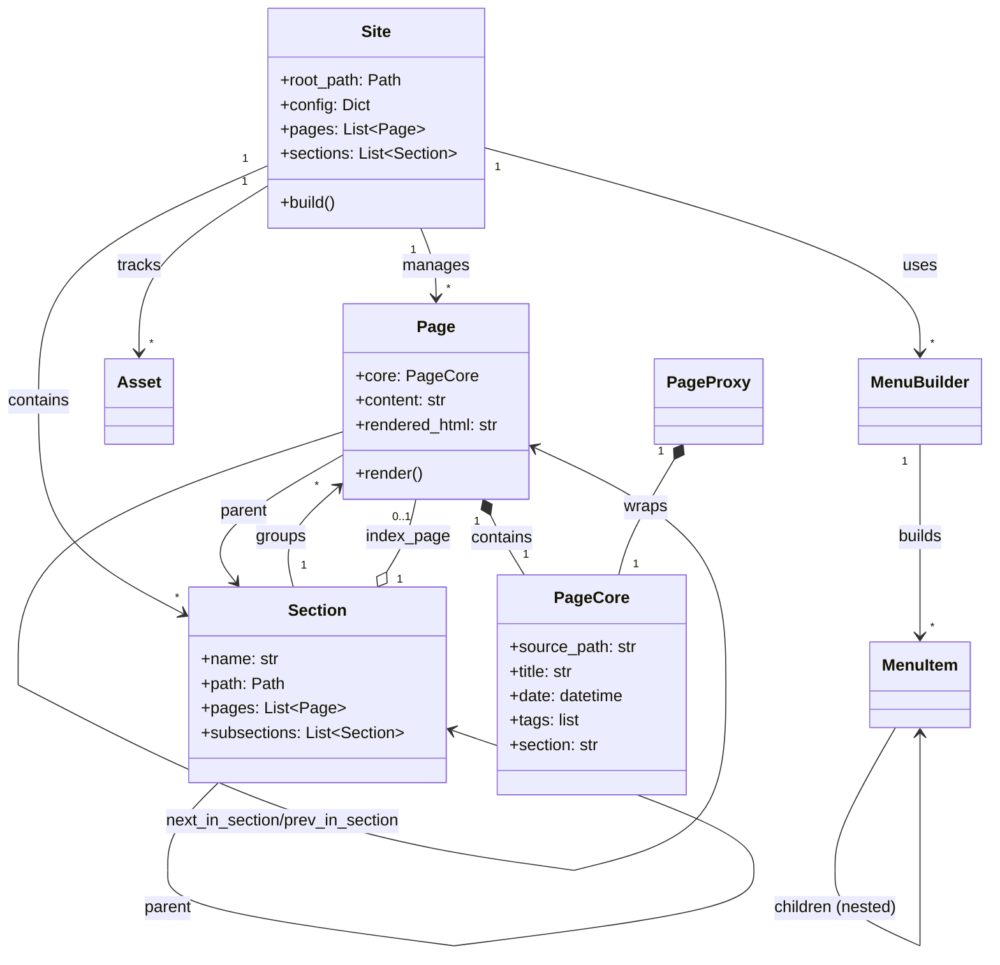

# Object Model

Bengal's object model provides a rich, hierarchical representation of site content with clear relationships and responsibilities.

## Core Objects

::::{tab-set}
:::{tab-item} Site
**Central Data Container** (`bengal/core/site.py`)

Holds all site content and delegates build coordination. It is a passive data container, not a "God object".

**Key Attributes:**
- `pages`: List of all Page objects
- `sections`: List of all Section objects
- `assets`: List of all Asset objects
- `config`: Configuration dictionary
- `menu`: Built navigation menus

**Key Methods:**
- `build()`: Delegates to `BuildOrchestrator`
- `discover_content()`: Delegates to `ContentOrchestrator`
:::

:::{tab-item} Page
**Content Unit** (`bengal/core/page/`)

Represents a single content page with source, metadata, rendered HTML, and navigation.

**Architecture:**
- **Composition Pattern**: `Page` contains a `PageCore` instance for cacheable metadata
- **Split into focused mixins**:
  - `page_core.py`: Cacheable metadata (title, date, tags, etc.)
  - `metadata.py`: Frontmatter parsing
  - `navigation.py`: Next/prev/parent links
  - `relationships.py`: Section membership
  - `computed.py`: URL generation, TOC
  - `operations.py`: Rendering logic

**PageCore Integration:**
- Cacheable fields (title, date, tags, slug) stored in `page.core`
- Property delegates provide direct access: `page.title` → `page.core.title`
- Enables type-safe caching and lazy loading via `PageProxy`
:::

:::{tab-item} Section
**Structural Unit** (`bengal/core/section.py`)

Represents folder-based grouping of pages with hierarchical organization.

**Features:**
- **Hierarchy**: Parent/child relationships (`subsections`)
- **Navigation**: Access to `regular_pages` and `sections`
- **Cascade**: Inheritance of frontmatter metadata to descendants
- **Path-based Registry**: O(1) lookup via `Site._section_registry` using normalized paths
- **Stable References**: Sections referenced by path strings (not object identity) for reliable incremental builds
:::

:::{tab-item} Asset
**Static Resource** (`bengal/core/asset.py`)

Handles static files (images, CSS, JS) with optimization.

**Capabilities:**
- Minification (CSS/JS)
- Image optimization
- Cache busting (fingerprinting)
- Output copying
:::

:::{tab-item} Menu
**Navigation Structure** (`bengal/core/menu.py`)

Provides hierarchical navigation menus built from config + frontmatter.

**Components:**
- `MenuItem`: Nested item with active state
- `MenuBuilder`: Constructs hierarchy and marks active items
:::
::::

## PageCore Architecture (Implemented in 0.1.4)

Bengal uses the **PageCore composition pattern** to enforce cache-proxy contract safety and enable fast incremental builds.

### The Problem It Solves

To enable incremental builds, we cache page metadata and lazy-load full content only when needed. Previously, this required manually keeping three representations in sync:
- `Page` (live object with full content)
- `PageMetadata` (cached metadata for navigation)
- `PageProxy` (lazy-loading wrapper)

**Risk**: Forgetting to update one representation caused cache bugs.

### The Solution: PageCore

`PageCore` is the **single source of truth** for all cacheable page metadata. Any field added to `PageCore` automatically becomes available in all three representations.

```python
@dataclass
class PageCore(Cacheable):
    """Cacheable page metadata shared between Page, PageMetadata, and PageProxy."""
    source_path: str  # String, not Path (JSON compatibility)
    title: str
    date: datetime | None = None
    tags: list[str] = field(default_factory=list)
    slug: str | None = None
    weight: int | None = None
    type: str | None = None
    section: str | None = None  # Path as string (stable reference)
    file_hash: str | None = None
```

### Architecture

```python
# Composition: Page contains PageCore
class Page:
    core: PageCore  # Cacheable metadata
    content: str    # Non-cacheable (requires parsing)
    rendered_html: str  # Build artifact

    @property
    def title(self) -> str:
        return self.core.title  # Property delegate

# Type alias: PageMetadata IS PageCore
PageMetadata = PageCore

# Wrapper: PageProxy wraps PageCore
class PageProxy:
    _core: PageCore  # Direct access, no lazy load needed

    @property
    def title(self) -> str:
        return self._core.title  # Direct from core
```

### Benefits

1. **Type Safety**: Compiler enforces all three representations stay in sync
2. **Simplified Caching**: `asdict(page.core)` serializes all cacheable fields
3. **Performance**: Core fields accessible without lazy loading
4. **Maintainability**: Adding new field requires only 3 changes (PageCore + 2 property delegates)

### Adding New Cacheable Fields

When adding a new cacheable field, update three locations:

1. **Add to PageCore** (`bengal/core/page/page_core.py`):
```python
@dataclass
class PageCore(Cacheable):
    # ... existing fields ...
    author: str | None = None  # NEW
```

2. **Add property delegate to Page** (`bengal/core/page/__init__.py`):
```python
@property
def author(self) -> str | None:
    return self.core.author
```

3. **Add property delegate to PageProxy** (`bengal/core/page/proxy.py`):
```python
@property
def author(self) -> str | None:
    return self._core.author
```

That's it! The field is now available in Page, PageMetadata, and PageProxy. The compiler will catch any missing implementations.

### What Goes in PageCore?

**✅ DO Include If:**
- Field comes from frontmatter (title, date, tags, slug, etc.)
- Field is computed without full content parsing (URL path components)
- Field needs to be accessible in templates without lazy loading
- Field is cascaded from section `_index.md` (type, layout, etc.)
- Field is used for navigation (section reference as path)

**❌ DO NOT Include If:**
- Field requires full content parsing (toc, excerpt, meta_description)
- Field is a build artifact (output_path, links, rendered_html)
- Field changes every build (timestamp, render_time)
- Field is computed from other non-cacheable fields

See: `bengal/core/page/page_core.py` for implementation details.

## Stable Section References

Bengal uses **path-based section references** instead of object identity for reliable incremental builds.

### Path-Based Registry

Sections are stored in a dictionary keyed by normalized paths:

```python
class Site:
    _section_registry: dict[Path, Section]  # O(1) lookup

    def get_section_by_path(self, path: Path | str) -> Section | None:
        normalized = self._normalize_section_path(path)
        return self._section_registry.get(normalized)  # O(1) lookup
```

### Benefits

- **Stable Across Rebuilds**: Path strings persist in cache, not object references
- **O(1) Lookup**: Dictionary lookup is constant time
- **Reliable Incremental Builds**: Sections can be renamed/moved without breaking references
- **Feature Flag**: `stable_section_references` config flag enables path-based tracking

### Implementation

- Sections stored as path strings in `PageCore.section` (not Section objects)
- Registry built during `Site.register_sections()`
- Dev server forces full rebuild on file create/delete/move to preserve relationships
- Performance regression tests validate no slowdown (`tests/integration/test_full_build_performance.py`)

See: `bengal/core/site.py` for implementation details.

## Object Model Relationships


