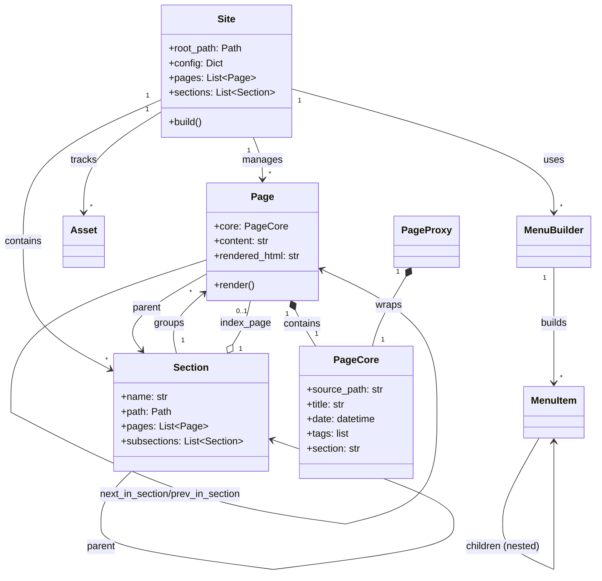

# Object Model

Bengal’s object model defines how `Site`, `Page`, `Section`, `Asset`, and `Menu` relate, and where cacheable metadata lives (`PageCore`).

## Read this first

- **If you want the object graph**: start with “Core Objects”, then “Object Model Relationships”.
- **If you want the cache contract**: start with “PageCore” (and refer to `bengal/core/page/page_core.py`).

## Core Objects

::::{tab-set}
:::{tab-item} Site
**Central data container** (`bengal/core/site/`)

Holds all site content and delegates build coordination to orchestrators.

**Key Attributes:**
- `pages`: List of all Page objects
- `sections`: List of all Section objects
- `assets`: List of all Asset objects
- `config`: Configuration dictionary
- `menu`: Built navigation menus

**Key Methods:**
- `build()`: Delegates to `BuildOrchestrator`
- `discover_content()`: Delegates to `ContentOrchestrator`
:::

:::{tab-item} Page
**Content Unit** (`bengal/core/page/`)

Represents a single content page with source, metadata, rendered HTML, and navigation.

**Architecture:**
- **Composition Pattern**: `Page` contains a `PageCore` instance for cacheable metadata
- **Split into focused mixins**:
  - `page_core.py`: Cacheable metadata (title, date, tags, etc.)
  - `metadata.py`: Frontmatter parsing
  - `navigation.py`: Next/prev/parent links
  - `relationships.py`: Section membership
  - `computed.py`: URL generation, TOC
  - `operations.py`: Rendering logic

**PageCore Integration:**
- Cacheable fields (title, date, tags, slug) stored in `page.core`
- Property delegates provide direct access: `page.title` → `page.core.title`
- Enables type-safe caching and lazy loading via `PageProxy`
:::

:::{tab-item} Section
**Structural Unit** (`bengal/core/section/`)

Represents folder-based grouping of pages with hierarchical organization.

**Architecture:**
- **Composition Pattern**: Split into focused mixins:
  - `hierarchy.py`: Tree traversal, parent/child, identity (`__hash__`, `__eq__`)
  - `navigation.py`: URL generation, version-aware filtering
  - `queries.py`: Page retrieval, sorting, index detection
  - `ergonomics.py`: Theme developer helpers (recent_pages, featured_posts, etc.)

**Features:**
- **Hierarchy**: Parent/child relationships (`subsections`)
- **Navigation**: Access to `regular_pages` and `sections`
- **Cascade**: Inheritance of frontmatter metadata to descendants
- **Path-based Registry**: O(1) lookup via `Site._section_registry` using normalized paths
- **Stable References**: Sections referenced by path strings (not object identity) for reliable incremental builds
:::

:::{tab-item} Asset
**Static Resource** (`bengal/core/asset.py`)

Handles static files (images, CSS, JS) with optimization.

**Capabilities:**
- Minification (CSS/JS)
- Image optimization
- Cache busting (fingerprinting)
- Output copying
:::

:::{tab-item} Menu
**Navigation Structure** (`bengal/core/menu.py`)

Provides hierarchical navigation menus built from config + frontmatter.

**Components:**
- `MenuItem`: Nested item with active state
- `MenuBuilder`: Constructs hierarchy and marks active items
:::
::::

## PageCore

`PageCore` is the single cacheable metadata structure shared by:

- **`Page`**: via `page.core` and property delegates
- **`PageMetadata`**: a type alias of `PageCore` used by caches
- **`PageProxy`**: wraps `PageCore` and lazy-loads only non-core fields

Refer to:
- `bengal/core/page/page_core.py`
- `bengal/cache/page_discovery_cache.py`
- `bengal/core/page/proxy.py`

::::{dropdown} Contributor notes: adding fields and deciding what belongs in PageCore
When you add a cacheable field:

1. Add it to `PageCore` (`bengal/core/page/page_core.py`)
2. Add a property delegate to `Page` (`bengal/core/page/__init__.py`)
3. Add a property delegate to `PageProxy` (`bengal/core/page/proxy.py`)

Include fields that are stable, JSON-serializable, and useful without full content parsing. Keep build artifacts and parsed-content-derived fields out of `PageCore`.
::::

## Stable Section References

Bengal uses **path-based section references** instead of object identity for reliable incremental builds.

### Path-Based Registry

Sections are stored in a dictionary keyed by normalized paths:

```python
class Site:
    _section_registry: dict[Path, Section]  # O(1) lookup

    def get_section_by_path(self, path: Path | str) -> Section | None:
        normalized = self._normalize_section_path(path)
        return self._section_registry.get(normalized)  # O(1) lookup
```

### Benefits

- **Stable Across Rebuilds**: Path strings persist in cache, not object references
- **O(1) Lookup**: Dictionary lookup is constant time
- **Reliable Incremental Builds**: Sections can be renamed/moved without breaking references
- **Feature Flag**: `stable_section_references` config flag enables path-based tracking

### Implementation

- Sections stored as path strings in `PageCore.section` (not Section objects)
- Registry built during `Site.register_sections()`

Refer to `bengal/core/site/section_registry.py` for the registry implementation.

## Object Model Relationships



## URL Ownership

Bengal uses a **URL ownership system** with claim-time enforcement to prevent URL collisions and ensure explicit ownership policy across all content producers.

### URLRegistry

The `URLRegistry` on `Site` is the central authority for URL claims. It enforces ownership at claim time (before file writes), preventing invalid states from being created.

**Key Features**:
- **Claim-time enforcement**: URLs are claimed before any file is written
- **Priority-based resolution**: Higher priority claims win conflicts
- **Ownership context**: All claims include owner, source, and priority metadata
- **Incremental safety**: Claims are cached and loaded for incremental builds

**Usage**:
```python
# Claim a URL (done automatically by orchestrators)
site.url_registry.claim(
    url="/about/",
    owner="content",
    source="content/about.md",
    priority=100,  # User content (highest priority)
)

# Claim via output path (for direct file writers)
url = site.url_registry.claim_output_path(
    output_path=Path("public/about/index.html"),
    site=site,
    owner="content",
    source="content/about.md",
    priority=100,
)
```

### Priority Levels

URL claims use priority levels to resolve conflicts:

| Priority | Owner | Rationale |
|----------|-------|-----------|
| 100 | User content | User intent always wins |
| 90 | Autodoc sections | Explicitly configured by user |
| 80 | Autodoc pages | Derived from sections |
| 50 | Section indexes | Structural authority |
| 40 | Taxonomy | Auto-generated |
| 10 | Special pages | Fallback utility pages |
| 5 | Redirects | Should never shadow actual content |

**Conflict Resolution**:
- Higher priority wins (user content can override generated content)
- Same priority + same source = idempotent (allowed)
- Same priority + different source = collision error

### Reserved Namespaces

Certain URL namespaces are reserved for specific generators:

- `/tags/` - Reserved for taxonomy (priority 40)
- `/search/`, `/404.html`, `/graph/` - Reserved for special pages (priority 10)
- Autodoc prefixes (e.g., `/cli/`, `/api/python/`) - Reserved for autodoc output (priority 90/80)

The `OwnershipPolicyValidator` warns when user content lands in reserved namespaces.

### Integration Points

URLRegistry is integrated across all content producers:

- **ContentDiscovery**: Claims URLs for user content (priority 100)
- **SectionOrchestrator**: Claims section index URLs (priority 50)
- **TaxonomyOrchestrator**: Claims taxonomy URLs (priority 40)
- **AutodocOrchestrator**: Claims autodoc URLs (priority 90/80)
- **RedirectGenerator**: Claims redirect URLs (priority 5)
- **SpecialPagesGenerator**: Claims special page URLs (priority 10)

### Incremental Build Safety

URL claims are persisted in `BuildCache` and loaded during incremental builds. This prevents new content from shadowing existing URLs that weren't rebuilt in the current build.

**Cache Integration**:
- Claims are saved to `BuildCache.url_claims` after build completes
- Cached claims are loaded during discovery phase for incremental builds
- Registry is pre-populated with claims from pages not being rebuilt

### Error Handling

When a collision is detected, `URLCollisionError` is raised with diagnostic information:

```
URL collision detected: /about/
  Existing claim: content (priority 100)
    Source: content/about.md
  New claim: taxonomy (priority 40)
    Source: tags/about
  Priority: Existing claim has higher priority (100 > 40) - new claim rejected
  Tip: Check for duplicate slugs, conflicting autodoc output, or namespace violations
```

### See Also

- `bengal/core/url_ownership.py` - URLRegistry implementation
- `bengal/config/url_policy.py` - Reserved namespace definitions
