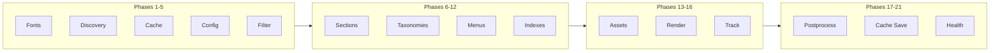

# Orchestration System

Bengal's orchestration system coordinates builds through specialized orchestrators. The `Site` is a passive data container; **orchestrators handle build logic**.

## Build Pipeline

The build process has **21 phases** organized into four modules:



## Phase Reference

### Discovery & Setup (1-5)

| Phase | Description |
|-------|-------------|
| `phase_fonts` | Download Google Fonts, generate CSS |
| `phase_discovery` | Scan `content/`, create Page/Section objects |
| `phase_cache_metadata` | Save page metadata for incremental builds |
| `phase_config_check` | Check config changes, clean deleted files |
| `phase_incremental_filter` | Detect changes, filter to minimal rebuild set |

### Content Processing (6-12)

| Phase | Description |
|-------|-------------|
| `phase_sections` | Ensure sections have index pages |
| `phase_taxonomies` | Collect tags/categories, generate taxonomy pages |
| `phase_taxonomy_index` | Persist tag-to-pages mapping |
| `phase_menus` | Build hierarchical navigation menus |
| `phase_related_posts` | Pre-compute related posts |
| `phase_query_indexes` | Build query indexes for fast lookups |
| `phase_update_pages_list` | Include generated taxonomy pages |

### Rendering (13-16)

| Phase | Description |
|-------|-------------|
| `phase_assets` | Minify, optimize, fingerprint assets |
| `phase_render` | Markdown → HTML, apply templates |
| `phase_update_site_pages` | Replace stale PageProxy objects |
| `phase_track_assets` | Persist page-to-assets mapping |

### Finalization (17-21)

| Phase | Description |
|-------|-------------|
| `phase_postprocess` | Generate sitemap, RSS, validate links |
| `phase_cache_save` | Save cache for incremental builds |
| `phase_collect_stats` | Collect build statistics |
| `phase_health_check` | Run validators |
| `phase_finalize` | Cleanup and logging |

## Orchestrators

| Orchestrator | Responsibility |
|--------------|----------------|
| **BuildOrchestrator** | Main conductor, calls all phases |
| **ContentOrchestrator** | Find/organize content, apply cascades |
| **RenderOrchestrator** | Parallel rendering, write output |
| **IncrementalOrchestrator** | Detect changes, filter work |
| **SectionOrchestrator** | Validate section hierarchy |
| **TaxonomyOrchestrator** | Collect terms, generate pages |
| **MenuOrchestrator** | Build navigation menus |
| **AssetOrchestrator** | Process static assets |
| **PostprocessOrchestrator** | Sitemap, RSS, link validation |

## BuildContext

Shared context passed through rendering and post-processing:

```python
@dataclass
class BuildContext:
    site: Site
    pages: list[Page]
    assets: list[Asset]
    tracker: DependencyTracker
    stats: BuildStats
    profile: BuildProfile
    incremental: bool = False
    pages_to_build: list[Page] = None
```

Created during Phase 14 (`phase_render`) and reused for post-processing.

## Parallelization

Orchestrators auto-switch between sequential and parallel execution:

```python
if parallel and len(items) > PARALLEL_THRESHOLD:
    # ThreadPoolExecutor for large workloads
else:
    # Sequential for small sites (avoid thread overhead)
```

## Incremental Builds

The `IncrementalOrchestrator` filters work before heavy lifting:

1. **Detect**: Find changed files (SHA256)
2. **Trace**: Find dependents (pages using changed templates)
3. **Filter**: Pass only affected items to Render/Asset orchestrators
