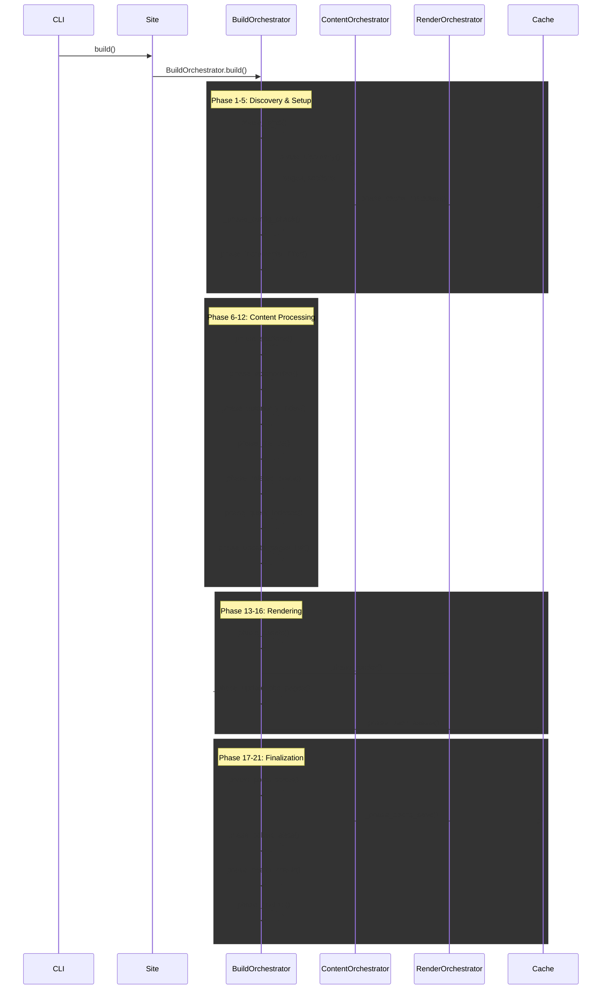

# Orchestration System

Bengal's orchestration system coordinates the build process through specialized orchestrator classes, each responsible for a specific phase of the build pipeline.

## Overview

The orchestration subsystem (`bengal/orchestration/`) implements the **delegation pattern** where the `Site` object delegates build coordination to specialized orchestrators. This design avoids "God objects" and provides clear separation of concerns.

:::{card} Key Principle
**Site** is a passive data container.
**Orchestrators** handle the active build logic.
:::

## Build Pipeline

The build process follows a structured sequence organized into **21 phases**, each implemented as a dedicated `_phase_*` method in `BuildOrchestrator`. This modular design improves maintainability and testability.



### Phase Structure

The build pipeline consists of **21 phases**, each extracted into a focused method (~50-100 lines):

#### Discovery & Setup (Phases 1-5)

| Phase | Method | Description |
|-------|--------|-------------|
| 1 | `_phase_fonts` | Downloads Google Fonts and generates CSS if configured |
| 2 | `_phase_discovery` | Scans `content/` for markdown files, creates Page/Section objects |
| 3 | `_phase_cache_metadata` | Saves page metadata to cache for incremental builds |
| 4 | `_phase_config_check` | Checks if config changed (forces full rebuild), cleans deleted files |
| 5 | `_phase_incremental_filter` | Detects changes, filters to minimal rebuild set |

#### Content Processing (Phases 6-12)

| Phase | Method | Description |
|-------|--------|-------------|
| 6 | `_phase_sections` | Ensures sections have index pages, validates hierarchy |
| 7 | `_phase_taxonomies` | Collects tags/categories, generates taxonomy pages |
| 8 | `_phase_taxonomy_index` | Persists tag-to-pages mapping for incremental builds |
| 9 | `_phase_menus` | Builds hierarchical navigation menus |
| 10 | `_phase_related_posts` | Pre-computes related posts for O(1) template access |
| 11 | `_phase_query_indexes` | Builds query indexes for fast lookups |
| 12 | `_phase_update_pages_list` | Adds generated taxonomy pages to rebuild set |

#### Rendering (Phases 13-16)

| Phase | Method | Description |
|-------|--------|-------------|
| 13 | `_phase_assets` | Processes CSS, JS, images (minify, optimize, fingerprint) |
| 14 | `_phase_render` | Renders markdown to HTML, applies templates |
| 15 | `_phase_update_site_pages` | Replaces stale PageProxy objects with fresh Pages |
| 16 | `_phase_track_assets` | Caches page-to-assets mapping for incremental builds |

#### Finalization (Phases 17-21)

| Phase | Method | Description |
|-------|--------|-------------|
| 17 | `_phase_postprocess` | Generates sitemap, RSS, validates links |
| 18 | `_phase_cache_save` | Saves build cache for future incremental builds |
| 19 | `_phase_collect_stats` | Collects final build statistics |
| 20 | `_phase_health_check` | Runs validators based on build profile |
| 21 | `_phase_finalize` | Final cleanup and logging |

### Phase Method Pattern

Each phase is a self-contained method with a clear signature:

```python
def _phase_taxonomies(
    self, cache, incremental: bool, parallel: bool, pages_to_build: list
) -> set:
    """
    Phase 7: Taxonomies & Dynamic Pages.

    Collects taxonomy terms (tags, categories) and generates taxonomy pages.
    Optimized for incremental builds - only processes changed pages.

    Args:
        cache: Build cache
        incremental: Whether this is an incremental build
        parallel: Whether to use parallel processing
        pages_to_build: List of pages being built (for incremental)

    Returns:
        Set of affected tag slugs

    Side effects:
        - Populates self.site.taxonomies
        - Creates taxonomy pages in self.site.pages
        - Updates self.stats.taxonomy_time_ms
    """
    # ... implementation
```

This pattern provides:
- **Testability**: Each phase can be tested in isolation
- **Readability**: `build()` is now ~75 lines of phase calls
- **Maintainability**: Changes are scoped to specific phases
- **Documentation**: Docstrings explain purpose and side effects

## Orchestrator Reference

::::{tab-set}
:::{tab-item} Build
**BuildOrchestrator** (`build.py`)

The main conductor. The `build()` method is a clean ~75-line sequence of phase calls.
- **21 phase methods** (`_phase_*`) for modularity
- **Coordinates** all other orchestrators
- **Manages** `BuildContext` threading
- **Handles** parallel vs sequential execution
- **Collects** build statistics
:::

:::{tab-item} Content
**ContentOrchestrator** (`content.py`)

Finds and organizes content.
- **Delegates** to `ContentDiscovery`
- **Links** navigation (next/prev/parent)
- **Applies** cascade metadata
- **Builds** cross-reference index
:::

:::{tab-item} Render
**RenderOrchestrator** (`render.py`)

Coordinates page rendering.
- **Manages** parallel rendering threads
- **Injects** `BuildContext` dependencies
- **Handles** errors gracefully
- **Writes** output files
:::

:::{tab-item} Incremental
**IncrementalOrchestrator** (`incremental.py`)

The decision maker.
- **Detects** file changes (SHA256)
- **Queries** dependency graph
- **Filters** work to minimal set
- **Updates** cache on success
:::
::::

## Specialized Orchestrators

::::{cards}
:columns: 2
:gap: medium
:variant: explanation

:::{card} Section Orchestrator
:icon: folder
Ensures every section has an index page and validates hierarchy structure.
:::

:::{card} Taxonomy Orchestrator
:icon: tag
Collects tags/categories and generates term/list pages (incremental-aware).
:::

:::{card} Menu Orchestrator
:icon: list
Builds hierarchical navigation menus from config and frontmatter.
:::

:::{card} Asset Orchestrator
:icon: image
Processes static assets (minify, optimize, fingerprint) in parallel.
:::

:::{card} Postprocess Orchestrator
:icon: check-circle
Generates sitemap, RSS, and runs link validation after rendering.
:::
::::

## Architecture Patterns

### 1. BuildContext Threading

To avoid global state, we pass a `BuildContext` dataclass through the pipeline. This enables clean phase method signatures and explicit dependency passing.

```python
@dataclass
class BuildContext:
    """Shared build context passed across orchestrators and phases."""
    # Core objects
    site: Site | None = None
    pages: list[Page] | None = None
    assets: list[Asset] | None = None
    tracker: DependencyTracker | None = None
    stats: BuildStats | None = None
    profile: BuildProfile | None = None

    # Progress reporting
    progress_manager: LiveProgressManager | None = None
    reporter: ProgressReporter | None = None

    # Build state (populated during build)
    cli: Any = None
    build_start: float = 0.0
    collector: Any = None
    cache: Any = None
    incremental: bool = False
    config_changed: bool = False
    pages_to_build: list[Page] = field(default_factory=list)
    assets_to_process: list[Asset] = field(default_factory=list)
    affected_tags: set[str] = field(default_factory=set)
    changed_page_paths: set[Path] = field(default_factory=set)
    affected_sections: set[str] | None = None
```

**Usage**: BuildContext is initialized at the start of `build()` and threaded through phase methods and sub-orchestrators:

```python
# In BuildOrchestrator.build()
ctx = BuildContext(site=self.site, stats=self.stats, ...)

# Phase methods receive what they need
self._phase_render(ctx.cli, ctx.parallel, ..., ctx.pages_to_build, ...)

# Sub-orchestrators receive full context
RenderOrchestrator.process(pages, build_context=ctx)
PostprocessOrchestrator.run(build_context=ctx)
```

### 2. Smart Parallelization

Orchestrators automatically switch between sequential and parallel execution based on workload size to avoid thread overhead.

```python
def process(items, parallel=True):
    # Threshold avoids overhead for small sites
    if parallel and len(items) > PARALLEL_THRESHOLD:
        with ThreadPoolExecutor() as executor:
            # Parallel execution
            pass
    else:
        # Sequential execution
        pass
```

### 3. Incremental Intelligence

The `IncrementalOrchestrator` acts as a filter before heavy lifting begins.

1. **Detect**: Find changed files
2. **Trace**: Find dependents (pages using changed templates)
3. **Filter**: Pass ONLY affected items to Render/Asset orchestrators
