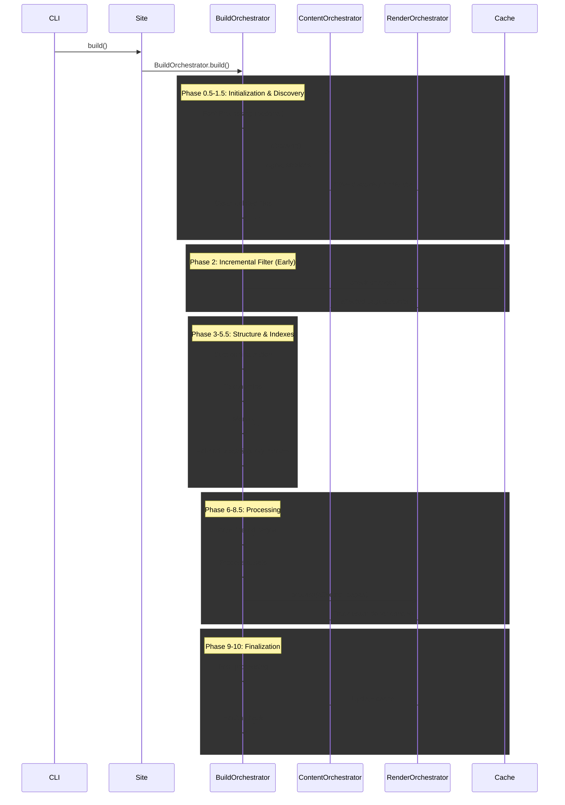

# Orchestration System

Bengal's orchestration system coordinates the build process through specialized orchestrator classes, each responsible for a specific phase of the build pipeline.

## Overview

The orchestration subsystem (`bengal/orchestration/`) implements the **delegation pattern** where the `Site` object delegates build coordination to specialized orchestrators. This design avoids "God objects" and provides clear separation of concerns.

:::{card} Key Principle
**Site** is a passive data container.
**Orchestrators** handle the active build logic.
:::

## Build Pipeline

The build process follows a structured sequence organized into 10 main phases, with sub-phases for caching and optimization steps.



### Phase Structure

The build pipeline consists of **10 main phases** with sub-phases for caching and optimization:

**Phase 0.5**: Font Processing (optional)
- Downloads Google Fonts and generates CSS if configured
- Runs before asset discovery

**Phase 1**: Content Discovery
- Scans `content/` directory for markdown files
- Creates Page and Section objects
- Applies frontmatter and cascade metadata

**Phase 1.25**: Cache Discovery Metadata
- Saves page metadata to cache for incremental builds
- Enables lazy loading in future builds

**Phase 1.5**: Cleanup Deleted Files
- Removes output files for deleted source files
- Ensures output stays in sync with source

**Phase 2**: Incremental Filtering (Early)
- Detects changed files using SHA256 hashing
- Filters pages and assets to minimal rebuild set
- Runs **before** taxonomies/menus for optimization

**Phase 3**: Section Finalization
- Ensures all sections have index pages
- Validates section hierarchy structure
- Incremental: Only processes affected sections

**Phase 4**: Taxonomies & Dynamic Pages
- Collects tags/categories from pages
- Generates taxonomy term/list pages
- Incremental: Only updates affected taxonomies

**Phase 4.5**: Save Taxonomy Index
- Persists tag-to-pages mapping to cache
- Enables incremental taxonomy updates

**Phase 5**: Menus
- Builds hierarchical navigation menus
- Combines config and frontmatter data
- Incremental: Skips if unchanged

**Phase 5.5**: Related Posts & Query Indexes
- Pre-computes related posts for O(1) template access
- Builds query indexes for fast lookups
- Incremental: Only updates affected indexes

**Phase 6**: Update Filtered Pages List
- Adds generated taxonomy pages to rebuild set
- Ensures all affected pages are included

**Phase 7**: Process Assets
- Processes CSS, JS, and images
- Minifies, optimizes, and fingerprints assets
- Runs **before** rendering so `asset_url()` works

**Phase 8**: Render Pages
- Renders markdown to HTML
- Applies templates and layouts
- Writes output files

**Phase 8.4**: Update Site Pages
- Replaces stale PageProxy objects with fresh Page objects
- Ensures post-processing sees updated content

**Phase 8.5**: Track Asset Dependencies
- Extracts asset references from rendered HTML
- Caches page-to-assets mapping for incremental builds

**Phase 9**: Post-Processing
- Generates sitemap.xml
- Generates RSS feed
- Validates links

**Phase 9**: Update Cache
- Saves build cache with file hashes
- Updates dependency graph
- Persists for next incremental build

**Phase 10**: Health Check
- Runs validators based on build profile
- Generates health report
- May fail build in strict mode

## Orchestrator Reference

::::{tab-set}
:::{tab-item} Build
**BuildOrchestrator** (`build.py`)

The main conductor.
- **Coordinates** all other orchestrators
- **Manages** `BuildContext` threading
- **Handles** parallel vs sequential execution
- **Collects** build statistics
:::

:::{tab-item} Content
**ContentOrchestrator** (`content.py`)

Finds and organizes content.
- **Delegates** to `ContentDiscovery`
- **Links** navigation (next/prev/parent)
- **Applies** cascade metadata
- **Builds** cross-reference index
:::

:::{tab-item} Render
**RenderOrchestrator** (`render.py`)

Coordinates page rendering.
- **Manages** parallel rendering threads
- **Injects** `BuildContext` dependencies
- **Handles** errors gracefully
- **Writes** output files
:::

:::{tab-item} Incremental
**IncrementalOrchestrator** (`incremental.py`)

The decision maker.
- **Detects** file changes (SHA256)
- **Queries** dependency graph
- **Filters** work to minimal set
- **Updates** cache on success
:::
::::

## Specialized Orchestrators

::::{cards}
:columns: 2
:gap: medium
:variant: explanation

:::{card} Section Orchestrator
:icon: folder
Ensures every section has an index page and validates hierarchy structure.
:::

:::{card} Taxonomy Orchestrator
:icon: tag
Collects tags/categories and generates term/list pages (incremental-aware).
:::

:::{card} Menu Orchestrator
:icon: list
Builds hierarchical navigation menus from config and frontmatter.
:::

:::{card} Asset Orchestrator
:icon: image
Processes static assets (minify, optimize, fingerprint) in parallel.
:::

:::{card} Postprocess Orchestrator
:icon: check-circle
Generates sitemap, RSS, and runs link validation after rendering.
:::
::::

## Architecture Patterns

### 1. BuildContext Threading

To avoid global state, we pass a `BuildContext` object through the pipeline. This pattern is being progressively adopted across orchestrators.

```python
# Created during build initialization
ctx = BuildContext(
    site=site,
    pages=pages_to_build,
    tracker=dependency_tracker,
    stats=build_stats,
    profile=build_profile,
)

# Threaded through phases (progressive adoption)
RenderOrchestrator.process(pages, build_context=ctx)
PostprocessOrchestrator.run(build_context=ctx)
```

**Status**: BuildContext is currently passed to RenderOrchestrator and PostprocessOrchestrator. Other orchestrators will adopt it progressively while maintaining backward compatibility.

### 2. Smart Parallelization

Orchestrators automatically switch between sequential and parallel execution based on workload size to avoid thread overhead.

```python
def process(items, parallel=True):
    # Threshold avoids overhead for small sites
    if parallel and len(items) > PARALLEL_THRESHOLD:
        with ThreadPoolExecutor() as executor:
            # Parallel execution
            pass
    else:
        # Sequential execution
        pass
```

### 3. Incremental Intelligence

The `IncrementalOrchestrator` acts as a filter before heavy lifting begins.

1. **Detect**: Find changed files
2. **Trace**: Find dependents (pages using changed templates)
3. **Filter**: Pass ONLY affected items to Render/Asset orchestrators
