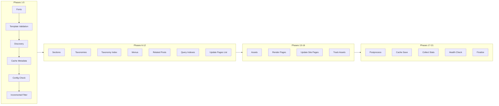

# Build Orchestration

Bengal's orchestration system coordinates builds through specialized orchestrators. The `Site` is a passive data container; **orchestrators handle build logic**.

## Build Phases

The build executes **21 main phases** (plus optional sub-phases like 1.5, 12.5, 19.5) organized into 5 groups:



## Phase Reference

### Initialization (Phases 1-5)

| Phase | Function | Description |
|-------|----------|-------------|
| 1 | `phase_fonts` | Download Google Fonts, generate CSS |
| 1.5 | `phase_template_validation` | Validate template syntax (optional) |
| 2 | `phase_discovery` | Scan `content/`, create Page/Section objects |
| 3 | `phase_cache_metadata` | Save page metadata for incremental builds |
| 4 | `phase_config_check` | Check config changes, clean deleted files |
| 5 | `phase_incremental_filter` | Detect changes, filter to minimal rebuild set |

### Content Processing (Phases 6-12)

| Phase | Function | Description |
|-------|----------|-------------|
| 6 | `phase_sections` | Ensure sections have index pages |
| 7 | `phase_taxonomies` | Collect tags/categories, generate taxonomy pages |
| 8 | `phase_taxonomy_index` | Persist tag-to-pages mapping |
| 9 | `phase_menus` | Build hierarchical navigation menus |
| 10 | `phase_related_posts` | Pre-compute related posts |
| 11 | `phase_query_indexes` | Build query indexes for fast lookups |
| 12 | `phase_update_pages_list` | Include generated taxonomy pages |
| 12.5 | URL collision check | Detect duplicate output paths |

### Rendering (Phases 13-16)

| Phase | Function | Description |
|-------|----------|-------------|
| 13 | `phase_assets` | Minify, optimize, fingerprint assets |
| 14 | `phase_render` | Markdown → HTML, apply templates |
| 15 | `phase_update_site_pages` | Replace stale PageProxy objects |
| 16 | `phase_track_assets` | Persist page-to-assets mapping |

### Finalization (Phases 17-21)

| Phase | Function | Description |
|-------|----------|-------------|
| 17 | `phase_postprocess` | Generate sitemap, RSS, validate links |
| 18 | `phase_cache_save` | Save cache for incremental builds |
| 19 | `phase_collect_stats` | Collect build statistics |
| 19.5 | Error session | Track errors for pattern detection |
| 20 | Health check | Run validators |
| 21 | `phase_finalize` | Cleanup and logging |

## Orchestrators

| Orchestrator | Responsibility | Module |
|--------------|----------------|--------|
| **BuildOrchestrator** | Main conductor, calls all phases | `bengal/orchestration/build/` |
| **ContentOrchestrator** | Find/organize content, apply cascades | `bengal/orchestration/content.py` |
| **RenderOrchestrator** | Parallel rendering, write output | `bengal/orchestration/render/` |
| **StreamingRenderOrchestrator** | Memory-optimized batched rendering | `bengal/orchestration/streaming.py` |
| **IncrementalOrchestrator** | Detect changes, filter work, coordinate cache invalidation | `bengal/orchestration/incremental/` |
| **SectionOrchestrator** | Validate section hierarchy | `bengal/orchestration/section.py` |
| **TaxonomyOrchestrator** | Collect terms, generate pages | `bengal/orchestration/taxonomy.py` |
| **MenuOrchestrator** | Build navigation menus | `bengal/orchestration/menu.py` |
| **AssetOrchestrator** | Process static assets | `bengal/orchestration/asset.py` |
| **PostprocessOrchestrator** | Sitemap, RSS, link validation | `bengal/orchestration/postprocess.py` |

### IncrementalOrchestrator Details

The `IncrementalOrchestrator` wires the incremental pipeline into Phase 5:

| Attribute | Type | Purpose |
|-----------|------|---------|
| `cache` | `BuildCache` | Main build cache for fingerprints, parsed content, output |
| `tracker` | `DependencyTracker` | Tracks page ↔ dependency relationships |
| `cache_coordinator` | `CacheCoordinator` | Coordinates cache invalidation across layers |
| `path_registry` | `PathRegistry` | Canonical path representation for cache keys |

The coordinator ensures that when a dependency changes (data file, template, taxonomy), all affected cache layers are invalidated consistently. See [Cache](cache.md#cache-invalidation-architecture) for details.

### Detection Pipeline (Phase 5)

Phase 5 (`phase_incremental_filter`) uses the **provenance-based filter** (`bengal/orchestration/build/provenance_filter.py`)
and composes detectors from `bengal/build/` (e.g., `bengal/build/detectors/`):

- `DetectionPipeline` composes ordered `ChangeDetector` implementations.
- Each detector returns a `ChangeDetectionResult`, merged as the pipeline runs.
- Full rebuild triggers short-circuit the pipeline for clarity and speed.

This replaces the older monolithic filter engine and keeps detection logic testable,
composable, and aligned with provenance-based builds.

## BuildContext

Shared context passed through rendering and post-processing (simplified view):

```python
@dataclass
class BuildContext:
    # Core (required by most phases)
    site: Site | None = None
    stats: BuildStats | None = None

    # Build mode flags
    incremental: bool = False
    verbose: bool = False
    quiet: bool = False
    strict: bool = False
    parallel: bool = True

    # Work items (populated during filtering)
    pages: list[Page] | None = None
    pages_to_build: list[Page] | None = None
    assets_to_process: list[Asset] | None = None
    changed_page_paths: set[Path] = field(default_factory=set)

    # Cache and tracking
    cache: BuildCache | None = None
    tracker: DependencyTracker | None = None

    # Output/progress
    cli: CLIOutput | None = None
    reporter: ProgressReporter | None = None
    output_collector: OutputCollector | None = None
```

Created early (during build setup) and enriched through the build. See `bengal/orchestration/build_context.py` for the complete definition.

## Parallelization

Orchestrators auto-switch based on workload. Thresholds vary by subsystem:

```python
# Incremental detectors (file/template change detection)
PARALLEL_THRESHOLD = 50

# Health check validators  
PARALLEL_THRESHOLD = 3

# General pattern
if parallel and len(items) > PARALLEL_THRESHOLD:
    with ThreadPoolExecutor() as executor:
        # Parallel processing
else:
    # Sequential for small workloads
```

The threshold varies because thread pool overhead differs by operation type—I/O-bound operations benefit from lower thresholds than CPU-bound ones.

## Dashboard Notifications

The build broadcasts phase status for monitoring:

```python
notify_phase_start("discovery")
# ... phase work ...
notify_phase_complete("discovery", duration_ms, "150 pages, 12 sections")
```

Groups: `discovery`, `content`, `assets`, `rendering`, `finalization`, `health`

:::{seealso}
- [Pipeline](pipeline.md) — Streaming and memory optimization
- [Cache](cache.md) — Build caching
:::
