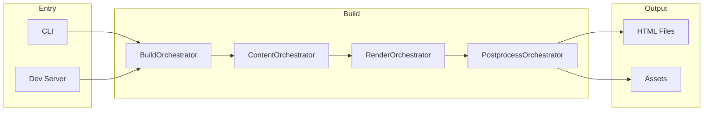
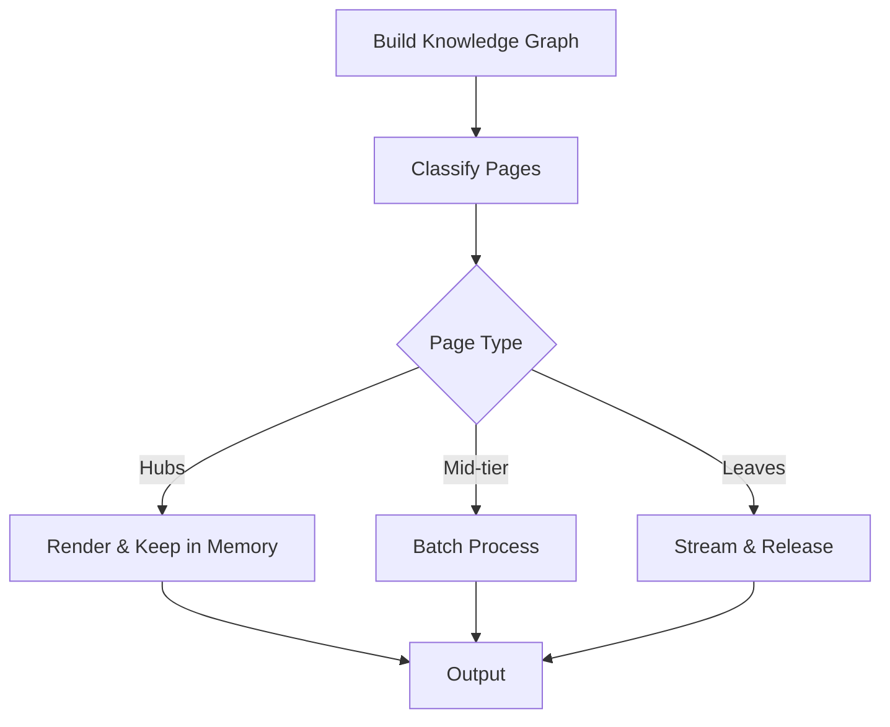

# Build Pipeline

Bengal uses an **orchestrator-based build pipeline** where specialized orchestrators coordinate each phase of the build process. The pipeline supports both standard and memory-optimized modes.

## Pipeline Flow



## Standard Build

The default build processes all pages through 21 phases:

```bash
bengal build
```

See [Orchestration](orchestration.md) for detailed phase documentation.

## Memory-Optimized Build

For large sites (5K+ pages), Bengal offers memory-optimized streaming:

```bash
bengal build --memory-optimized
```

### StreamingRenderOrchestrator

Uses knowledge graph analysis to process pages in optimal order:



**Strategy**:

1. **Hubs** (highly connected): Render first, keep in memory
2. **Mid-tier**: Process in batches
3. **Leaves** (70-80% of pages): Stream in batches with `gc.collect()` after each

**Memory Savings**: 80-90% reduction on large sites.

**Best For**: Sites with 5K+ pages with tight memory constraints.

```python
from bengal.orchestration.streaming import StreamingRenderOrchestrator

streaming = StreamingRenderOrchestrator(site)
streaming.process(pages, parallel=True, batch_size=100)
```

## Incremental Builds

Incremental builds run a dedicated **detection pipeline** in `bengal/build/` before heavy rendering:

1. **Detect**: Compare fingerprints/provenance for content, templates, assets, data
2. **Expand**: Follow tracked relationships to expand the rebuild set
3. **Filter**: Hand affected pages/assets to the render step

The pipeline composes `ChangeDetector` implementations (`bengal/build/detectors/`)
and produces an immutable `ChangeDetectionResult` (`bengal/build/contracts/`).
It short-circuits on full rebuild triggers for speed and clarity.

```bash
bengal build --incremental
```

## File Watching (Development Server)

Bengal uses **`watchfiles`** (Rust-based) for fast file change detection:

```python
from bengal.server.file_watcher import create_watcher
from bengal.server.ignore_filter import IgnoreFilter

ignore_filter = IgnoreFilter(
    glob_patterns=["*.pyc", "__pycache__"],
    directories=[output_dir],
)
watcher = create_watcher([content_dir, templates_dir], ignore_filter)

async for changed_paths, event_types in watcher.watch():
    # event_types: {"created", "modified", "deleted"}
    if "created" in event_types or "deleted" in event_types:
        # Structural change → full rebuild
        run_full_build()
    else:
        # Content-only → incremental rebuild
        run_incremental_build(changed_paths)
```

**Features**:

- 10-50x faster than Python alternatives
- Built-in event coalescing and batching
- Native asynchronous iterator support
- Event type propagation for smart rebuild decisions

## Parallelism

Orchestrators auto-switch between sequential and parallel execution based on workload size. The threshold varies by context (e.g., 5 for rendering, 3 for health checks, 50 for file detection):

```python
# Example: rendering threshold
PARALLEL_THRESHOLD = 5  # Avoid thread overhead for small sites

if parallel and len(items) > PARALLEL_THRESHOLD:
    with ThreadPoolExecutor() as executor:
        # Parallel processing
else:
    # Sequential processing
```

## Key Modules

| Module | Purpose |
| --- | --- |
| `bengal/orchestration/build/` | 21 phase functions |
| `bengal/orchestration/streaming.py` | Memory-optimized rendering |
| `bengal/build/` | Incremental detection pipeline, provenance, tracking |
| `bengal/orchestration/incremental/` | Incremental orchestration wiring |
| `bengal/server/file_watcher.py` | Rust-based file watching |
| `bengal/server/build_trigger.py` | Rebuild decision logic |

:::{seealso}

- [Orchestration](orchestration.md) — Phase-by-phase reference
- [Cache](cache.md) — Incremental build caching

:::
