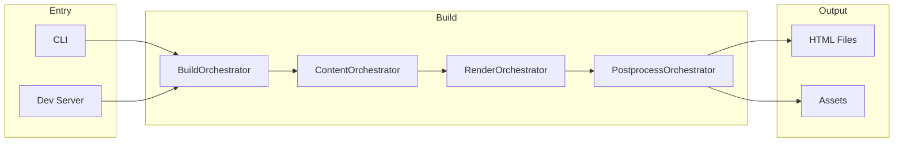
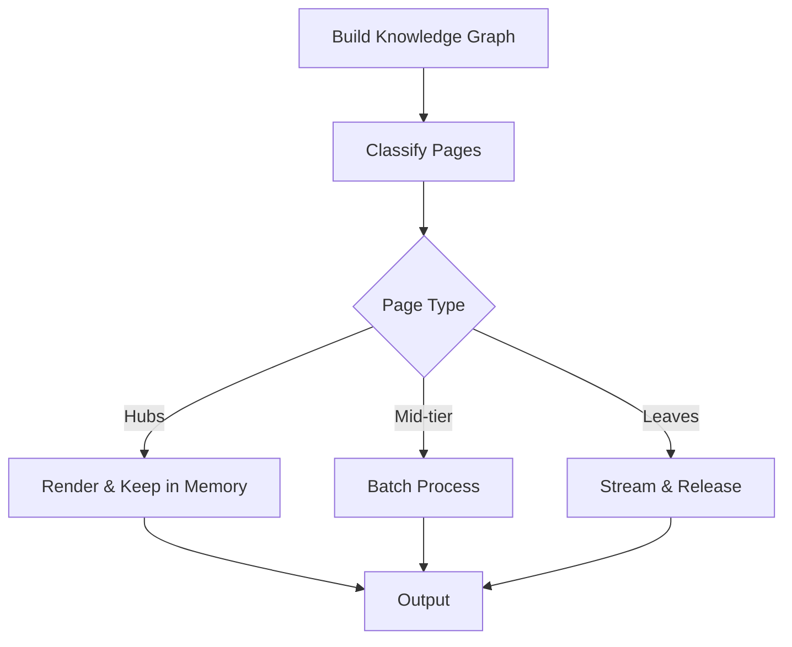

# Build Pipeline

Bengal uses an **orchestrator-based build pipeline** where specialized orchestrators coordinate each phase of the build process. The pipeline supports both standard and memory-optimized modes.

## Pipeline Flow



## Standard Build

The default build processes all pages through 21 phases:

```bash
bengal build
```

See [Orchestration](orchestration/) for detailed phase documentation.

## Memory-Optimized Build

For large sites (5K+ pages), Bengal offers memory-optimized streaming:

```bash
bengal build --memory-optimized
```

### StreamingRenderOrchestrator

Uses knowledge graph analysis to process pages in optimal order:



**Strategy**:
1. **Hubs** (highly connected): Render first, keep in memory
2. **Mid-tier**: Process in batches
3. **Leaves** (70-80% of pages): Stream in batches with `gc.collect()` after each

**Memory Savings**: 80-90% reduction on large sites.

**Best For**: Sites with 5K+ pages where memory is constrained.

```python
from bengal.orchestration.streaming import StreamingRenderOrchestrator

streaming = StreamingRenderOrchestrator(site)
streaming.process(pages, parallel=True, batch_size=100)
```

## Incremental Builds

The `IncrementalOrchestrator` filters work before heavy lifting:

1. **Detect**: Find changed files (SHA256 hash comparison)
2. **Trace**: Query dependency graph for affected pages
3. **Filter**: Pass only affected items to renderers

```bash
bengal build --incremental
```

## File Watching (Dev Server)

Bengal uses **watchfiles** (Rust-based) for fast file change detection:

```python
from bengal.server.file_watcher import WatchfilesWatcher

watcher = WatchfilesWatcher(
    paths=[content_dir, templates_dir],
    ignore_filter=ignore_filter,
)

async for changed_paths, event_types in watcher.watch():
    # event_types: {"created", "modified", "deleted"}
    if "created" in event_types or "deleted" in event_types:
        # Structural change → full rebuild
        run_full_build()
    else:
        # Content-only → incremental rebuild
        run_incremental_build(changed_paths)
```

**Features**:
- 10-50x faster than Python alternatives
- Built-in debouncing and batching
- Native async iterator support
- Event type propagation for smart rebuild decisions

## Parallelization

Orchestrators auto-switch between sequential and parallel execution:

```python
PARALLEL_THRESHOLD = 5  # Avoid thread overhead for small sites

if parallel and len(items) > PARALLEL_THRESHOLD:
    with ThreadPoolExecutor() as executor:
        # Parallel processing
else:
    # Sequential processing
```

## Key Modules

| Module | Purpose |
|--------|---------|
| `bengal/orchestration/build/` | 21 phase functions |
| `bengal/orchestration/streaming.py` | Memory-optimized rendering |
| `bengal/orchestration/incremental/` | Change detection and filtering |
| `bengal/server/file_watcher.py` | Rust-based file watching |
| `bengal/server/build_trigger.py` | Rebuild decision logic |

:::{seealso}
- [Orchestration](orchestration/) — Phase-by-phase reference
- [Cache](cache/) — Incremental build caching
:::
