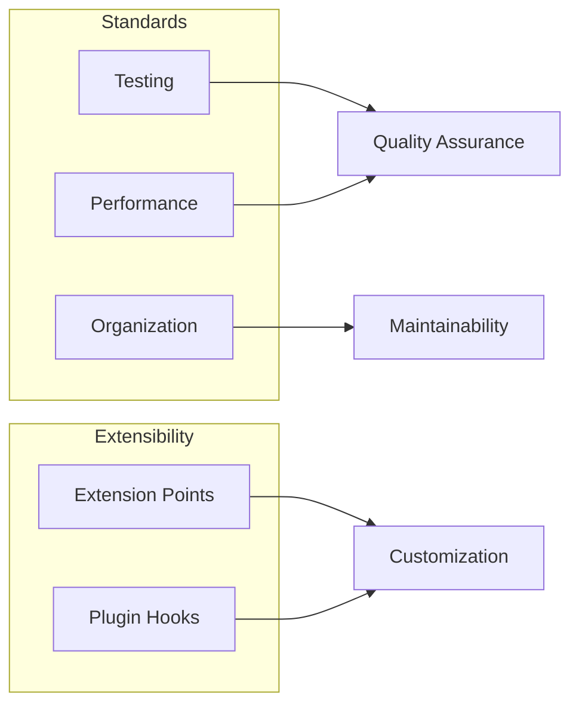

# Meta & Operations

Operational details, standards, and project meta-information.

## Project Quality

## Coverage

| Area | Coverage | Approach |
|------|----------|----------|
| **Testing** | Unit + Integration | pytest, fixture-based |
| **Performance** | Benchmarked | Build time, memory, incremental |
| **Organization** | Documented | Clear module boundaries |

## Extension Points

Bengal supports customization at multiple levels:

| Level | Mechanism | Use Case |
|-------|-----------|----------|
| **Content** | Custom loaders | New content sources |
| **Validation** | Custom validators | Project-specific rules |
| **Rendering** | Custom shortcodes | Rich content components |
| **Post-process** | Custom processors | Output transformations |

:::{seealso}
- [Extension Points](extension-points/) — Hook documentation
- [Testing](testing/) — Test patterns and fixtures
:::
