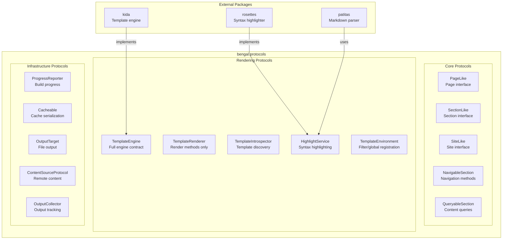

# Protocol Layer

Bengal uses Python protocols (PEP 544) to define contracts between subsystems and external packages. All protocols are consolidated in `bengal.protocols` for discoverability and consistency.

## Protocol Categories



## Usage

Import all protocols from the canonical location:

```python
from bengal.protocols import (
    # Build & orchestration
    BuildPhase,

    # Core
    PageLike, SectionLike, SiteLike,
    NavigableSection, QueryableSection,
    
    # Rendering
    TemplateEngine, TemplateRenderer, HighlightService,
    TemplateEnvironment, EngineCapability,
    
    # Infrastructure
    ProgressReporter, Cacheable, OutputTarget,
    ContentSourceProtocol, OutputCollector,
)
```

## Core Protocols

### SectionLike

Interface for content sections (directories in content tree).

```python
@runtime_checkable
class SectionLike(Protocol):
    @property
    def name(self) -> str: ...
    @property
    def title(self) -> str: ...
    @property
    def path(self) -> Path | None: ...
    @property
    def href(self) -> str: ...
    @property
    def pages(self) -> list[PageLike]: ...
    @property
    def subsections(self) -> list[SectionLike]: ...
    @property
    def parent(self) -> SectionLike | None: ...
    @property
    def index_page(self) -> PageLike | None: ...
```

### PageLike

Interface for content pages.

```python
@runtime_checkable
class PageLike(Protocol):
    @property
    def title(self) -> str: ...
    @property
    def href(self) -> str: ...
    @property
    def content(self) -> str: ...
    @property
    def date(self) -> datetime | None: ...
    @property
    def draft(self) -> bool: ...
    @property
    def weight(self) -> int: ...
    @property
    def source_path(self) -> Path: ...
    @property
    def metadata(self) -> dict[str, Any]: ...
    @property
    def tags(self) -> list[str]: ...
```

### SiteLike

Interface for the site object.

```python
@runtime_checkable
class SiteLike(Protocol):
    @property
    def title(self) -> str: ...
    @property
    def baseurl(self) -> str: ...
    @property
    def pages(self) -> list[PageLike]: ...
    @property
    def sections(self) -> list[SectionLike]: ...
    @property
    def root_section(self) -> SectionLike: ...
    @property
    def config(self) -> SiteConfig: ...
    @property
    def root_path(self) -> Path: ...
    @property
    def output_dir(self) -> Path: ...
    @property
    def dev_mode(self) -> bool: ...
```

## Rendering Protocols

### TemplateEngine

Full template engine contract. Composed of smaller protocols for flexibility.

```python
class TemplateEngine(TemplateRenderer, TemplateIntrospector, TemplateValidator, Protocol):
    @property
    def capabilities(self) -> EngineCapability: ...
    
    def has_capability(self, cap: EngineCapability) -> bool: ...
```

Use the smaller protocols when you only need specific functionality:

| Protocol | Methods | Use When |
|----------|---------|----------|
| `TemplateRenderer` | `render_template`, `render_string` | Only rendering |
| `TemplateIntrospector` | `template_exists`, `list_templates` | Template discovery |
| `TemplateValidator` | `validate` | Syntax checking |

### HighlightService

Syntax highlighting contract. Thread-safe.

```python
@runtime_checkable
class HighlightService(Protocol):
    @property
    def name(self) -> str: ...
    
    def highlight(
        self,
        code: str,
        language: str,
        *,
        hl_lines: list[int] | None = None,
        show_linenos: bool = False,
        **options: Any,
    ) -> str: ...
    
    def supports_language(self, language: str) -> bool: ...
```

**Thread Safety**: `highlight()` must be safe to call from multiple threads concurrently.

## Infrastructure Protocols

### Cacheable

Objects that can be serialized to/from the build cache.

```python
@runtime_checkable
class Cacheable(Protocol):
    def to_cache_dict(self) -> dict[str, Any]: ...
    
    @classmethod
    def from_cache_dict(cls: type[T], data: dict[str, Any]) -> T: ...
```

### ProgressReporter

Build progress reporting. Used by orchestration layer.

```python
@runtime_checkable
class ProgressReporter(Protocol):
    def add_phase(self, phase_id: str, label: str, total: int | None = None) -> None: ...
    def start_phase(self, phase_id: str) -> None: ...
    def update_phase(
        self,
        phase_id: str,
        current: int | None = None,
        current_item: str | None = None,
    ) -> None: ...
    def complete_phase(self, phase_id: str, elapsed_ms: float | None = None) -> None: ...
    def log(self, message: str) -> None: ...
```

### OutputTarget

File output abstraction. Thread-safe.

```python
@runtime_checkable
class OutputTarget(Protocol):
    @property
    def name(self) -> str: ...
    
    def write(self, path: str, content: str) -> None: ...
    def write_bytes(self, path: str, content: bytes) -> None: ...
    def copy(self, src: str, dest: str) -> None: ...
    def mkdir(self, path: str) -> None: ...
    def exists(self, path: str) -> bool: ...
```

**Thread Safety**: All methods must be safe for concurrent calls.

## Design Principles

### Leaf-Node Architecture

`bengal.protocols` is a **leaf node** in the import graph:

- ✅ Can import: `typing`, `pathlib`, `collections.abc`, standard library
- ❌ Cannot import: `bengal.core`, `bengal.rendering`, `bengal.cache`, etc.

This prevents circular dependencies and allows external packages to depend on protocols without pulling in Bengal's internals.

### Protocol Composition

Large protocols are composed from smaller ones:

```python
# Instead of one large protocol:
class BigEngine(Protocol):
    def render(self): ...
    def validate(self): ...
    def introspect(self): ...

# Use composable protocols:
class TemplateRenderer(Protocol):
    def render_template(self): ...

class TemplateValidator(Protocol):
    def validate(self): ...

class TemplateEngine(TemplateRenderer, TemplateValidator, Protocol):
    """Full engine is composition of capabilities."""
```

This allows functions to accept only the capabilities they need.

### Thread-Safety Requirements

Protocols document thread-safety requirements in docstrings:

- `HighlightService.highlight()` — must be thread-safe
- `OutputTarget.*` — all methods must be thread-safe
- `ContentSourceProtocol.fetch_all()` — must be thread-safe

## Backwards Compatibility

Old import paths still work but emit deprecation warnings:

```python
# Old (deprecated, emits warning):
from bengal.core.section.protocols import SectionLike
from bengal.rendering.engines.protocol import TemplateEngineProtocol
from bengal.rendering.highlighting.protocol import HighlightBackend

# New (canonical):
from bengal.protocols import SectionLike, TemplateEngine, HighlightService
```

## Related Documentation

- [Extension Points](extension-points) — Using protocols for customization
- [Custom Template Engine](/docs/theming/templating/custom-engine/) — Implementing TemplateEngine
- [Object Model](../core/object-model) — PageLike and SectionLike implementations
