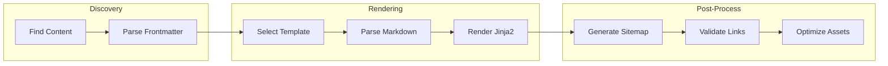
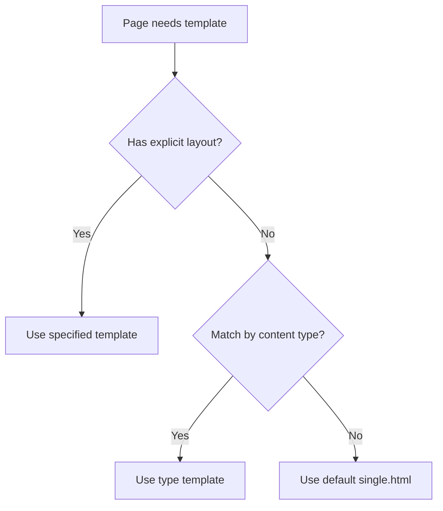

# Rendering Pipeline

How Bengal transforms source content into final output.

## Pipeline Overview

## Stage Responsibilities

| Stage | What it does | Key modules |
|-------|--------------|-------------|
| **Discovery** | Find `.md` files, parse frontmatter | `bengal/discovery/` |
| **Rendering** | Template selection, Markdown → HTML | `bengal/rendering/` |
| **Post-Process** | Sitemap, RSS, link validation | `bengal/postprocess/` |

## Template Resolution

:::{note}
The rendering pipeline is **lazy** — templates are compiled on first use and cached. Markdown is parsed only when content is accessed.
:::
