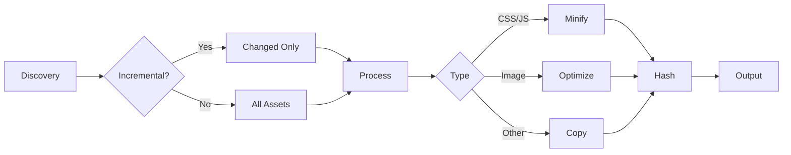

# Asset Pipeline

Bengal's asset pipeline processes CSS, JS, images, and fonts with minification, optimization, and fingerprinting.

## Asset Types

| Type | Extensions | Processing |
|------|-----------|------------|
| **CSS** | `.css`, `.scss`, `.sass` | Minification, source maps |
| **JavaScript** | `.js`, `.mjs`, `.ts` | Minification, source maps |
| **Images** | `.jpg`, `.png`, `.gif`, `.webp`, `.svg` | Optimization, format conversion |
| **Fonts** | `.woff`, `.woff2`, `.ttf` | Copy only |
| **Other** | All others | Copy only |

## Processing Flow



## Configuration

```toml
[assets]
minify_css = true
minify_js = true
optimize_images = true
fingerprint = false  # true for production

[assets.images]
quality = 85
strip_metadata = true
formats = ["webp"]

exclude = ["*.map", "drafts/**"]
```

## Cache Busting

With `fingerprint = true`:

```
style.css → style.abc123.css
```

Template usage:

```jinja2
<link rel="stylesheet" href="{{ asset_url('style.css') }}">
<!-- Renders: /assets/style.abc123.css -->
```

## Asset Manifest

Bengal writes `public/asset-manifest.json` mapping logical paths to fingerprinted outputs:

```json
{
  "assets": {
    "css/style.css": {
      "output_path": "assets/css/style.a1b2c3.css",
      "fingerprint": "a1b2c3"
    }
  }
}
```

## Key Modules

| Module | Purpose |
|--------|---------|
| `bengal/assets/pipeline.py` | Central coordinator |
| `bengal/discovery/asset_discovery.py` | Finds assets in site/theme |
| `bengal/cache/asset_dependency_map.py` | Tracks CSS/JS imports |
| `bengal/assets/manifest.py` | Manifest data model |
| `bengal/rendering/template_engine/asset_url.py` | Template resolution |

## Dependency Tracking

CSS imports (`@import`) and JS imports (`import`) are tracked. When a file changes, all files that import it are rebuilt.

## CLI Commands

```bash
bengal assets status       # Inspect manifest
bengal build --clean-output  # Remove stale files before build
```
