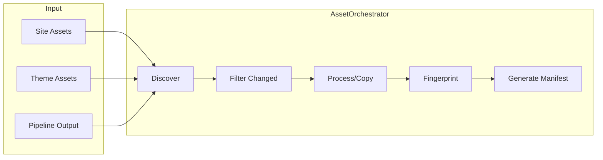
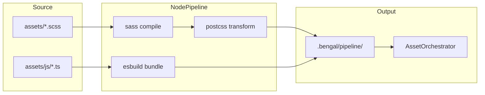

# Asset Pipeline

Bengal processes static assets (CSS, JS, images, fonts) through two systems:

1. **AssetOrchestrator** (Python) — Copying, fingerprinting, manifest generation
2. **NodePipeline** (optional) — SCSS compilation, PostCSS, JS bundling

## AssetOrchestrator

The core asset processor handles:

| Task | Description |
|------|-------------|
| **Copying** | Copy assets from `assets/` and theme to output |
| **Fingerprinting** | Hash-based filenames for cache-busting (`main.abc123.css`) |
| **Manifest** | JSON mapping of logical → fingerprinted paths |
| **Cleanup** | Remove stale fingerprinted files |

### Processing Flow



### Parallel Processing

Assets process in parallel above a threshold:

```python
from bengal.orchestration.asset import AssetOrchestrator

orchestrator = AssetOrchestrator(site)
orchestrator.process(
    assets=site.assets,
    parallel=True,  # Auto-enables ThreadPoolExecutor
    progress_manager=progress,
)
```

### Asset Manifest

Templates access fingerprinted URLs via the manifest:

```jinja2
<link rel="stylesheet" href="{{ asset('css/main.css') }}">
{# Outputs: /assets/css/main.abc123.css #}
```

```python
# Module: bengal/assets/manifest.py
manifest = AssetManifest(output_dir)
manifest.add("css/main.css", "css/main.abc123.css")
manifest.write()  # Writes asset-manifest.json
```

## NodePipeline (Optional)

For modern frontend tooling, enable the Node-based pipeline:

```yaml
# bengal.yaml
assets:
  pipeline: true
  scss: true
  postcss: true
  bundle_js: true
  esbuild_target: es2018
  sourcemaps: true
```

### Requirements

```bash
npm install -D sass postcss postcss-cli autoprefixer esbuild
```

### Supported Transformations

| Stage | Tool | Input | Output |
|-------|------|-------|--------|
| SCSS | `sass` CLI | `.scss` | `.css` |
| PostCSS | `postcss` CLI | `.css` | `.css` (prefixed) |
| JS/TS | `esbuild` | `.js`, `.ts` | Bundled `.js` |

### Pipeline Flow



### Usage

```python
from bengal.assets.pipeline import from_site

pipeline = from_site(site)
compiled_files = pipeline.build()  # Returns list of compiled paths
# Files are written to .bengal/pipeline/ for AssetOrchestrator to pick up
```

## Incremental Processing

During incremental builds, only changed assets are processed:

1. **Hash comparison**: Compare SHA256 of source files
2. **Dependency tracking**: Track CSS imports for cascade invalidation
3. **Selective copy**: Only copy/transform changed files

## Key Modules

| Module | Purpose |
|--------|---------|
| `bengal/orchestration/asset.py` | AssetOrchestrator class |
| `bengal/assets/manifest.py` | Fingerprint manifest generation |
| `bengal/assets/pipeline.py` | NodePipeline (SCSS, PostCSS, esbuild) |
| `bengal/core/asset/` | Asset model and processing logic |

:::{seealso}
- [Assets](/docs/theming/assets/) — User-facing asset documentation
- [Configuration](/docs/building/configuration/) — Asset pipeline settings
:::
