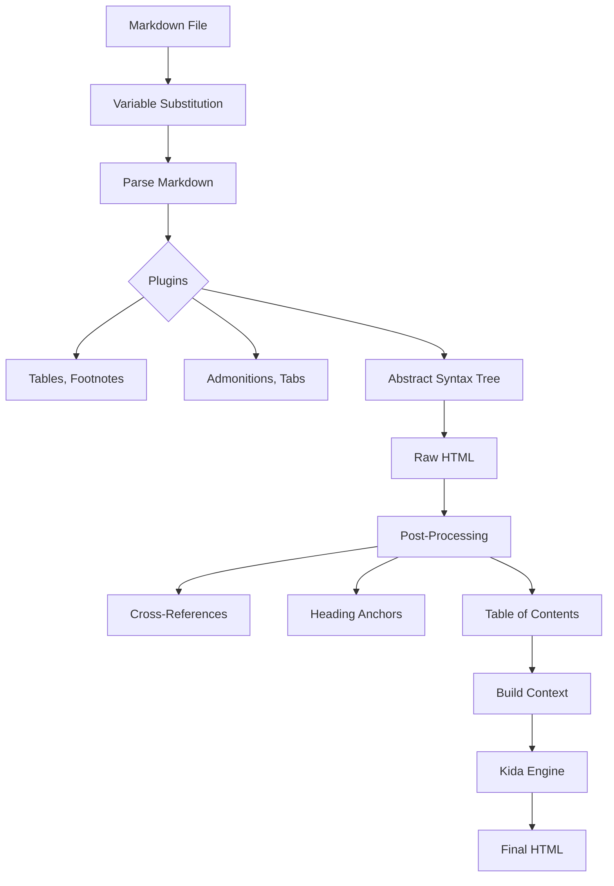

# Rendering Pipeline

The rendering pipeline transforms source content into final HTML output.

## Overview

The pipeline follows a 5-stage process:

```
Parse → Build AST → Apply Templates → Render HTML → Write Output
```

## Architecture



## Components

::::{tab-set}
:::{tab-item} Parser
**Markdown Parser** (`parsing/`)

Patitas is the default markdown engine (thread-safe, O(n) guaranteed). Mistune is available as a legacy option.

**Features:**
- **Variable Substitution**: `{{ page.title }}` in content
- **Directives**: `:::{note}` syntax for rich components
- **TOC Extraction**: Auto-generates table of contents
- **Thread-Safe**: Designed for Python 3.14+ free-threaded builds
- **ContextVar Configuration**: Thread-local config via `ParseConfig` and `RenderConfig`
- **Instance Pooling**: `ParserPool` and `RendererPool` for reduced GC pressure
- **Metadata Accumulation**: Single-pass extraction of math, code, links, word count
:::

:::{tab-item} Templates
**Template Engine** (`rendering/engines/`)

Kida-based engine with project-specific helpers.

**Capabilities:**
- **Theme Support**: Overridable templates (Site > Theme > Parent > Default)
- **Safe Rendering**: Error boundaries prevent build crashes
- **Caching**: Bytecode caching for speed
- **Free-Threading**: Safe for parallel rendering
:::

:::{tab-item} Pipeline
**Pipeline Coordinator** (`rendering/pipeline/`)

Orchestrates the flow for each page. Organized as a package with focused modules:
- `core.py`: Main RenderingPipeline class
- `thread_local.py`: Thread-local parser management
- `toc.py`: TOC extraction utilities
- `transforms.py`: Content transformations
- `output.py`: Output handling

**Responsibilities:**
- Manages the 3-stage process
- Handles output path determination
- Tracks template dependencies
- Writes atomic output
- Thread-local parser instances for performance
:::
::::

## Markdown Directives

Bengal extends Markdown with directives using `:::{name}` syntax. Directives are lazy-loaded on demand for fast startup times.

::::{tab-set}
:::{tab-item} Content Blocks
**Admonitions**: `note`, `tip`, `warning`, `danger`, `error`, `info`, `example`, `success`, `caution`, `seealso`

**Structural**:
- `dropdown` / `details` - Collapsible sections
- `container` / `div` - Generic wrapper with CSS classes
- `steps` / `step` - Numbered step sequences

**Interactive**:
- `tab-set` / `tabs` + `tab-item` / `tab` - Tabbed content
- `checklist` - Interactive task lists
:::

:::{tab-item} Cards & Layout
**Cards**:
- `cards` - Card grid container
- `card` - Individual card
- `child-cards` - Auto-generate cards from child pages
- `grid` / `grid-item-card` - Sphinx-compatible grid aliases

**Layout**:
- `gallery` - Image gallery with lightbox
- `figure` - Enhanced figure with caption
:::

:::{tab-item} Code
**Code Blocks**:
- `code-tabs` - Multi-language code blocks
- `literalinclude` - Include code from external files

**Embeds**:
- `gist` - GitHub Gist embed
- `codepen` - CodePen embed
- `codesandbox` - CodeSandbox embed
- `stackblitz` - StackBlitz embed
:::

:::{tab-item} Media
**Video**:
- `youtube` - YouTube embed
- `vimeo` - Vimeo embed
- `video` - Generic video embed

**Audio & Terminal**:
- `audio` - Audio player
- `asciinema` - Terminal recording playback
- `marimo` - Marimo notebook embed (Mistune-only)
:::

:::{tab-item} Navigation
**Page Navigation**:
- `breadcrumbs` - Breadcrumb trail
- `siblings` - Sibling page links
- `prev-next` - Previous/next navigation
- `related` - Related content links
:::

:::{tab-item} Reference
**API & Versioning**:
- `since` / `versionadded` - Version introduction
- `deprecated` / `versionremoved` - Deprecation notices
- `changed` / `versionchanged` - Change notices

**Utilities**:
- `badge` / `bdg` - Inline badges
- `button` - CTA buttons
- `icon` / `svg-icon` - Icon insertion
- `target` / `anchor` - Explicit anchor targets
- `rubric` - Section headings without TOC entry
- `glossary` - Term definitions
- `list-table` / `data-table` - Structured tables
- `include` - Include markdown files
- `example-label` - Example block labels
- `build` - Build status badges
:::
::::

## Performance

For benchmarks and reproducible measurements, refer to [Performance](../../../../building/performance/) and the `benchmarks/` directory.

## Template Functions

The engine includes 80+ helper functions organized into focused modules by responsibility.

:::{dropdown} Function Categories
:icon: code

**Phase 1 - Essential:**
- **Strings**: `truncate`, `slugify`, `titlecase`, `markdownify`
- **Collections**: `where`, `group_by`, `sort_by`, `limit`, `first`
- **Math**: `add`, `multiply`, `round`
- **Dates**: `dateformat`, `time_ago`, `date_iso`
- **URLs**: `absolute_url`, `url_for`, `canonical_url`
- **Page Lookup**: `get_page`, `page_exists`

**Phase 2 - Advanced:**
- **Content**: `markdown`, `highlight`, `excerpt`
- **Data**: `load_data` (yaml, json, csv)
- **Advanced Strings**: Regex, pluralization, translations
- **Files**: `read_file`, `glob`, `exists`
- **Advanced Collections**: Chunking, pagination, tree operations

**Phase 3 - Specialized:**
- **Images**: Image processing and optimization
- **Icons**: FontAwesome, Material, custom icons
- **SEO**: Meta tags, Open Graph, structured data
- **Debug**: `dump`, `inspect`, `type`
- **Taxonomies**: Tag and category operations

**Phase 4+:**
- **Cross-References**: Internal linking (`ref`, `doc`, `anchor`)
- **Navigation**: Breadcrumbs, TOC, auto-nav, tree building
- **Theme**: Asset URLs, theme configuration access
- **Autodoc**: API documentation helpers
- **Template Tests**: `is draft`, `is featured`, `is outdated`
- **Versioning**: Smart version switching URLs
:::

## Template Context

The rendering pipeline builds a rich context for each page with safe access patterns.

:::{dropdown} Context Architecture
:icon: container

**Core Objects:**
- `page` — Current page with all properties
- `site` — Site object with pages, sections, config
- `section` — Parent section
- `config` — Site configuration (alias for `site.config`)
- `params` — Page metadata (alias for `page.metadata`)

**Pre-computed Values:**
- `content` — Rendered HTML (safe)
- `title`, `toc`, `toc_items`
- `meta_desc`, `reading_time`, `excerpt`

**Context Wrappers:**
- `SiteContext` — Safe access to site properties
- `ConfigContext` — Safe access to configuration
- `ThemeContext` — Theme features and settings
- `ParamsContext` — Frontmatter with safe nested access
- `SectionContext` — Section properties with fallbacks

See [TEMPLATE-CONTEXT.md](https://github.com/lbliii/bengal/blob/main/bengal/themes/default/templates/TEMPLATE-CONTEXT.md) for the complete reference.
:::
