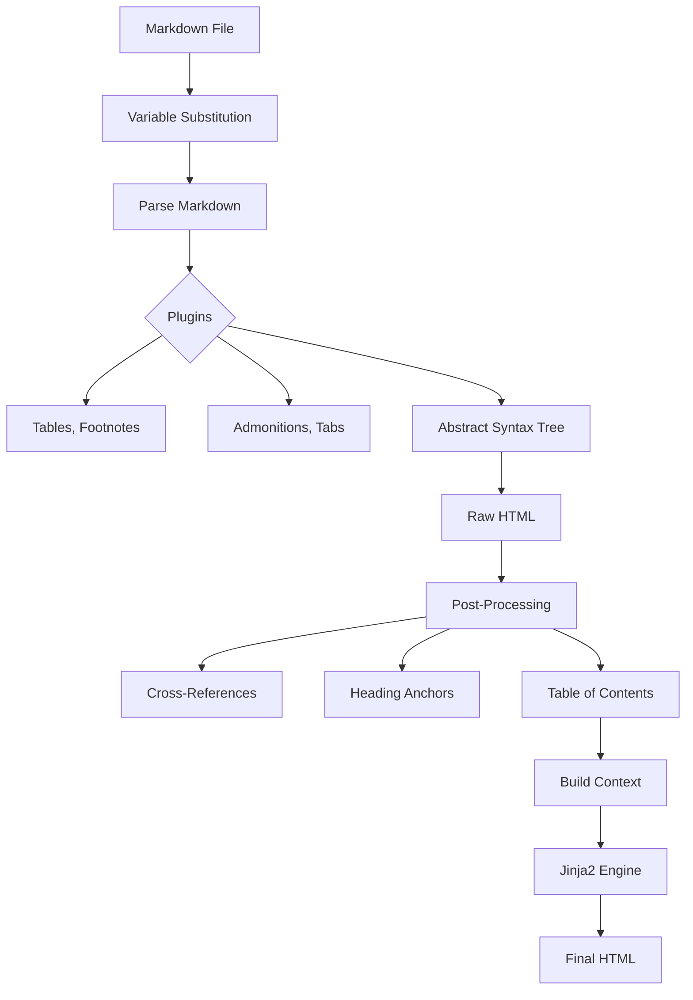

# Rendering Pipeline

The rendering pipeline is the heart of Bengal, transforming source content into final HTML output.

## Overview

The pipeline follows a strict 3-stage process:

```
Parse (Markdown → AST) → Render (Apply Templates) → Post-process (Enhance)
```

## Architecture



## Components

::::{tab-set}
:::{tab-item} Parser
**Markdown Parser** (`rendering/parsers/`)

We use **Mistune** by default for high performance (2x faster than Python-Markdown).

**Features:**
- **Variable Substitution**: `{{ page.title }}` in content
- **Directives**: `:::{note}` syntax for rich components
- **TOC Extraction**: Auto-generates table of contents
:::

:::{tab-item} Templates
**Template Engine** (`rendering/template_engine.py`)

Jinja2-based engine with 75+ custom functions.

**Capabilities:**
- **Theme Support**: Overridable templates (Site > Theme > Default)
- **Safe Rendering**: Error boundaries prevent build crashes
- **Caching**: Bytecode caching for speed
:::

:::{tab-item} Pipeline
**Pipeline Coordinator** (`rendering/pipeline.py`)

Orchestrates the flow for each page.

**Responsibilities:**
- Manages the 3-stage process
- Handles output path determination
- Tracks template dependencies
- Writes atomic output
:::
::::

## Mistune Directives

Bengal extends Markdown with powerful directives using `:::{name}` syntax.

::::{cards}
:columns: 3
:gap: small
:variant: info

:::{card} Admonitions
:icon: alert-circle
Callouts like Note, Warning, Tip.
:::

:::{card} Tabs
:icon: layers
Tabbed content sections.
:::

:::{card} Dropdowns
:icon: chevron-down
Collapsible details.
:::

:::{card} Cards
:icon: grid
Grid layouts (like this one!).
:::

:::{card} Code Tabs
:icon: code
Multi-language code blocks.
:::

:::{card} Buttons
:icon: square
Call-to-action buttons.
:::
::::

## Performance

We benchmarked parser performance on a 78-page site:

| Parser | Time | Throughput | Notes |
|--------|------|------------|-------|
| Python-Markdown | 3.78s | 20.6 pages/s | Feature-rich legacy |
| **Mistune** | **2.18s** | **35.8 pages/s** | **42% Faster** |

## Template Functions

The engine includes 17 modules of helper functions available in all templates.

:::{dropdown} Available Function Categories
:icon: code
- **Strings**: `truncate`, `slugify`, `markdownify`
- **Collections**: `where`, `group_by`, `sort_by`
- **Dates**: `time_ago`, `date_iso`
- **URLs**: `absolute_url`, `relref`
- **Images**: `image_processed`, `image_url`
- **Taxonomies**: `related_posts`, `popular_tags`
:::
