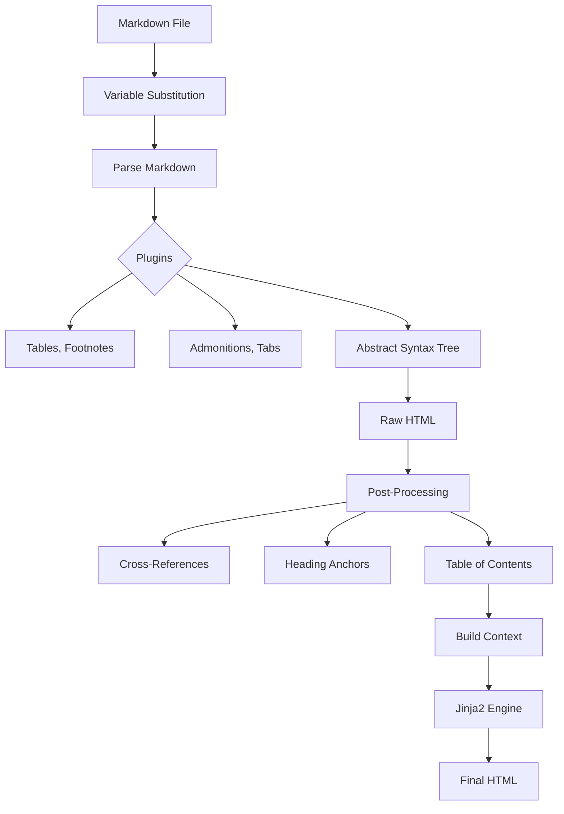

# Rendering Pipeline

The rendering pipeline transforms source content into final HTML output.

## Overview

The pipeline follows a strict 3-stage process:

```
Parse (Markdown → AST) → Render (Apply Templates) → Post-process (Enhance)
```

## Architecture



## Components

::::{tab-set}
:::{tab-item} Parser
**Markdown Parser** (`rendering/parsers/`)

Mistune is the default markdown engine (unless overridden by configuration).

**Features:**
- **Variable Substitution**: `{{ page.title }}` in content
- **Directives**: `:::{note}` syntax for rich components
- **TOC Extraction**: Auto-generates table of contents
:::

:::{tab-item} Templates
**Template Engine** (`rendering/template_engine/`)

Jinja2-based engine with project-specific helpers.

**Capabilities:**
- **Theme Support**: Overridable templates (Site > Theme > Default)
- **Safe Rendering**: Error boundaries prevent build crashes
- **Caching**: Bytecode caching for speed
:::

:::{tab-item} Pipeline
**Pipeline Coordinator** (`rendering/pipeline/`)

Orchestrates the flow for each page. Organized as a package with focused modules:
- `core.py`: Main RenderingPipeline class
- `thread_local.py`: Thread-local parser management
- `toc.py`: TOC extraction utilities
- `transforms.py`: Content transformations
- `output.py`: Output handling

**Responsibilities:**
- Manages the 3-stage process
- Handles output path determination
- Tracks template dependencies
- Writes atomic output
- Thread-local parser instances for performance
:::
::::

## Mistune Directives

Bengal extends Markdown with directives using `:::{name}` syntax.

::::{cards}
:columns: 3
:gap: small
:variant: info

:::{card} Admonitions
:icon: info
Callouts like Note, Warning, Tip.
:::

:::{card} Tabs
:icon: layers
Tabbed content sections.
:::

:::{card} Dropdowns
:icon: chevron-down
Collapsible details.
:::

:::{card} Cards
:icon: layers
Grid layouts (like this one!).
:::

:::{card} Code Tabs
:icon: code
Multi-language code blocks.
:::

:::{card} Buttons
:icon: star
Call-to-action buttons.
:::
::::

## Performance

For benchmarks and reproducible measurements, refer to [Performance](../meta/performance.md) and the `benchmarks/` directory.

## Template Functions

The engine includes 17 modules of helper functions available in all templates.

:::{dropdown} Available Function Categories
:icon: code
- **Strings**: `truncate`, `slugify`, `markdownify`
- **Collections**: `where`, `group_by`, `sort_by`
- **Dates**: `time_ago`, `date_iso`
- **URLs**: `absolute_url`, `relref`
- **Images**: `image_processed`, `image_url`
- **Taxonomies**: `related_posts`, `popular_tags`
:::
