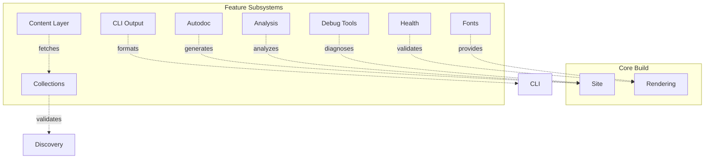

# Subsystems

Specialized subsystems providing advanced features.

## Subsystem Overview

## Feature Matrix

| Subsystem | Purpose | Entry Point |
|-----------|---------|-------------|
| **Autodoc** | Generate docs from Python, CLI, OpenAPI | `bengal/autodoc/` |
| **Analysis** | Graph analysis, PageRank, link suggestions | `bengal/analysis/` |
| **Health** | Content validation, broken link detection | `bengal/health/` |
| **Fonts** | Google Fonts download, self-hosting | `bengal/fonts/` |
| **Collections** | Type-safe content schemas with validation | `bengal/collections/` |
| **Content Layer** | Unified API for local/remote content sources | `bengal/content_layer/` |
| **CLI Output** | Centralized terminal output system | `bengal/output/` |
| **Debug Tools** | Diagnostic utilities for builds | `bengal/debug/` |

## Integration Points

All subsystems integrate with the core build via hooks:

- **Autodoc** → generates Pages before build
- **Analysis** → runs post-build for reports
- **Health** → validates during post-processing
- **Fonts** → downloads during asset processing
- **Collections** → validates frontmatter during discovery phase
- **Content Layer** → fetches remote content for Collections
- **CLI Output** → formats all terminal output with profile-aware styling
- **Debug Tools** → provides diagnostics via CLI commands

:::{note}
Subsystems are **lazy-loaded** — they only import when used, minimizing startup time for projects that don't need them.
:::
