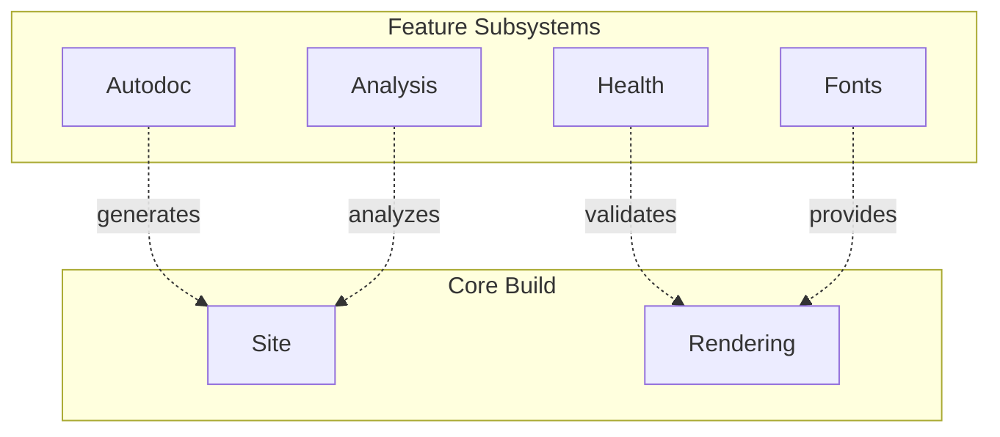

# Subsystems

Specialized subsystems providing advanced features.

## Subsystem Overview

## Feature Matrix

| Subsystem | Purpose | Entry Point |
|-----------|---------|-------------|
| **Autodoc** | Generate docs from Python, CLI, OpenAPI | `bengal/autodoc/` |
| **Analysis** | Graph analysis, PageRank, link suggestions | `bengal/analysis/` |
| **Health** | Content validation, broken link detection | `bengal/health/` |
| **Fonts** | Google Fonts download, self-hosting | `bengal/fonts/` |

## Integration Points

All subsystems integrate with the core build via hooks:

- **Autodoc** → generates Pages before build
- **Analysis** → runs post-build for reports
- **Health** → validates during post-processing
- **Fonts** → downloads during asset processing

:::{note}
Subsystems are **lazy-loaded** — they only import when used, minimizing startup time for projects that don't need them.
:::
