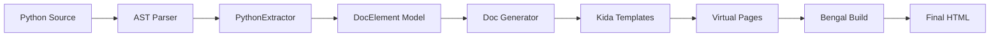

# Autodoc System

Bengal includes an **automatic documentation generation system** that extracts API documentation from Python source code using AST-based static analysis.

:::{note}
**Zero-Import Extraction**: Unlike Sphinx, Bengal's autodoc **does not import your code**. This means it never crashes due to missing dependencies or side effects.
:::

## Architecture

The system follows a clean Extractor → Generator → Template pipeline:



## Components

::::{tab-set}
:::{tab-item} Extractors
**Source Analysis** (`extractors/`)

Parses source code into `DocElement` objects.

- **Python** (`extractors/python/`): Package with modular components:
  - `extractor.py`: Main `PythonExtractor` class using AST for classes, functions, and type hints
  - `signature.py`: Function signature and argument extraction
  - `module_info.py`: Module name inference and path resolution
  - `inheritance.py`: Inherited member synthesis
  - `skip_logic.py`: Exclusion pattern matching
  - `aliases.py`: Module alias detection
- **CLI** (`extractors/cli.py`): Extracts commands and options from Click apps.
- **OpenAPI** (`extractors/openapi.py`): Extracts endpoints from OpenAPI specs.
:::

:::{tab-item} Model
**Unified Data Model** (`base.py`)

`DocElement` is the universal representation of any documented item.

- **Structure**: Name, description, metadata, children
- **Language Agnostic**: Used for Python, CLI, and HTTP APIs
- **Serializable**: Can be cached to disk
:::

:::{tab-item} Orchestration
**Virtual Page Generation** (`orchestration/`)

Generates API documentation as virtual Page objects.

- **VirtualAutodocOrchestrator**: Main coordinator for autodoc generation
- **Page Builders**: Creates virtual pages from DocElements
- **Template Integration**: Renders directly via theme templates
- **No Intermediate Files**: Docs generate as virtual pages, not markdown files
:::
::::


## Resilience

Autodoc is designed to handle edge cases gracefully:

- **Syntax errors**: Files with syntax errors are skipped with a warning
- **Missing docstrings**: Elements without docstrings still appear in the generated documentation
- **Malformed type hints**: Invalid annotations are rendered as-is without crashing
- **Partial extraction**: If one file fails, extraction continues for remaining files

## Configuration

Configure autodoc in `bengal.toml`:

```toml
[autodoc.python]
enabled = true
source_dirs = ["src/mylib"]
docstring_style = "auto"  # auto, google, numpy, sphinx
```

## CLI Support

Bengal supports **Click**, **Typer**, and **argparse** applications via configuration.

```toml
# bengal.toml
[autodoc.cli]
enabled = true
app_module = "myapp.cli:main"
```

This generates command references including arguments, options, and hierarchy.

## OpenAPI Support

Generate REST API documentation from OpenAPI 3.x specifications:

```toml
# bengal.toml
[autodoc.openapi]
enabled = true
spec = "openapi.yaml"  # Or openapi.json
output_dir = "content/api"
```

This generates endpoint documentation with request/response schemas, parameters, and examples.
