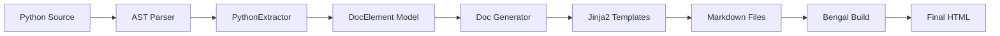

# Autodoc System

Bengal includes an **automatic documentation generation system** that extracts API documentation from Python source code using AST-based static analysis.

:::{note}
**Zero-Import Extraction**: Unlike Sphinx, Bengal's autodoc **does not import your code**. This means it never crashes due to missing dependencies or side effects.
:::

## Architecture

The system follows a clean Extractor → Generator → Template pipeline:



## Components

::::{tab-set}
:::{tab-item} Extractors
**Source Analysis** (`extractors/`)

Parses source code into `DocElement` objects.

- **Python**: Uses `ast` module to parse classes, functions, and type hints.
- **CLI**: Extracts commands and options from Click apps.
- **OpenAPI**: (Planned) Extracts endpoints from OpenAPI specs.
:::

:::{tab-item} Model
**Unified Data Model** (`base.py`)

`DocElement` is the universal representation of any documented item.

- **Structure**: Name, description, metadata, children
- **Language Agnostic**: Used for Python, CLI, and HTTP APIs
- **Serializable**: Can be cached to disk
:::

:::{tab-item} Generator
**Markdown Generation** (`generator.py`)

Converts models into Markdown using templates.

- **Two-Pass**: Generates Markdown first, then Bengal renders it
- **Parallel**: Runs extraction and generation concurrently
- **Caching**: Smart caching of generated content
:::
::::


## Template Safety

Autodoc templates are designed to never fail the build, even with malformed docstrings.

::::{cards}
:columns: 2
:gap: medium
:variant: explanation

:::{card} Error Boundaries
:icon: check-circle
If a template section fails, only that section shows an error. The rest of the page renders normally.
:::

:::{card} Safe Filters
:icon: funnel
Custom filters like `safe_description` handles escaping and fallback for missing data.
:::
::::

## Configuration

Configure autodoc in `bengal.toml`:

```toml
[autodoc.python]
enabled = true
source_dirs = ["src/mylib"]
output_dir = "content/api"
docstring_style = "google"  # google, numpy, sphinx
```

## CLI Support

We currently support **Click** applications via configuration.

```toml
# bengal.toml
[autodoc.cli]
enabled = true
app = "myapp.cli:main"
output_dir = "content/cli-reference"
```

This generates command references including arguments, options, and hierarchy.
