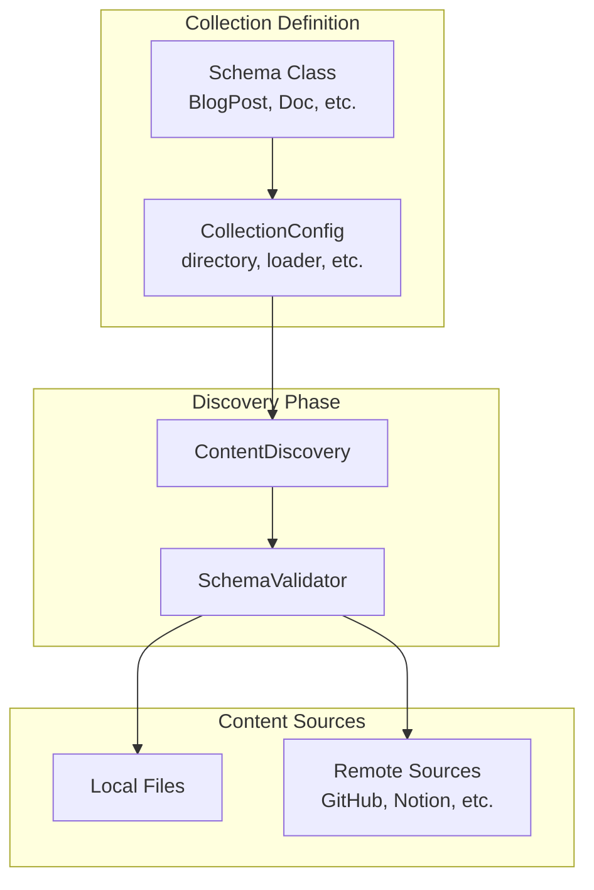

# Collections System

Bengal's Collections system provides type-safe content schemas with validation, enabling early error detection during content discovery and IDE autocompletion.

## Overview

Collections allow you to define typed schemas for your content's frontmatter, catching errors early and providing type safety throughout your build process.

```python
# collections.py (project root)
from dataclasses import dataclass, field
from datetime import datetime
from bengal.collections import define_collection

@dataclass
class BlogPost:
    title: str
    date: datetime
    author: str = "Anonymous"
    tags: list[str] = field(default_factory=list)
    draft: bool = False

collections = {
    "blog": define_collection(
        schema=BlogPost,
        directory="content/blog",
    ),
}
```

## Architecture



## Key Features

### Type Safety

Collections use Python dataclasses or Pydantic models to define frontmatter structure:

```python
@dataclass
class DocPage:
    title: str
    description: str | None = None
    weight: int | None = None
    tags: list[str] = field(default_factory=list)
```

### Early Validation

Validation happens during the discovery phase, catching errors before rendering:

```python
# Invalid frontmatter raises ContentValidationError immediately
# Missing required field: title
# Invalid type: weight must be int, got str
```

### Remote Content Support

Collections integrate with the Content Layer for remote sources:

```python
from bengal.collections import define_collection
from bengal.content_layer import github_loader, notion_loader

collections = {
    "docs": define_collection(
        schema=DocPage,
        directory="content/docs",  # Local content
    ),
    "api": define_collection(
        schema=APIDoc,
        loader=github_loader(repo="myorg/api-docs", path="docs/"),  # Remote
    ),
}
```

## Built-in Schemas

Bengal provides standard schemas for common content types:

- **`BlogPost`**: Blog posts with date, author, tags
- **`DocPage`**: Documentation pages with weight, tags
- **`Tutorial`**: Tutorial pages with order, prerequisites
- **`Changelog`**: Changelog entries with version, date
- **`API`**: API reference pages
- **`Post`**: Generic post schema

## Configuration Options

```python
define_collection(
    schema=BlogPost,
    directory="content/blog",
    glob="**/*.md",              # File pattern (default: **/*.md)
    strict=True,                  # Reject unknown fields (default: True)
    allow_extra=False,            # Store extra fields (default: False)
    loader=github_loader(...),   # Remote content source
)
```

## Validation Modes

### Strict Mode (Default)

```python
# Rejects unknown fields
@dataclass
class BlogPost:
    title: str
    date: datetime

# frontmatter: {title: "Post", date: "2025-01-01", extra: "value"}
# ❌ Error: Unknown field 'extra'
```

### Lenient Mode

```python
# Allows extra fields, stores in _extra dict
blog = define_collection(
    schema=BlogPost,
    directory="content/blog",
    strict=False,
    allow_extra=True,
)

# frontmatter: {title: "Post", date: "2025-01-01", custom: "value"}
# ✅ Valid: custom stored in page._extra
```

## Integration with Content Layer

Collections seamlessly integrate with the Content Layer for remote sources:

```python
from bengal.collections import define_collection
from bengal.content_layer import github_loader

collections = {
    "api-docs": define_collection(
        schema=APIDoc,
        loader=github_loader(
            repo="myorg/api-docs",
            path="docs/",
            branch="main",
        ),
    ),
}
```

**Zero-cost**: If you don't use remote loaders, there's no overhead. Remote sources are lazy-loaded only when configured.

## Error Handling

Collections provide detailed validation errors:

```python
from bengal.collections import ContentValidationError, SchemaValidator

validator = SchemaValidator(BlogPost, strict=True)
result = validator.validate(frontmatter_dict)

if not result.valid:
    for error in result.errors:
        print(f"  {error.field}: {error.message}")
```

When validation fails during content discovery, Bengal raises `ContentValidationError`:

```python
from bengal.collections import ContentValidationError

# ContentValidationError includes:
# - path: Path to the content file
# - errors: List of ValidationError instances
# - collection_name: Name of the collection (if known)
```

## Standard Schemas Reference

### BlogPost

```python
@dataclass
class BlogPost:
    title: str
    date: datetime
    author: str = "Anonymous"
    tags: list[str] = field(default_factory=list)
    draft: bool = False
    description: str | None = None
    image: str | None = None
    excerpt: str | None = None
```

### DocPage

```python
@dataclass
class DocPage:
    title: str
    weight: int = 0
    category: str | None = None
    tags: list[str] = field(default_factory=list)
    toc: bool = True
    description: str | None = None
    deprecated: bool = False
    since: str | None = None
```

### Tutorial

```python
@dataclass
class Tutorial:
    title: str
    difficulty: str | None = None
    duration: str | None = None
    prerequisites: list[str] = field(default_factory=list)
    tags: list[str] = field(default_factory=list)
    series: str | None = None
    order: int | None = None
```

## Related

- [[docs/reference/architecture/subsystems/content-layer|Content Layer]] - Remote content sources
- [[docs/reference/architecture/rendering/discovery|Content Discovery]] - How content is discovered
- [[docs/reference/architecture/core/content-types|Content Types]] - Content strategies
