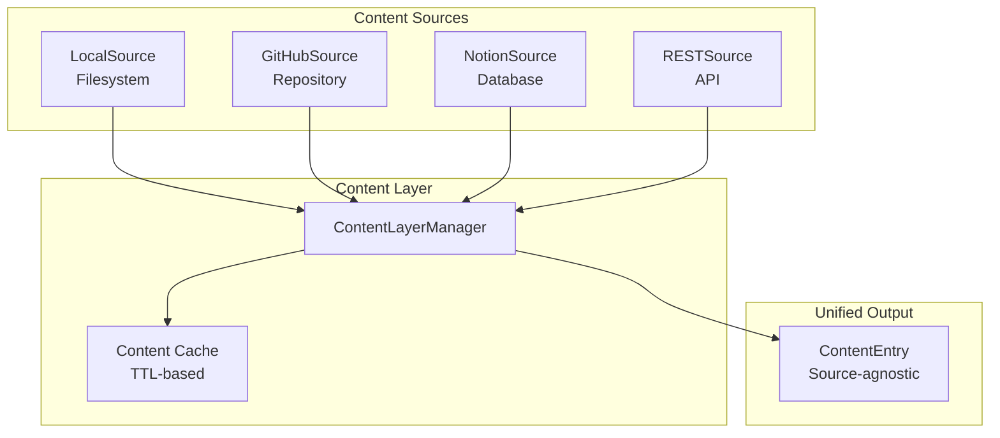

# Content Layer

Bengal's Content Layer provides a unified API for fetching content from any source: local files, GitHub repos, REST APIs, Notion databases, and more.

## Overview

The Content Layer abstracts content sources behind a consistent interface, enabling Bengal to work with content from anywhere while maintaining zero-cost for local-only projects.

```python
from bengal.content.sources import ContentLayerManager, local_loader, github_loader

manager = ContentLayerManager()

# Local content (zero overhead)
manager.register_source("docs", "local", {"directory": "content/docs"})

# Remote content (lazy-loaded)
manager.register_source("api", "github", {
    "repo": "myorg/api-docs",
    "path": "docs/",
})

entries = manager.fetch_all_sync()
```

## Architecture



## Design Principles

### Zero-Cost Unless Used

- **Local-only**: Zero overhead, no network calls, no new dependencies
- **Remote sources**: Lazy-loaded only when configured
- **CMS SDKs**: Imported only when their loader is used

```python
# Local-only (default) - no overhead
collections = {
    "docs": define_collection(schema=Doc, directory="content/docs"),
}

# Remote sources - opt-in via extras
pip install bengal[github]   # GitHub loader
pip install bengal[notion]    # Notion loader
pip install bengal[all-sources]  # All loaders
```

## ContentEntry

All sources return unified `ContentEntry` objects:

```python
@dataclass
class ContentEntry:
    id: str                        # Unique identifier
    slug: str                      # URL-friendly slug
    content: str                   # Raw content (markdown)
    frontmatter: dict[str, Any]    # Parsed metadata
    source_type: str               # 'local', 'github', 'notion', 'rest'
    source_name: str               # Source instance name
    source_url: str | None         # Original URL
    last_modified: datetime | None # For cache invalidation
    checksum: str | None           # Content hash
    etag: str | None               # HTTP ETag (for conditional requests)
    cached_path: Path | None       # Local cache file path
    cached_at: datetime | None     # When this entry was cached
```

## Supported Sources

### Local Filesystem

```python
from bengal.content.sources import local_loader

loader = local_loader(directory="content/docs")
entries = await loader.fetch_all()
```

### GitHub

```python
from bengal.content.sources import github_loader

loader = github_loader(
    repo="myorg/api-docs",
    path="docs/",
    branch="main",
    token="ghp_...",  # Optional, for private repos
)
entries = await loader.fetch_all()
```

### Notion

```python
from bengal.content.sources import notion_loader

loader = notion_loader(
    database_id="abc123...",
    token="secret_...",
)
entries = await loader.fetch_all()
```

### REST API

```python
from bengal.content.sources import rest_loader

loader = rest_loader(
    url="https://api.example.com/docs",
    headers={"Authorization": "Bearer ${API_TOKEN}"},
    content_field="body",           # JSON path to content
    id_field="id",                  # JSON path to ID
    frontmatter_fields={            # Map frontmatter to JSON paths
        "title": "title",
        "date": "published_at",
    },
)
entries = await loader.fetch_all()
```

## Caching

The Content Layer provides automatic caching with TTL:

```python
manager = ContentLayerManager(
    cache_dir=Path(".bengal/content_cache"),
    cache_ttl=timedelta(hours=1),
    offline=False,  # Use cache only if True
)
```

**Cache Strategy**:
- Remote content cached to disk
- TTL-based invalidation
- Checksum-based change detection
- Offline mode for development

## Integration with Collections

Collections seamlessly integrate with Content Layer:

```python
from bengal.collections import define_collection
from bengal.content.sources import github_loader

collections = {
    "api-docs": define_collection(
        schema=APIDoc,
        loader=github_loader(repo="myorg/api-docs", path="docs/"),
    ),
}
```

The collection system handles the Content Layer integration automatically.

## Custom Sources

Implement `ContentSource` to add custom sources:

```python
from bengal.content.sources.source import ContentSource
from bengal.content.sources.entry import ContentEntry

class MyCustomSource(ContentSource):
    @property
    def source_type(self) -> str:
        return "my-api"

    async def fetch_all(self):
        async for item in self._fetch_from_api():
            yield ContentEntry(
                id=item["id"],
                slug=item["slug"],
                content=item["content"],
                frontmatter=item["metadata"],
                source_type=self.source_type,
                source_name=self.name,
            )

    async def fetch_one(self, id: str) -> ContentEntry | None:
        item = await self._fetch_item(id)
        return self._to_entry(item) if item else None
```

## Performance

### Caching Benefits

- **First fetch**: Network latency (varies by source)
- **Cached fetch**: ~1ms (disk read)
- **TTL expiration**: Automatic refresh

### Parallel Fetching

The Content Layer fetches from multiple sources in parallel:

```python
# Fetches from all sources concurrently
entries = await manager.fetch_all()
```

## Error Handling

Sources handle errors gracefully:

```python
from bengal.errors import BengalDiscoveryError

try:
    entries = await loader.fetch_all()
except BengalDiscoveryError as e:
    logger.error(f"Failed to fetch from {loader.source_type}: {e}")
    # Falls back to cached content if available
```

## Related

- [[docs/reference/architecture/subsystems/collections|Collections]] - Type-safe content schemas
- [[docs/reference/architecture/rendering/discovery|Content Discovery]] - How content is discovered
- [[docs/reference/architecture/core/cache|Cache]] - Build state caching
