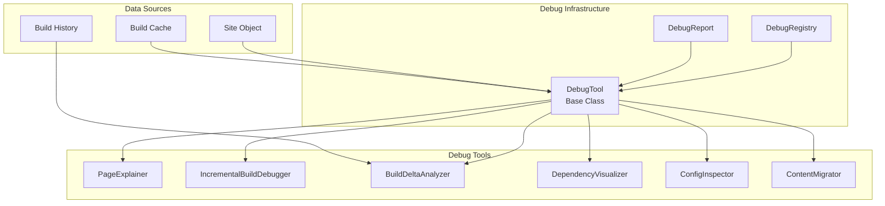

# Debug Tools

Bengal's Debug Tools provide diagnostic utilities for understanding how pages are built, analyzing dependencies, and debugging incremental build issues.

## Overview

The debug system provides a framework for building diagnostic tools that analyze builds, explain behavior, and help troubleshoot issues.

```python
from bengal.debug import PageExplainer, ExplanationReporter, IncrementalBuildDebugger

# Explain how a page is built
explainer = PageExplainer(site)
explanation = explainer.explain(page_path)
ExplanationReporter().print(explanation)

# Debug incremental build issues
debugger = IncrementalBuildDebugger(site=site, cache=cache)
report = debugger.analyze()
print(report.format_summary())
```

## Architecture



## Available Tools

### Page Explainer

Explains how a page is built, including template resolution, dependencies, and rendering steps:

```python
from bengal.debug import PageExplainer, ExplanationReporter

explainer = PageExplainer(site)
explanation = explainer.explain("content/docs/getting-started.md")

ExplanationReporter().print(explanation)
# Output:
# Template: docs.html (resolved from section cascade)
# Dependencies: theme/templates/docs.html, content/docs/_index.md
# Rendering: Markdown → HTML → Template → Output
```

### Incremental Build Debugger

Diagnoses incremental build issues:

```python
from bengal.debug import IncrementalBuildDebugger

debugger = IncrementalBuildDebugger(site=site, cache=cache)
report = debugger.analyze()

# Find phantom rebuilds (pages that rebuild without apparent cause)
phantom_rebuilds = debugger.find_phantom_rebuilds()

# Explain why a page was rebuilt
reason = debugger.explain_rebuild("content/post.md")
```

**Features**:
- Explain why pages rebuild
- Find phantom rebuilds
- Validate cache integrity
- Simulate changes

### Build Delta Analyzer

Compares builds and explains changes:

```python
from bengal.debug import BuildDeltaAnalyzer

analyzer = BuildDeltaAnalyzer(site=site)
delta = analyzer.compare_builds(build1_snapshot, build2_snapshot)

print(delta.summary())
# Output:
# Pages added: 5
# Pages removed: 2
# Pages modified: 12
# Assets changed: 3
```

### Dependency Visualizer

Visualizes build dependencies:

```python
from pathlib import Path
from bengal.debug import DependencyVisualizer

visualizer = DependencyVisualizer(site=site, cache=cache)
graph = visualizer.build_graph()

# Export to DOT format for Graphviz
visualizer.export_dot(Path("dependencies.dot"))

# Or get DOT as string
dot_source = graph.to_dot()
```

### Config Inspector

Advanced config comparison with origin tracking:

```python
from bengal.debug import ConfigInspector

inspector = ConfigInspector(site=site)
comparison = inspector.compare("development", "production")

for diff in comparison.diffs:
    print(f"{diff.path}: {diff.old_value} → {diff.new_value}")

# Explain how a specific key got its value
explanation = inspector.explain_key("site.baseurl")
print(explanation.format())
```

### Content Migrator

Safe content restructuring with link tracking:

```python
from bengal.debug import ContentMigrator

migrator = ContentMigrator(site=site)
preview = migrator.preview_move(
    source="content/old/page.md",
    destination="content/new/page.md",
)

# Preview shows:
# - Files to move
# - Links to update
# - Redirects to create

if preview.can_proceed:
    migrator.execute_move(preview)
```

## Debug Tool Framework

### Creating Custom Tools

Subclass `DebugTool` to create custom diagnostic tools:

```python
from bengal.debug import DebugTool, DebugReport, DebugRegistry, Severity

@DebugRegistry.register
class MyDebugTool(DebugTool):
    name = "my-tool"
    description = "Analyzes something specific"

    def analyze(self) -> DebugReport:
        report = self.create_report()

        # Add findings via report.add_finding()
        report.add_finding(
            title="Found issue",
            description="Detailed explanation of what was found",
            severity=Severity.WARNING,
            category="my-category",
            suggestion="Fix by doing X",
        )

        return report
```

### Debug Registry

The registry enables tool discovery:

```python
from bengal.debug import DebugRegistry

# List all tools
tools = DebugRegistry.list_tools()
# [("page-explainer", "Explains how pages are built"), ...]

# Get a tool
tool_class = DebugRegistry.get("incremental")
tool = DebugRegistry.create("incremental", site=site, cache=cache)
```

## Debug Reports

All tools return structured `DebugReport` objects:

```python
report = tool.analyze()

# Summary
print(report.format_summary())

# Full report
print(report.format())

# Findings
for finding in report.findings:
    print(f"{finding.severity.emoji} {finding.title}")
    print(f"   {finding.description}")
    if finding.suggestion:
        print(f"   💡 {finding.suggestion}")
```

## CLI Integration

Debug tools are accessible via CLI commands:

```bash
# Explain a page
bengal explain content/docs/getting-started.md

# Debug incremental builds
bengal debug incremental

# Explain why a specific page was rebuilt
bengal debug incremental --explain content/posts/my-post.md

# Compare builds (against baseline or previous)
bengal debug delta --baseline
bengal debug delta --save-baseline

# Visualize dependencies
bengal debug deps --export dot --output dependencies.dot

# Show blast radius of a file change
bengal debug deps --blast-radius templates/base.html

# Preview content migration
bengal debug migrate --move docs/old.md guides/new.md
```

## Related

- [Orchestration](../core/orchestration.md) - How incremental builds work
- [Cache](../core/cache.md) - Cache system details
- [CLI](../tooling/cli.md) - Command-line interface
