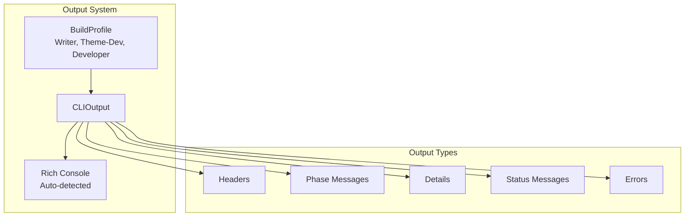

# CLI Output System

Bengal's CLI Output system provides a unified interface for all terminal messaging with profile-aware formatting, consistent spacing, and automatic TTY detection.

## Overview

The output system centralizes all CLI messaging, ensuring consistent formatting across commands and adapting to different user profiles (Writer, Theme-Dev, Developer).

```python
from bengal.output import CLIOutput
from bengal.utils.profile import BuildProfile

cli = CLIOutput(profile=BuildProfile.WRITER)

cli.header("Building your site...")
cli.phase_start("Discovery")
cli.detail("Found 245 pages", indent=1)
cli.phase_complete("Discovery", duration_ms=61)
cli.success("Built 245 pages in 0.8s")
```

## Architecture



## Build Profiles

Different profiles show different levels of detail:

### Writer Profile

Optimized for content creators:

```python
cli = CLIOutput(profile=BuildProfile.WRITER)
# Shows: High-level progress, errors, warnings
# Hides: Technical details, debug info
```

### Theme-Dev Profile

For theme development:

```python
cli = CLIOutput(profile=BuildProfile.THEME_DEV)
# Shows: Template resolution, asset processing
# Hides: Content discovery details
```

### Developer Profile

Full technical output:

```python
cli = CLIOutput(profile=BuildProfile.DEVELOPER)
# Shows: Everything, including debug info
```

## Output Methods

### Headers

```python
cli.header("Building your site...")
# Output: Building your site...
```

### Phase Messages

```python
cli.phase_start("Discovery")
cli.phase_complete("Discovery", duration_ms=61)
# Output: ✓ Discovery (61ms)
```

### Details

```python
cli.detail("Found 245 pages", indent=1)
# Output:   Found 245 pages
```

### Status Messages

```python
cli.success("Build complete!")
cli.warning("Some pages have warnings")
cli.error("Build failed")
cli.info("Using cached assets")
```

### Progress

```python
cli.progress_start("Rendering pages", total=245)
cli.progress_update(100)
cli.progress_complete()
```

## Message Levels

The output system uses message levels for filtering:

```python
from bengal.output.enums import MessageLevel

cli.should_show(MessageLevel.INFO)    # True/False based on profile
cli.should_show(MessageLevel.DEBUG)   # Only in Developer profile
```

## Rich Integration

The output system automatically detects Rich support:

```python
cli = CLIOutput(use_rich=None)  # Auto-detect
cli = CLIOutput(use_rich=True)  # Force Rich
cli = CLIOutput(use_rich=False) # Plain text
```

**Rich Features**:
- Syntax highlighting
- Tables and panels
- Progress bars
- Colors and styling

**Fallback**: Automatically falls back to plain text when Rich isn't available.

## Global Instance

Use the global instance for convenience:

```python
from bengal.output import get_cli_output, init_cli_output

# Initialize once
cli = init_cli_output(profile=BuildProfile.WRITER)

# Use anywhere
cli = get_cli_output()
cli.success("Done!")
```

## Dev Server Integration

The output system integrates with the dev server:

```python
# Dev server sets environment variable
os.environ["BENGAL_DEV_SERVER"] = "1"

# Output system detects dev mode
cli.dev_server  # True
# Enables phase deduplication, streaming output
```

## Phase Deduplication

In dev server mode, duplicate phase messages are suppressed:

```python
# Rapid rebuilds don't spam terminal
cli.phase_start("Rendering")  # Shows
cli.phase_start("Rendering")  # Suppressed (within 1.5s window)
```

## Output Styles

Different output styles for different contexts:

```python
from bengal.output.enums import OutputStyle

cli.set_style(OutputStyle.SUMMARY)  # Brief summary
cli.set_style(OutputStyle.VERBOSE)  # Detailed output
cli.set_style(OutputStyle.QUIET)  # Minimal output
```

## Related

- [CLI](../tooling/cli.md) - Command-line interface
- [Performance](../meta/performance.md) - Benchmarks and hot paths
