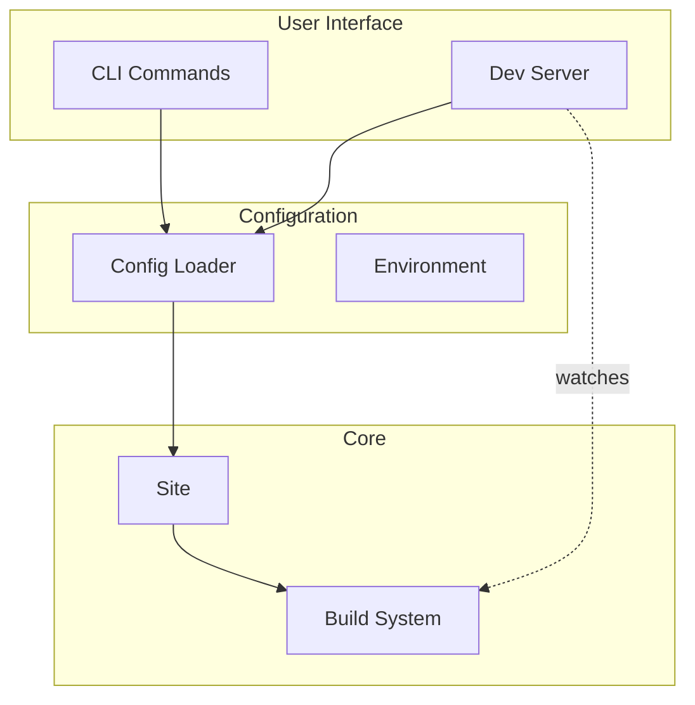

# Tooling & CLI

Developer interfaces for working with Bengal.

## Tool Architecture



## Component Overview

| Component | Purpose | Key Features |
|-----------|---------|--------------|
| **CLI** | Command interface | Typer-based, auto-generated help |
| **Dev Server** | Local development | Live reload, WebSocket updates |
| **Config** | Settings loader | TOML/YAML, environment merging |
| **Utils** | Shared utilities | Progress reporting, file handling |

## CLI Architecture

The CLI uses [Typer](https://typer.tiangolo.com/) with command groups:

```
bengal
├── build      # Build site
├── serve      # Dev server
├── new        # Scaffolding
├── validate   # Health checks
├── autodoc    # Documentation generation
└── analyze    # Site analysis
```

:::{tip}
The CLI is fully documented via autodoc. See [CLI Reference](/cli/) for complete command documentation.
:::
