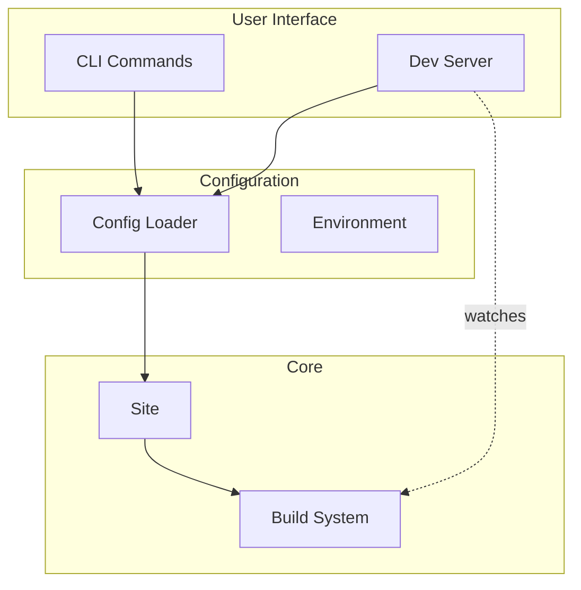

# Tooling & CLI

Developer interfaces for working with Bengal.

## Tool Architecture



## Component Overview

| Component | Purpose | Key Features |
|-----------|---------|--------------|
| **CLI** | Command interface | Typer-based, auto-generated help |
| **Dev Server** | Local development | Live reload, WebSocket updates |
| **Config** | Settings loader | TOML/YAML, environment merging |
| **Utils** | Shared utilities | Progress reporting, file handling |

## CLI Architecture

The CLI uses [Click](https://click.palletsprojects.com/) with command groups and aliases:

```
bengal
├── build      # Build site (also: b)
├── serve      # Dev server (also: s, dev)
├── clean      # Clean output (also: c)
├── validate   # Health checks (also: v, check)
├── new        # Scaffolding (site, page, layout, etc.)
├── config     # Configuration management
├── collections # Content collections
├── health     # Health check commands
├── debug      # Debug tools
├── explain    # Page explanation
└── ...        # Many more commands
```

**Alias System**: Bengal supports intuitive command aliases:
- Top-level shortcuts: `bengal build`, `bengal serve`, `bengal dev`
- Single-letter aliases: `bengal b`, `bengal s`, `bengal c`, `bengal v`

:::{tip}
The CLI is fully documented. See [[docs/reference/architecture/tooling/cli|CLI Reference]] for complete command documentation.
:::
