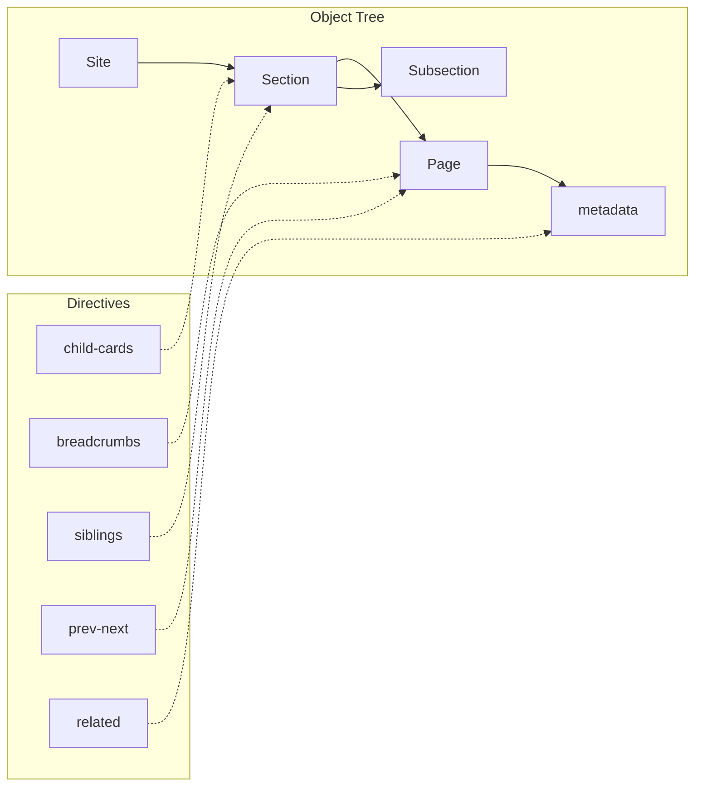

# Navigation Directives

Navigation directives automatically generate navigation elements from your site's object tree. They read directly from page and section metadata, eliminating manual content duplication.

## Key Terms

Object Tree
:   Bengal's hierarchical representation of your site structure (Site → Sections → Pages). Navigation directives traverse this tree to generate content automatically.

Child Cards
:   A directive (`{child-cards}`) that automatically creates a card grid from a section's child pages and subsections.

Breadcrumbs
:   A directive (`{breadcrumbs}`) that generates hierarchical navigation showing the current page's location in the site structure.

Siblings
:   A directive (`{siblings}`) that lists pages at the same level as the current page within their shared parent section.

Prev/Next
:   A directive (`{prev-next}`) that generates previous/next navigation links within a section.

Related
:   A directive (`{related}`) that lists pages with matching tags.

## Child Cards

Automatically generate a card grid from child sections and pages. This is the recommended approach for section index pages.

### Syntax

```markdown
:::{child-cards}
:columns: 2
:include: sections
:fields: title, description, icon
:::
```

### Options

| Option | Values | Default | Description |
|--------|--------|---------|-------------|
| `:columns:` | `1`, `2`, `3`, `4`, `auto` | `2` | Number of columns in the grid |
| `:include:` | `all`, `sections`, `pages` | `all` | What to include in the cards |
| `:fields:` | Comma-separated list | `title, description` | Metadata fields to display |
| `:gap:` | `small`, `medium`, `large` | `medium` | Gap between cards |
| `:layout:` | `default`, `horizontal`, `compact` | `default` | Card layout style |

### Available Fields

- `title` - Page/section title from frontmatter
- `description` - Description from frontmatter
- `icon` - Icon from frontmatter (falls back to folder/file SVG icons)
- `date` - Publication date
- `tags` - Tag list
- `estimated_time` - Reading time estimate
- `difficulty` - Difficulty level

### Examples

**Basic Child Cards**:

```markdown
:::{child-cards}
:columns: 2
:include: sections
:fields: title, description, icon
:::
```

**Include All Children**:

```markdown
:::{child-cards}
:columns: 3
:include: all
:fields: title, description
:::
```

**Pages Only**:

```markdown
:::{child-cards}
:include: pages
:fields: title, description, date
:layout: compact
:::
```

### Best Practices

1. **Use for section index pages** - Replace manual card lists with `child-cards`
2. **Add icons in frontmatter** - Each child page/section can have `icon: name` in frontmatter
3. **Add card_color in frontmatter** - Use `card_color: blue` for colored cards
4. **Falls back to SVG icons** - When no icon is specified, sections get folder icons and pages get file icons

## Breadcrumbs

Generate hierarchical breadcrumb navigation showing the page's location in the site.

### Syntax

```markdown
:::{breadcrumbs}
:separator: >
:include-home: true
:home-text: Home
:::
```

### Options

| Option | Values | Default | Description |
|--------|--------|---------|-------------|
| `:separator:` | Any string | `>` | Separator between breadcrumb items |
| `:include-home:` | `true`, `false` | `true` | Include home link at start |
| `:home-text:` | Any string | `Home` | Text for home link |

### Example Output

```html
<nav class="breadcrumbs">
  <a href="/">Home</a> > <a href="/docs/">Docs</a> > <a href="/docs/theming/">Theming</a> > <span>Templating</span>
</nav>
```

## Siblings

List sibling pages (pages in the same section as the current page).

### Syntax

```markdown
:::{siblings}
:show-current: false
:limit: 10
:::
```

### Options

| Option | Values | Default | Description |
|--------|--------|---------|-------------|
| `:show-current:` | `true`, `false` | `false` | Highlight/include current page |
| `:limit:` | Number | `10` | Maximum siblings to show |

### Example Output

```html
<ul class="siblings">
  <li><a href="/docs/theming/assets/">Assets</a></li>
  <li><a href="/docs/theming/themes/">Themes</a></li>
  <li><a href="/docs/theming/recipes/">Recipes</a></li>
</ul>
```

## Prev/Next Navigation

Generate previous/next links for sequential navigation within a section.

### Syntax

```markdown
:::{prev-next}
:show-title: true
:labels: Previous, Next
:::
```

### Options

| Option | Values | Default | Description |
|--------|--------|---------|-------------|
| `:show-title:` | `true`, `false` | `true` | Show page titles in links |
| `:labels:` | Comma-separated | `Previous, Next` | Labels for prev/next links |

### Example Output

```html
<nav class="prev-next">
  <a class="prev" href="/docs/theming/templating/">← Previous: Templating</a>
  <a class="next" href="/docs/theming/themes/">Next: Themes →</a>
</nav>
```

## Related Pages

List pages that share tags with the current page.

### Syntax

```markdown
:::{related}
:limit: 5
:show-tags: true
:::
```

### Options

| Option | Values | Default | Description |
|--------|--------|---------|-------------|
| `:limit:` | Number | `5` | Maximum related pages to show |
| `:show-tags:` | `true`, `false` | `false` | Show matching tags |

### Example Output

```html
<ul class="related">
  <li><a href="/docs/tutorials/theming/">Theming Tutorial</a></li>
  <li><a href="/docs/guides/custom-css/">Custom CSS Guide</a></li>
</ul>
```

## How It Works

Navigation directives access Bengal's object tree directly:



This means:
- **No manual updates needed** - Cards update automatically when you add/remove pages
- **Single source of truth** - Metadata comes from frontmatter, not duplicated in cards
- **O(1) lookups** - Direct object access, no index lookups required

## Frontmatter for Navigation

To get the best results, add these fields to your pages' frontmatter:

```yaml
---
title: My Page
description: A helpful description for cards
icon: book           # Icon name (book, code, rocket, etc.)
card_color: blue     # Card color (blue, green, purple, orange, etc.)
weight: 10           # Sort order (lower = first)
tags: [guide, python]  # For related pages
---
```

## Related

- [Layout Directives](/docs/reference/directives/layout/) - Manual cards and tabs
- [Content Organization](/docs/content/organization/) - How sections and pages work
