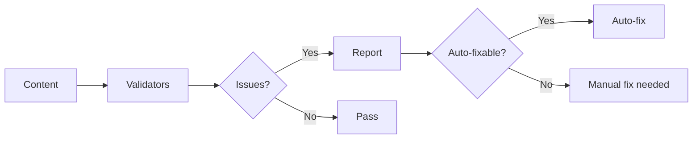

---


title: Validation
description: Content validation and health checks
weight: 60
category: guide
icon: check-circle
card_color: purple
tags:
- persona-operator
- persona-writer
aliases:
  - /docs/content/validation/
aliases:
  - /docs/ship/validate/
  - /docs/content/validation/
---

# Content Validation

Catch broken links, bad directives, and config drift before they reach production.

:::{note}
**Do I need this?** Yes when you want automated quality checks in CI or before
deploy. Skip if you are still prototyping locally and fixing issues by hand.
For the full validate-and-fix workflow, see
[[docs/ship/validate/validate-and-fix|Validate and Fix]]. For auto-fix,
custom validators, and health configuration, see
[[docs/ship/validate/validate-and-fix-reference|Validation Reference]].
:::

:::{child-cards}
:columns: 2
:include: pages
:fields: title, description, icon
:::

## Validation Flow



## Quick Start

:::{tab-set}
:::{tab-item} Validate
```bash
# Run all checks
bengal check

# Validate specific files
bengal check --file content/page.md

# Only validate changed files (incremental)
bengal check --changed

# Verbose output (show all checks)
bengal check --verbose

# Show quality suggestions
bengal check --suggestions

# Watch mode (validate on file changes)
bengal check --watch
```
:::

:::{tab-item} Auto-fix
```bash
# Preview fixes
bengal fix --dry-run

# Apply safe fixes
bengal fix

# Apply all fixes including confirmations
bengal fix --all

# Fix specific validator only
bengal fix --validator Directives
```

Fixes common issues:
- Unclosed directive fences
- Invalid directive options
- YAML syntax errors
:::

:::{tab-item} CI/CD
```bash
# Fail build on issues
bengal build --strict

# Validate and exit with error code
bengal check
```

The `--strict` flag makes warnings into errors.
:::
:::{/tab-set}

## Built-in Checks

| Check | What it validates |
|-------|-------------------|
| `links` | Internal and external links work |
| `assets` | Asset references exist |
| `config` | Configuration is valid |
| `navigation` | Menu structure is correct |
| `rendering` | Templates render without errors |
| `cross_ref` | Cross-references are valid |
| `taxonomy` | Tags and categories are consistent |
| `directives` | MyST directive syntax is correct |
| `anchors` | Heading IDs are unique and valid |

## Custom Validators

Create project-specific rules by extending `BaseValidator`:

```python
# validators/custom.py
from bengal.health.base import BaseValidator
from bengal.health.report import CheckResult

class RequireAuthorValidator(BaseValidator):
    """Validator that checks for author field in frontmatter."""

    name = "Author Required"
    description = "Ensures all pages have an author field"

    def validate(self, site, build_context=None):
        results = []
        for page in site.pages:
            if not page.metadata.get("author"):
                results.append(CheckResult.error(
                    f"Missing author in {page.source_path}",
                    recommendation="Add 'author: Your Name' to frontmatter",
                    details=[str(page.source_path)],
                ))
        return results
```

:::{tip}
**CI integration**: Add `bengal check` to your CI pipeline to catch issues before deployment. Use `--verbose` to see all checks, or `--suggestions` for quality recommendations.
:::
