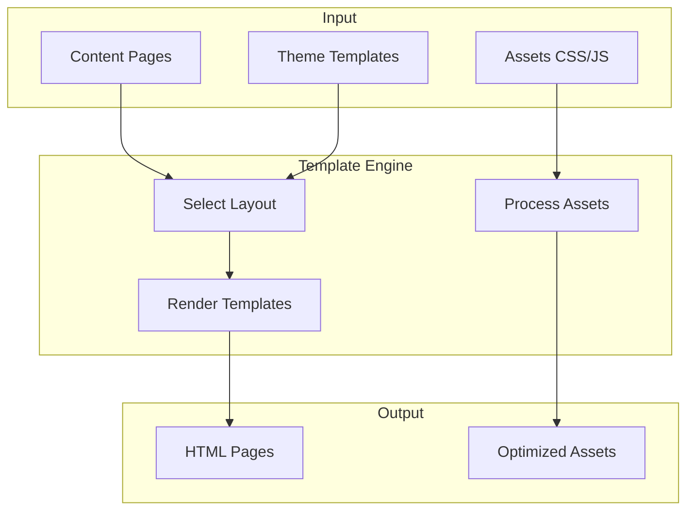

# Design & Theming

Control how your site looks with [[ext:kida:|Kida]] templates, CSS/JS assets, and theme packages.

## What Do You Need?

:::{child-cards}
:columns: 2
:include: sections
:fields: title, description, icon
:::

## How Theming Works

## Customization Levels

| Level | Effort | What You Can Change |
|-------|--------|---------------------|
| **CSS Variables** | Low | Colors, fonts, spacing via `--var` overrides |
| **Template Overrides** | Medium | Copy and modify specific templates with [swizzling](./themes/customize/) |
| **Custom Theme** | High | Full control over all templates and assets |

:::{tip}
**Quick wins**: Start with [CSS Variables](./themes/customize/) to change colors and fonts without touching templates. Use `bengal utils theme swizzle` to copy and customize specific templates when you need structural changes.
:::

## Reference

| Reference | Description |
|-----------|-------------|
| [Theme Variables](/docs/reference/theme-variables/) | Complete `page`, `site`, `section` object reference |
| [Template Functions](/docs/reference/template-functions/) | 80+ filters and functions for templates |
| [Kida Syntax](/docs/reference/kida-syntax/) | Kida template engine syntax reference ([[ext:kida:docs|full docs]]) |
