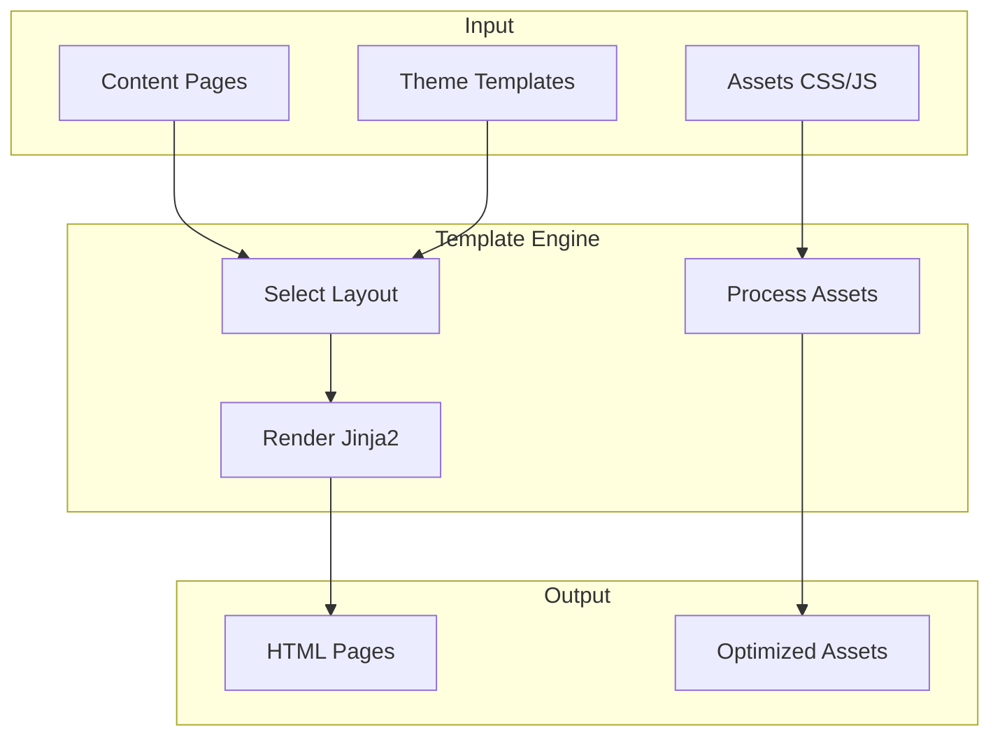

# Design & Theming

Control how your site looks with Jinja2 templates, CSS/JS assets, and theme packages.

## What Do You Need?

::::{cards}
:columns: 2
:gap: medium

:::{card}
:link: ./templating/
:pull: title, description
:color: blue
:::

:::{card}
:link: ./assets/
:pull: title, description
:color: green
:::

:::{card}
:link: ./themes/
:pull: title, description
:color: purple
:::

:::{card}
:link: ./recipes/
:pull: title, description
:color: orange
:::
::::

## How Theming Works

## Customization Levels

| Level | Effort | What You Can Change |
|-------|--------|---------------------|
| **CSS Variables** | Low | Colors, fonts, spacing via `--var` overrides |
| **Template Overrides** | Medium | Copy and modify specific templates |
| **Custom Theme** | High | Full control over all templates and assets |

:::{tip}
**Quick wins**: Start with [CSS Variables](./themes/customization/) to change colors and fonts without touching templates. Graduate to [Template Overrides](./templating/overrides/) when you need structural changes.
:::
