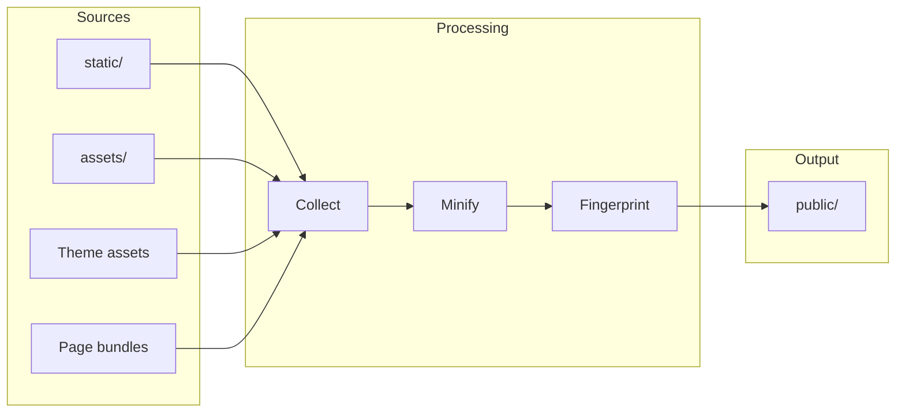

# Asset Pipeline

Bengal processes your CSS, JavaScript, images, and fonts with optional minification and fingerprinting.

## How Assets Flow



## Asset Locations

| Location | Copied To | Processing | Use For |
|----------|-----------|------------|---------|
| `static/` | `public/` | None | Files that don't need processing |
| `assets/` | `public/` | Full pipeline | CSS/JS needing minification |
| Theme's `static/` | `public/` | None | Theme's static files |
| Page bundles | `public/` | Scope-limited | Page-specific images/data |

## Quick Reference

::::{tab-set}
:::{tab-item} Configuration
```toml
# bengal.toml
[build.assets]
minify_css = true
minify_js = true
fingerprint = true   # main.css → main.a1b2c3.css
```
:::

:::{tab-item} Template Usage
```jinja
{# Basic asset URL #}
<link rel="stylesheet" href="{{ 'css/main.css' | asset_url }}">

{# With fingerprint for cache-busting #}
<link rel="stylesheet" href="{{ 'css/main.css' | fingerprint }}">

{# Images #}

```
:::

:::{tab-item} Page Bundle Assets
```jinja
{# Access assets co-located with current page #}

  

```
:::
::::

:::{tip}
**Fingerprinting** adds a hash to filenames (`main.a1b2c3.css`) for cache-busting. Enable it in production for optimal caching.
:::
